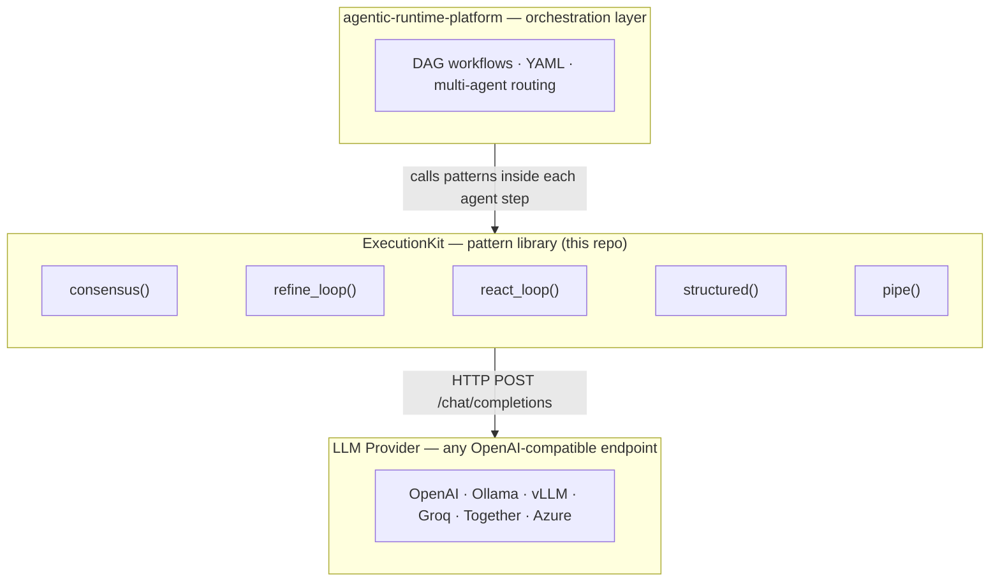

<div align="center">

# ExecutionKit

**Composable LLM reasoning patterns.**
Consensus voting · Iterative refinement · ReAct tool loops · Structured JSON · Zero SDK lock-in.

[](https://www.python.org/downloads/)
[](LICENSE)
[](https://pypi.org/project/executionkit/)
[](https://github.com/tafreeman/executionkit/releases)
[](https://github.com/tafreeman/executionkit/actions/workflows/ci.yml)
[](https://github.com/astral-sh/ruff)
[](http://mypy-lang.org/)
[](https://tafreeman.github.io/executionkit/)

</div>

---

ExecutionKit fills the gap between raw chat calls and full orchestration stacks — more power than one-off prompts, less weight than a framework. Provider-agnostic, zero runtime dependencies (stdlib only), `mypy --strict` clean.

📚 **Full documentation: [tafreeman.github.io/executionkit](https://tafreeman.github.io/executionkit/)**

## Architecture

ExecutionKit is the execution-primitive layer of a two-tier stack. The companion repo,
[agentic-runtime-platform](https://github.com/tafreeman/agentic-runtime-platform), handles orchestration
above it — ExecutionKit patterns run inside each agent step there.

| File | Contents |
|---|---|
| [`docs/architecture.md`](docs/architecture.md) | Module map, dependency graph, error hierarchy, security notes |
| [`CONTRIBUTING.md` — Anti-Scope](CONTRIBUTING.md#anti-scope) | What the library does not do, and why |
| [`examples/`](examples/) | `OPENAI_API_KEY=<your-key> python examples/quickstart_openai.py` |

For implementation details, start with [`docs/architecture.md`](docs/architecture.md) and the public docs site. The diagram below shows the intended layering.



## Quick Start

```bash
pip install executionkit
```

```python
import asyncio
import os
from executionkit import Provider, consensus

async def main() -> None:
    async with Provider(
        "https://api.openai.com/v1",
        api_key=os.environ["OPENAI_API_KEY"],
        model="gpt-4o-mini",
    ) as provider:
        result = await consensus(provider, "Classify this ticket: ...", num_samples=5)
        print(result.value, result.metadata["agreement_ratio"], result.cost)

asyncio.run(main())
```

**What you see when you run it:**

```console
$ pip install executionkit
$ export OPENAI_API_KEY=<your-key>
$ python examples/quickstart_openai.py
Answer: Paris
Agreement: 100%
Cost: TokenUsage(input_tokens=57, output_tokens=6, llm_calls=3)
```

See the [Quick Start guide](https://tafreeman.github.io/executionkit/getting-started/quickstart/) for a complete walkthrough.

## What shipped in v0.1.0

**Five security fixes** in the initial release: prompt-injection sandboxing in the default evaluator via XML delimiters and 32 KB input truncation; API key masking in `Provider.__repr__`; credential redaction in HTTP error messages; information hiding in tool error returns; and supply-chain hardening with Bandit SAST + pip-audit in CI. **Six net-new features** including the `structured()` pattern, optional `httpx` pooling backend, `max_history_messages` capping, JSON Schema tool-arg validation, async context manager lifecycle for `Provider`, and MkDocs Material docs with ADRs. Full notes: [`CHANGELOG.md`](CHANGELOG.md) · [docs site](https://tafreeman.github.io/executionkit/changelog/).

## Patterns

| Pattern | What it does |
|---------|--------------|
| **[Consensus](https://tafreeman.github.io/executionkit/patterns/consensus/)** | Run *N* parallel calls, vote on the result, return the majority answer with confidence. |
| **[Iterative Refinement](https://tafreeman.github.io/executionkit/patterns/iterative-refinement/)** | Generate, score, refine. Bounded loop with a quality gate. |
| **[ReAct Tool Loop](https://tafreeman.github.io/executionkit/patterns/react-loop/)** | Think-act-observe loop with JSON-Schema-validated tool calls. |
| **[Structured Output](https://tafreeman.github.io/executionkit/patterns/structured/)** | Parse JSON responses with custom validators and automatic repair retries. |
| **[Pipe](https://tafreeman.github.io/executionkit/patterns/pipe/)** | Chain patterns end-to-end with a shared budget. |

## Why ExecutionKit

- **Provider-agnostic.** OpenAI, Ollama, vLLM, GitHub Models, Together, Groq, llama.cpp, and Azure via an OpenAI-compatible gateway.
- **Zero SDK lock-in.** Structural `LLMProvider` protocol — any conforming object works without inheritance.
- **Composable.** Patterns are async functions. Wrap them, chain them with `pipe()`, or drop them inside a larger orchestrator like [agentic-runtime-platform](https://github.com/tafreeman/agentic-runtime-platform).
- **Budget-aware.** TOCTOU-safe `max_cost` enforcement across parallel calls.
- **Secure-by-default.** API key masking, credential redaction in errors, JSON-Schema tool validation, prompt-injection-hardened default evaluator.

## Built for Platform Teams

ExecutionKit targets three groups who need LLM reliability without runtime coupling:

- **Platform / infra engineers** dropping a reasoning primitive into an existing service — no SDK to pin, no dependency conflict. `pip install executionkit` adds one package with zero transitive dependencies; provider swap is one constructor call.
- **Solutions architects** evaluating multi-vendor strategies — the structural `LLMProvider` protocol means vendor A and vendor B are runtime-swappable with no code changes outside the constructor.
- **AI-native teams** building beyond chat — consensus voting, iterative refinement, and ReAct tool loops are the building blocks for production-grade LLM behaviour without pulling in a full framework.

If you need DAG orchestration on top, [agentic-runtime-platform](https://github.com/tafreeman/agentic-runtime-platform) layers over ExecutionKit and handles scheduling, retries, and evaluation gating.

## Relationship to agentic-runtime-platform

ExecutionKit and [agentic-runtime-platform](https://github.com/tafreeman/agentic-runtime-platform) occupy different layers of the same stack:

| | ExecutionKit | agentic-runtime-platform |
|---|---|---|
| **Role** | Pattern library | Orchestration runtime |
| **Scope** | Single LLM call patterns with cost tracking | Multi-agent DAG workflows with tiered model routing |
| **Workflow authoring** | Python functions | Declarative YAML |
| **Dependencies** | Zero (stdlib only; `httpx` optional) | FastAPI, LangGraph, Pydantic, provider SDKs |
| **Use when** | You need a reasoning primitive — vote, refine, tool loop | You need to orchestrate many agents with scheduling, retries, and evaluation |

**agentic-runtime-platform uses ExecutionKit patterns internally** as the execution primitive for each agent step. Build atop agentic-runtime-platform for free; install ExecutionKit alone if you want the patterns without the orchestration overhead.

## Documentation

The canonical reference is the [docs site](https://tafreeman.github.io/executionkit/):

- [Installation](https://tafreeman.github.io/executionkit/getting-started/installation/)
- [Quick Start](https://tafreeman.github.io/executionkit/getting-started/quickstart/)
- [Provider Setup](https://tafreeman.github.io/executionkit/getting-started/providers/)
- [Patterns Overview](https://tafreeman.github.io/executionkit/patterns/)
- [Recipes](https://tafreeman.github.io/executionkit/recipes/composition/) — failover, cost-aware routing, pattern composition.
- [API Reference](https://tafreeman.github.io/executionkit/api/core/)

## Development

```bash
pip install -e ".[dev]"
ruff check . && ruff format . --check
mypy --strict executionkit/
pytest --cov=executionkit --cov-fail-under=80
```

See [CONTRIBUTING.md](CONTRIBUTING.md) for the full dev workflow.

## License

MIT — see [LICENSE](LICENSE).
