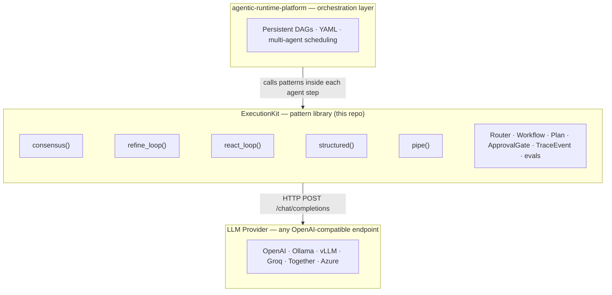

<div align="center">

# ExecutionKit

**Composable LLM reasoning patterns.**
Consensus voting · Iterative refinement · ReAct tool loops · Structured JSON · Zero SDK lock-in.

[](https://www.python.org/downloads/)
[](LICENSE)
[](https://pypi.org/project/executionkit/)
[](https://github.com/tafreeman/executionkit/releases)
[](https://github.com/tafreeman/executionkit/actions/workflows/ci.yml)
[](https://github.com/astral-sh/ruff)
[](http://mypy-lang.org/)
[](https://tafreeman.github.io/executionkit/)

</div>

---

ExecutionKit fills the gap between raw chat calls and full orchestration stacks — more power than one-off prompts, less weight than a framework. Provider-agnostic, zero runtime dependencies (stdlib only), `mypy --strict` clean, with lightweight eval, tracing, routing, workflow, planning, and approval primitives.

📚 **Full documentation: [tafreeman.github.io/executionkit](https://tafreeman.github.io/executionkit/)**

## Architecture

ExecutionKit is the execution-primitive layer of a two-tier stack. The companion repo,
[agentic-runtime-platform](https://github.com/tafreeman/agentic-runtime-platform), handles orchestration
above it — ExecutionKit patterns run inside each agent step there.

| File | Contents |
|---|---|
| [`docs/architecture.md`](docs/architecture.md) | Module map, dependency graph, error hierarchy, security notes |
| [`CONTRIBUTING.md` — Anti-Scope](CONTRIBUTING.md#anti-scope) | What the library does not do, and why |
| [`examples/`](examples/) | `OPENAI_API_KEY=<your-key> python examples/quickstart_openai.py` |

For implementation details, start with [`docs/architecture.md`](docs/architecture.md) and the public docs site. The diagram below shows the intended layering.



> **Platform role (ADR-023).** ExecutionKit is the **OpenAI-message-format execution kernel** of the
> stack: the runtime aligns its provider seam onto ExecutionKit's `LLMProvider` / `LLMResponse`
> contract rather than maintaining a parallel one. The decision, migration plan, and
> functionality-preservation matrix live in the runtime repo at
> [`docs/adr/ADR-023-*`](https://github.com/tafreeman/agentic-runtime-platform/tree/main/docs/adr).
> The shared value types (`LLMResponse`, `ToolCall`, `TokenUsage`) and the error
> hierarchy live directly in `executionkit/` today. ADR-023 reserves a future
> extraction path if agentic-runtime-platform ever needs a separate contracts
> package, but there is no standalone `executionkit-contracts` distribution in
> v0.3.0.

> **Development note:** Built with AI-assisted development under human review; architecture, tests,
> release gates, and public documentation remain maintainer-owned and verified through the repo's
> lint, type, test, and security checks.

## Quick Start

```bash
pip install executionkit
```

```python
import asyncio
import os
from executionkit import Provider, consensus

async def main() -> None:
    async with Provider(
        "https://api.openai.com/v1",
        api_key=os.environ["OPENAI_API_KEY"],
        model="gpt-4o-mini",
    ) as provider:
        result = await consensus(provider, "What is the capital of France?", num_samples=3)
        print(result.value, result.metadata["agreement_ratio"], result.cost)

asyncio.run(main())
```

**What you see when you run it** (illustrative shape — token counts depend on the model, prompt, and provider tokenizer; `llm_calls` counts every dispatched wire attempt including retries, so it equals `num_samples` only when no attempt was retried):

```console
$ pip install executionkit
$ export OPENAI_API_KEY=<your-key>
$ python examples/quickstart_openai.py
Answer: Paris
Agreement: 100%
Cost: TokenUsage(input_tokens=<varies>, output_tokens=<varies>, llm_calls=3)
```

See the [Quick Start guide](https://tafreeman.github.io/executionkit/getting-started/quickstart/) for a complete walkthrough.

## What shipped since v0.2.0

**Multi-turn conversations.** `react_loop` now accepts a `messages=` transcript to continue a prior conversation (mutually exclusive with `prompt`) and returns the updated transcript in `metadata["messages"]`; `Kit.turn()` plus a `Kit.messages` transcript layer a stateful conversational API on top of it, with a `ConversationScript` / `Turn` / `run_conversation_script()` harness for scripted multi-turn evals. **The [map-reduce](https://tafreeman.github.io/executionkit/patterns/map-reduce/) pattern** ([ADR-011](docs/adr/011-map-reduce-pattern.md)) fans a prompt out across a collection of inputs in parallel, then reduces to a single answer. **A stdlib-only MCP server** (`python -m executionkit.mcp`, [ADR-012](docs/adr/012-stdlib-mcp-server.md)) exposes `consensus` and a sandboxed `react_loop` as [Model Context Protocol](https://modelcontextprotocol.io) tools over stdio. **Anthropic Message Batches fan-out** — `consensus_batch()` and `map_batch()` ([ADR-014](docs/adr/014-message-batches.md)) submit large sample sets as a single Anthropic Batches job instead of live concurrent calls, sharing the same voting logic as `consensus()`. Also new: an optional `rate_limiter=` on `Kit` backed by `TokenBucket`, and a `summarizer=` hook that compresses history dropped by `react_loop`'s `max_history_messages` trimming into a system note. Full notes: [`CHANGELOG.md`](CHANGELOG.md) · [docs site](https://tafreeman.github.io/executionkit/changelog/).

## Patterns

| Pattern | What it does |
|---------|--------------|
| **[Consensus](https://tafreeman.github.io/executionkit/patterns/consensus/)** | Run *N* parallel calls, vote on the result, return the majority answer with confidence. |
| **[Iterative Refinement](https://tafreeman.github.io/executionkit/patterns/iterative-refinement/)** | Generate, score, refine. Bounded loop with a quality gate. |
| **[ReAct Tool Loop](https://tafreeman.github.io/executionkit/patterns/react-loop/)** | Think-act-observe loop with progressive structured-output guardrails: a dependency-free subset validator runs first, and a full JSON-Schema check layers on when `jsonschema` is installed — failing closed on schemas the subset validator can't express rather than under-validating. |
| **[Structured Output](https://tafreeman.github.io/executionkit/patterns/structured/)** | Parse JSON responses with custom validators and automatic repair retries. |
| **[Pipe](https://tafreeman.github.io/executionkit/patterns/pipe/)** | Chain patterns end-to-end with a shared budget. |
| **[Map-Reduce](https://tafreeman.github.io/executionkit/patterns/map-reduce/)** | Fan out over a collection of inputs in parallel, process each independently, then reduce to a single answer. |

## Lightweight primitives

ExecutionKit also exposes small stdlib-only primitives for the glue code around pattern calls, including a set of single-run agent-orchestration primitives (`Router`, `Workflow`/`Step`, `Plan`/`PlanStep`, `ApprovalGate`) — composition within one execution, not multi-agent handoff, which stays [out of scope](CONTRIBUTING.md#anti-scope):

- **Evals.** `EvalCase` and `run_eval_suite()` run deterministic golden checks in CI; `live_provider_from_env()` enables opt-in live checks via `EXECUTIONKIT_LIVE_EVAL=1`, `EXECUTIONKIT_BASE_URL`, and `EXECUTIONKIT_MODEL`. A further tier, `scripts/claude_ci_eval.py`, asks the headless Claude Code CLI to judge the failure corpus's own documented expectations — gated, opt-in (PR label / manual dispatch / weekly schedule), requires `ANTHROPIC_API_KEY`, and is advisory only: it is never a required check and a failed or skipped run cannot block a merge ([ADR-013](docs/adr/013-claude-in-ci-eval.md)).
- **Observability.** `TraceEvent` callbacks can receive structured events for LLM calls, retries, tool calls, workflow steps, plan steps, approvals, cost, and latency; when `opentelemetry-api` is installed, `llm_span()` wraps each LLM call in a real OTel span whose attributes (`llm.model`, `llm.input_tokens`, `llm.output_tokens`, `cost_usd`) are designed to map onto the OpenTelemetry GenAI semantic conventions without requiring the dependency at all.
- **Routing.** `Router` and `RouteRule` select a provider before a pattern call without changing the pattern implementation.
- **Workflow and planning.** `Workflow`/`Step` execute simple dependency-ordered fan-out DAGs; `Plan`/`PlanStep` execute ordered plan-then-act flows.
- **Approval gates.** `ApprovalGate` can require human or policy approval before tool execution, workflow steps, or plan steps.

## Why ExecutionKit

- **Provider-agnostic.** OpenAI, Ollama, vLLM, GitHub Models, Together, Groq, llama.cpp, and Azure via an OpenAI-compatible gateway.
- **Zero SDK lock-in.** Structural `LLMProvider` protocol — any conforming object works without inheritance.
- **Composable.** Patterns are async functions. Wrap them, chain them with `pipe()`, or drop them inside a larger orchestrator like [agentic-runtime-platform](https://github.com/tafreeman/agentic-runtime-platform).
- **Budget-aware.** TOCTOU-safe `max_cost` enforcement across parallel calls; `llm_calls` counts every dispatched wire attempt, including failed retries.
- **Resilient by construction.** `RetryConfig`'s retryable allowlist plus a `TokenBucket` rate-limit strategy (`engine/retry.py`, `engine/rate_bucket.py`) provide typed retry/backoff and rate-limit coordination: retryable failures back off with full jitter, a 429's `retry_after` immediately drains the bucket and arms a cooldown, and non-retryable errors fail fast instead of being retried into a cascading failure.
- **Secure-by-default.** API key masking, broad credential redaction in library-owned error paths, a dependency-free top-level JSON-Schema subset plus optional full `jsonschema` validation (fail-closed when the subset is insufficient), a prompt-injection-hardened default evaluator, and optional approval gates.
- **Eval-aware.** A deterministic golden suite and model-failure corpus assert pattern behavior and known failure handling in normal CI, with `EvalReport.accuracy`/`summary()` metrics. Real-model regression, `LIVE_CORPUS`, judge-calibration, and Claude corpus-review tiers are explicitly advisory and env-gated; they are evidence of endpoint compatibility and eval plumbing, not a required model-efficacy gate.

## MCP server

`python -m executionkit.mcp` starts a stdlib-only [Model Context Protocol](https://modelcontextprotocol.io) server over stdio (newline-delimited JSON-RPC 2.0) exposing two patterns as MCP tools: `consensus` and `react_loop` — the latter restricted to a fixed, side-effect-free demo toolset, so MCP callers cannot register arbitrary code ([ADR-012](docs/adr/012-stdlib-mcp-server.md)). The backing model resolves from the same `EXECUTIONKIT_BASE_URL` / `EXECUTIONKIT_MODEL` / `EXECUTIONKIT_API_KEY` env vars as the live-eval provider; without them the server still starts and answers `initialize`/`tools/list`, and `tools/call` returns a structured `isError` result naming the missing configuration. Only the `tools` capability is advertised — no runtime dependency was added (ADR-004 holds).

## Tool execution sandbox

`react_loop` treats the model→tool edge as a hard boundary ([ADR-015](docs/adr/015-react-loop-tool-sandbox.md)): arguments are schema-validated before a tool runs (stdlib subset validator, full JSON Schema with the `jsonschema` extra), every call gets a per-tool `asyncio.wait_for` timeout, exceptions and timeouts become bounded error observations (exception *type* only — never argument-bearing tracebacks), observations truncate at `max_observation_chars`, and an optional fail-closed `ApprovalGate` is checked per call. The concurrent fan-out is bounded on every axis: `max_rounds` × `max_tool_calls_per_round` (surplus calls are rejected with an observation, never executed) × per-call timeout × observation size. Trace events redact argument values by default. The only model-influenced text the package ever interprets — the MCP demo calculator — runs on a pure-AST allowlist interpreter; there is no `eval()` in ExecutionKit.

## Message Batches fan-out

For fan-outs where nobody is waiting on a socket, `consensus_batch()` and `map_batch()` (`executionkit/batches.py`) submit the samples as a single [Anthropic Message Batches](https://docs.anthropic.com/en/docs/build-with-claude/batch-processing) job over a stdlib `urllib` client — no new dependency (ADR-004 holds) — and poll until it ends. `consensus_batch` scores samples with the *same* `tally_votes` implementation as the live `consensus()` pattern (extracted to `engine/voting.py`), so the two transports cannot drift; `map_batch` returns responses in prompt order as the "map" half of a map-reduce. Any errored/expired batch entry raises rather than being silently dropped ([ADR-014](docs/adr/014-message-batches.md)). The live `consensus()` remains the right choice for latency-sensitive interactive calls.

## Deliberately out of scope / roadmap

See [`CONTRIBUTING.md` — Anti-Scope](CONTRIBUTING.md#anti-scope) for what ExecutionKit rejects as a pattern library, not a framework. On top of that, as of v0.3.0:

- **RAG / embeddings / vector search** — deliberately out of scope. Retrieval belongs in the calling application or a dedicated vector store, not the reasoning-pattern layer.

## Built for Platform Teams

ExecutionKit targets three groups who need LLM reliability without runtime coupling:

- **Platform / infra engineers** dropping a reasoning primitive into an existing service — no SDK to pin, no dependency conflict. `pip install executionkit` adds one package with zero transitive dependencies; provider swap is one constructor call.
- **Solutions architects** evaluating multi-vendor strategies — the structural `LLMProvider` protocol means vendor A and vendor B are runtime-swappable with no code changes outside the constructor.
- **AI-native teams** building beyond chat — consensus voting, iterative refinement, and ReAct tool loops are the building blocks for production-grade LLM behaviour without pulling in a full framework.

If you need persistent, declarative, multi-agent orchestration on top, [agentic-runtime-platform](https://github.com/tafreeman/agentic-runtime-platform) layers over ExecutionKit and handles scheduling, runtime state, and fleet-level evaluation gating.

## Relationship to agentic-runtime-platform

ExecutionKit and [agentic-runtime-platform](https://github.com/tafreeman/agentic-runtime-platform) occupy different layers of the same stack:

| | ExecutionKit | agentic-runtime-platform |
|---|---|---|
| **Role** | Pattern library | Orchestration runtime |
| **Scope** | Reasoning patterns plus lightweight Python routing/workflow/planning primitives | Multi-agent DAG workflows with tiered model routing |
| **Workflow authoring** | Python functions and named async steps | Declarative YAML |
| **Dependencies** | Zero (stdlib only; `httpx` optional) | FastAPI, LangGraph, Pydantic, provider SDKs |
| **Use when** | You need a reasoning primitive — vote, refine, tool loop, trace, route, simple DAG | You need to orchestrate many agents with scheduling, persistence, retries, and evaluation |

**agentic-runtime-platform uses ExecutionKit patterns internally** as the execution primitive for each agent step. Build atop agentic-runtime-platform for free; install ExecutionKit alone if you want the patterns without the orchestration overhead.

## Documentation

The canonical reference is the [docs site](https://tafreeman.github.io/executionkit/):

- [Installation](https://tafreeman.github.io/executionkit/getting-started/installation/)
- [Quick Start](https://tafreeman.github.io/executionkit/getting-started/quickstart/)
- [Provider Setup](https://tafreeman.github.io/executionkit/getting-started/providers/)
- [Patterns Overview](https://tafreeman.github.io/executionkit/patterns/)
- [Recipes](https://tafreeman.github.io/executionkit/recipes/composition/) — failover, cost-aware routing, pattern composition.
- [API Reference](https://tafreeman.github.io/executionkit/api/core/)

## Development

```bash
pip install -e ".[dev]"
ruff check . && ruff format . --check
mypy --strict executionkit/
pytest --cov=executionkit --cov-fail-under=80
```

See [CONTRIBUTING.md](CONTRIBUTING.md) for the full dev workflow.

## License

MIT — see [LICENSE](LICENSE).
