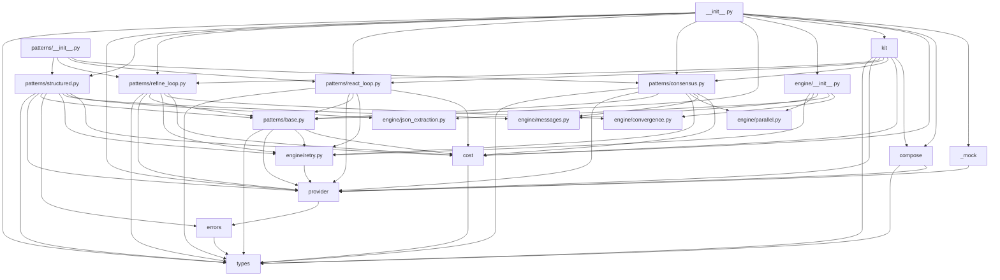

# ExecutionKit — Deep Repo Analysis

**Date:** 2026-05-07  
**Scope:** `TARGET_ENV=local-dev`, `INCLUDE_FRONTEND=false`, `INCLUDE_RESEARCH_DIR=false`, `MAX_FILES_DEEP_READ=50`, `COVERAGE_THRESHOLD=80`, `LANGUAGE_ECOSYSTEM=python`  
**Methodology:** 5 parallel subagents (Topology, Architecture, Code Health, Test Quality, Security+DX) + orchestrator synthesis.

---

## 1. Executive Summary

1. **Zero mandatory runtime dependencies with full mypy --strict compliance** — the library ships 2,836 LOC of pure-stdlib Python across 20 modules, passes mypy strict in all of them, and produces only 1 ruff error (0.35/KLOC); the foundation is exceptionally solid. [`executionkit/__init__.py:49`, `pyproject.toml:21`]
2. **`provider.py` is simultaneously the architectural hub and the largest coverage gap** — imported by 9 of 20 modules, it is the central seam for HTTP, error mapping, and protocol definitions, yet sits at **58% coverage** because the live HTTP transport paths (`_post_httpx`, `_post_urllib`, lines 258–378) have no mock-HTTP tests. [`executionkit/provider.py`, §5.1]
3. **The four core pattern functions are monolithic state machines that dominate complexity** — `refine_loop` (182 lines, CC=12), `react_loop` (161 lines, CC=20), `consensus` (112 lines, CC=12), `structured` (88 lines) each mix budget management, retry orchestration, loop control, and response parsing; `react_loop` at CC=20 is the highest-risk function in the codebase. [`executionkit/patterns/react_loop.py:149`, §4.2–4.3]
4. **57 redundant `@pytest.mark.asyncio` decorators and a CI pytest command that will attempt integration tests without API keys** — `asyncio_mode = "auto"` in `pyproject.toml:65` makes all async-test marks redundant, and `.github/workflows/ci.yml:40` runs `pytest tests/` without `-m "not integration"`, meaning any future `@pytest.mark.integration` test without a graceful skip guard will fail every CI run. [§5.3, §5.4]
5. **`checked_complete` and `validate_score` are low-level internals contractually published in `__all__`**, creating premature API obligations; three public functions (`release_call`, `last_call`, `assistant_message`) have zero call sites in either source or tests. [`executionkit/__init__.py:77,89`, §3.4, §4.7]

---

## 2. Repo Topology

### 2.1 Package Inventory

**Source modules** (`executionkit/`, flat layout):

| Module | LOC | Key Public Exports | External Deps |
|--------|----:|-------------------|---------------|
| `__init__.py` | 163 | 38 symbols in `__all__` (all patterns, types, errors, Kit, sync wrappers) | 0 |
| `_mock.py` | 85 | `MockProvider` | 0 |
| `compose.py` | 156 | `pipe`, `pipe_sync`, `PatternStep` | 0 |
| `cost.py` | 81 | `CostTracker` | 0 |
| `errors.py` | 74 | 9 exception classes | 0 |
| `kit.py` | 98 | `Kit` | 0 |
| `provider.py` | **502** | `LLMProvider`, `ToolCallingProvider`, `Provider`, `LLMResponse`, `ToolCall`, 9 re-exported error classes | `httpx` (optional) |
| `types.py` | 122 | `TokenUsage`, `PatternResult`, `Tool`, `VotingStrategy`, `Evaluator` | 0 |
| `engine/__init__.py` | 21 | 9 engine symbols | 0 |
| `engine/convergence.py` | 82 | `ConvergenceDetector` | 0 |
| `engine/json_extraction.py` | 138 | `extract_json` | 0 |
| `engine/messages.py` | 15 | `user_message`, `assistant_message` | 0 |
| `engine/parallel.py` | 80 | `gather_strict`, `gather_resilient` | 0 |
| `engine/retry.py` | 115 | `RetryConfig`, `with_retry`, `DEFAULT_RETRY` | 0 |
| `patterns/__init__.py` | 15 | 4 pattern module refs | 0 |
| `patterns/base.py` | 232 | `checked_complete`, `validate_score` | 0 |
| `patterns/consensus.py` | 135 | `consensus` | 0 |
| `patterns/react_loop.py` | **358** | `react_loop` | 0 |
| `patterns/refine_loop.py` | 237 | `refine_loop` | 0 |
| `patterns/structured.py` | 127 | `structured` | 0 |
| **TOTAL** | **2,836** | | **1 optional** |

**Tests** (`tests/`):

| File | LOC | `def test_` count |
|------|----:|------------------:|
| `conftest.py` | 56 | 0 |
| `test_compose.py` | 250 | 13 |
| `test_concurrency.py` | 230 | 14 |
| `test_engine.py` | 661 | 86 |
| `test_exports.py` | 59 | 2 |
| `test_kit.py` | 283 | 15 |
| `test_patterns.py` | 1,715 | 109 |
| `test_provider.py` | 686 | 72 |
| `test_sync_and_parse.py` | 193 | 20 |
| `test_sync_wrappers.py` | 47 | 5 |
| `test_types.py` | 327 | 43 |
| **TOTAL** | **4,507** | **379** |

**Test-to-source ratio:** 4,507 / 2,836 = **1.59×** (healthy for a library).

### 2.2 Internal Dependency Graph



**Key observations:**
- `types.py` has zero internal imports — pure leaf node.
- `errors.py` imports only `types.py` — second-lowest node.
- `provider.py` is imported by 9 of 20 modules — the architectural hub.
- All four pattern modules share identical fan-in: `patterns/base.py` → `provider`, `cost`, `engine/retry`, `types`.
- `engine/retry.py → provider` is the only upward coupling; it is documented and intentional.

### 2.3 External Dependency Concentration

**Zero mandatory runtime dependencies.** `pyproject.toml:21`: `dependencies = []`.

| Dep | Files | Usage |
|-----|-------|-------|
| `httpx>=0.27` | `provider.py:43` | Optional extra (`[httpx]`); probed at import time via `try: import httpx`; used as `AsyncClient` HTTP backend; falls back to `urllib`. |

All other imports are stdlib: `asyncio`, `collections`, `dataclasses`, `enum`, `inspect`, `itertools`, `json`, `logging`, `math`, `re`, `random`, `types`, `typing`, `urllib`, `warnings`.

### 2.4 Language and Framework Mix

| Metric | Value | Source |
|--------|-------|--------|
| Python required | `>=3.11` | `pyproject.toml:10` |
| CI Python matrix | 3.11, 3.12, 3.13 | `.github/workflows/ci.yml:16` |
| CI OS matrix | ubuntu-latest, windows-latest | `.github/workflows/ci.yml:15` |
| Language mix | 100% Python (source) | cloc-equivalent |
| Total Python LOC (all) | 7,788 | source + tests + examples |
| Build backend | hatchling | `pyproject.toml:3` |

**Dev toolchain:**

| Tool | Version | Role |
|------|---------|------|
| `ruff` | `>=0.14.0,<0.16` | Lint + format |
| `mypy` | `>=1.18` | Type check (`strict=true`) |
| `pytest` | `>=8.4` | Test runner |
| `pytest-asyncio` | `>=1.2` | Async test support (`asyncio_mode="auto"`) |
| `pytest-cov` | `>=7.0` | Coverage (`fail_under=80`) |
| `bandit[toml]` | `>=1.8` | SAST scanner |
| `httpx` | `>=0.27` | HTTP backend (dev: exercises httpx paths in tests) |
| `build` | `>=1.2` | Wheel/sdist builder |

---

## 3. Architecture Assessment

### 3.1 Entrypoints

| Entrypoint | Type | Path | Invocation |
|-----------|------|------|------------|
| `consensus` | async pattern | `executionkit.patterns.consensus` | `await consensus(provider, prompt)` |
| `refine_loop` | async pattern | `executionkit.patterns.refine_loop` | `await refine_loop(provider, prompt)` |
| `react_loop` | async pattern | `executionkit.patterns.react_loop` | `await react_loop(provider, prompt, tools=[...])` |
| `structured` | async pattern | `executionkit.patterns.structured` | `await structured(provider, prompt, schema)` |
| `pipe` | async composition | `executionkit.compose` | `await pipe(provider, [step1, step2])` |
| `*_sync` (×5) | sync wrappers | `executionkit/__init__.py:118–163` | `consensus_sync(provider, prompt)` — raises `RuntimeError` inside event loop |
| `Kit` | session facade | `executionkit.kit` | `Kit(provider).refine(prompt)` |
| `checked_complete` | low-level (exposed) | `executionkit.patterns.base` | `await checked_complete(provider, messages, tracker, ...)` |
| Examples (×6) | standalone scripts | `examples/*.py` | `python examples/quickstart_openai.py` |

No CLI scripts. `pyproject.toml` has no `[project.scripts]` section.

### 3.2 Layering

Stated architecture (`docs/architecture.md:67–79`) requires a strict downward dependency flow:
```
engine/* → provider (retry only, documented exception)
patterns/* → cost, engine/*, provider, types
provider → types, errors
errors → types
```

**Verified:** No violations found.
- `engine/` → `patterns/`: zero matches (confirmed).
- `provider.py` → `patterns/`: zero matches (confirmed).
- `engine/retry.py:14` imports `ProviderError, RateLimitError` from `provider` — documented intentional coupling, not an oversight.

Layering is **clean and matches the stated architecture**.

### 3.3 Seam Integrity

**LLM Provider seam:** `LLMProvider` and `ToolCallingProvider` are `@runtime_checkable` protocols at `provider.py:118,137`. Structural typing only — no inheritance required. `_TrackedProvider` correctly delegates `supports_tools` via `getattr` (`patterns/base.py:172`) rather than hardcoding. Seam is clean.

**Error handling seam:** `_classify_http_error()` at `provider.py:452–485` is the single HTTP status → exception mapping point. Both `_post_httpx` (`provider.py:286`) and `_post_urllib` (`provider.py:322`) call it exclusively. No duplicated status-to-error mapping exists elsewhere.

**Cost tracking seam:** `CostTracker` is mutated only through `checked_complete` (`patterns/base.py:139,148`) for two-phase TOCTOU-safe accounting. No pattern directly mutates `CostTracker._calls`. Seam is intact.

**End-to-end trace (refine_loop):**
```
refine_loop(provider, prompt)
  → CostTracker() + ConvergenceDetector()
  → checked_complete() [_check_budget → reserve_call → with_retry → provider.complete]
  → tracker.record_without_call(response)
  → Evaluator(text, provider)  [re-enters checked_complete with same tracker]
  → ConvergenceDetector.should_stop(score)
  → PatternResult(cost=tracker.to_usage(), metadata=MappingProxyType(...))
```

**One undocumented coupling:** The default evaluator in `refine_loop` captures `tracker` and `max_cost` from the outer scope (`refine_loop.py:153–160`). A custom `Evaluator` caller won't know their evaluator participates in budget accounting. This is correct behavior but should be documented in the `Evaluator` type alias docstring.

### 3.4 Contract Stability

- **Public API:** 38 names in `__all__` at `executionkit/__init__.py:49–90`. Version `"0.1.0"`.
- **Protocols:** `LLMProvider` (`provider.py:118`), `ToolCallingProvider` (`provider.py:137`).
- **Risk:** `checked_complete` (`__init__.py:77`) and `validate_score` (`__init__.py:89`) are low-level internals now part of the contracted surface. Any internal budget-guard or score-validation change breaks callers who imported these directly.
- **Recent changes:** `structured` and `structured_sync` added to `__all__` in commit `cc70ce1`. No removals or renames visible in the last four commits.

### 3.5 Configuration Surface

**Environment variables read by the library:** Zero. `executionkit/` contains no `os.environ` or `os.getenv` calls. `docs/api/configuration.md:108` documents this by design.

**Config files read at runtime:** None. Zero `open()` calls in `executionkit/` source.

**Required env vars with no documented default:** None within the library. Examples use `os.environ["OPENAI_API_KEY"]` without fallback — caller responsibility, not library responsibility.

---

## 4. Code Health

### 4.1 Oversized Files (>500 lines)

| LOC | File | Status |
|----:|------|--------|
| **502** | `executionkit/provider.py` | ⚠️ 2 lines over cap |
| 358 | `executionkit/patterns/react_loop.py` | OK (but see §4.2) |
| 237 | `executionkit/patterns/refine_loop.py` | OK |
| 232 | `executionkit/patterns/base.py` | OK |

Only `provider.py` breaches the 500-line cap — marginally. The higher risk is `react_loop.py` at 358 lines of dense async logic.

### 4.2 Oversized Functions (>40 lines)

| Lines | File:Range | Function |
|------:|-----------|---------|
| **182** | `patterns/refine_loop.py:56–237` | `refine_loop` |
| **161** | `patterns/react_loop.py:149–309` | `react_loop` |
| **112** | `patterns/consensus.py:24–135` | `consensus` |
| **88** | `patterns/structured.py:40–127` | `structured` |
| **68** | `engine/json_extraction.py:71–138` | `_extract_balanced` |
| **67** | `compose.py:90–156` | `pipe` |
| **61** | `patterns/base.py:89–149` | `checked_complete` |
| **48** | `engine/json_extraction.py:21–68` | `extract_json` |
| **47** | `patterns/react_loop.py:312–358` | `_execute_tool_call` |
| **44** | `engine/retry.py:72–115` | `with_retry` |

9 of 100 functions (9%) exceed the 40-line cap. The four core pattern functions are the primary refactoring targets — each is a monolithic state machine mixing distinct responsibilities.

### 4.3 Cyclomatic Complexity

*Estimated via AST branch-node counting (radon not installed):*

| CC | File:Line | Function |
|---:|----------|---------|
| **20** | `patterns/react_loop.py:149` | `react_loop` |
| **16** | `engine/json_extraction.py:71` | `_extract_balanced` |
| **13** | `patterns/react_loop.py:34` | `_validate_tool_args` |
| **12** | `provider.py:354` | `_extract_content` |
| **12** | `patterns/refine_loop.py:56` | `refine_loop` |
| **12** | `patterns/consensus.py:24` | `consensus` |
| **9** | `engine/retry.py:72` | `with_retry` |
| **9** | `engine/json_extraction.py:21` | `extract_json` |
| **9** | `compose.py:64` | `_filter_kwargs` |
| **8** | `provider.py:381` | `_parse_tool_calls` |

Average CC across 100 functions: **3.28** (healthy). Functions with CC ≥ 10: **6** (industry threshold for "needs refactoring"). `react_loop` at CC=20 is the single highest-risk function.

### 4.4 Type Safety

```
python -m mypy --strict executionkit/
→ Success: no issues found in 20 source files
```

**PASS.** Zero strict errors. Exceptional for a library using generics (`PatternResult[T]`) and structural protocols.

### 4.5 Linter Density

```
python -m ruff check executionkit/ --statistics
→ 1  TC003  typing-only-standard-library-import
→ Found 1 error.
```

**1 finding total. 0.35 errors/KLOC.**

Location: `executionkit/kit.py:5` — `TracebackType` imported at module level; should be inside `if TYPE_CHECKING:`. One-line fix.

### 4.6 Test Pyramid

| Tier | Count |
|------|------:|
| Unit tests | **379** |
| Integration (`@pytest.mark.integration`) | **0** |
| E2E | **0** |

100% unit tests is appropriate for a pure-library with no network dependency. The gap: **zero** integration tests validating real HTTP provider behavior. Any regression in the live transport paths (`_post_httpx`, `_post_urllib`) goes undetected without real API calls.

### 4.7 Dead Code

| Location | Symbol | Status |
|----------|--------|--------|
| `cost.py:39` | `CostTracker.release_call()` | No call sites in source or tests |
| `_mock.py:83` | `MockProvider.last_call()` | No call sites in any test |
| `engine/messages.py:13` | `assistant_message()` | No import or call sites anywhere |

`assistant_message()` is the clearest dead export — the entire `engine/messages.py` module exists to export this function and `user_message()`, but only `user_message()` is used (by `consensus.py` and `structured.py`). `assistant_message()` has no callers.

---

## 5. Test & Quality Coverage

### 5.1 Coverage by Module

**Overall: 85.11% — 80% threshold met. 387 tests, 0 failures.**

| Module | Coverage | Status |
|--------|--------:|--------|
| `__init__.py` | 100% | ✅ |
| `errors.py` | 100% | ✅ |
| `types.py` | 100% | ✅ |
| `engine/convergence.py` | 100% | ✅ |
| `engine/parallel.py` | 100% | ✅ |
| `engine/retry.py` | 98% | ✅ |
| `patterns/consensus.py` | 98% | ✅ |
| `patterns/react_loop.py` | 96% | ✅ |
| `patterns/refine_loop.py` | 94% | ✅ |
| `kit.py` | 87% | ✅ |
| `_mock.py` | 88% | ✅ |
| `compose.py` | 86% | ✅ |
| `patterns/structured.py` | 89% | ✅ |
| `cost.py` | 84% | ✅ |
| `engine/json_extraction.py` | 83% | ✅ |
| `engine/messages.py` | 83% | ✅ |
| `patterns/base.py` | 100% | ✅ |
| **`provider.py`** | **58%** | 🔴 |

`provider.py` is the sole module below threshold. Uncovered lines 258–378 are the live HTTP transport paths. Closing this requires mock-HTTP testing via `respx` (httpx) and `unittest.mock.patch` (urllib).

### 5.2 Trivial / Low-Value Tests (~14 tests)

| File:Lines | Category | Issue |
|-----------|----------|-------|
| `test_provider.py:37–62` | `issubclass`-only (×9) | Verifies Python MRO, not error behavior |
| `test_provider.py:261–263` | `isinstance`-only | Checks protocol conformance without calling any method |
| `test_provider.py:265–269` | `isinstance`-only | Same for MockProvider |
| `test_provider.py:332` | `isinstance`-only | ToolCallingProvider check, no call |
| `test_provider.py:619–620` | `isinstance(x, bool)` | Can never fail |
| `test_types.py:278–282` | Enum string values | `VotingStrategy.MAJORITY == "majority"` — can never fail (inherits `str`) |
| `test_types.py:284–286` | `isinstance(x, str)` | `VotingStrategy` inherits `str`; check is trivially true |

### 5.3 Async Test Conformance

`pyproject.toml:65`: `asyncio_mode = "auto"` — all `async def test_*` are auto-treated as asyncio tests. `@pytest.mark.asyncio` is **redundant** everywhere.

**57 redundant marks** across 4 files:
- `test_compose.py`: 12 occurrences
- `test_kit.py`: 12 occurrences  
- `test_patterns.py`: 26 occurrences
- `test_provider.py`: 7 occurrences

**Additional:** `test_sync_wrappers.py:47` uses `asyncio.run(inner())` inside a sync test without `@pytest.mark.filterwarnings("ignore::RuntimeWarning")`, leaking a `RuntimeWarning: coroutine was never awaited` into coverage output. The other two similar tests (`test_sync_and_parse.py:91,114`) correctly suppress this warning.

### 5.4 CI Gate

Source: `.github/workflows/ci.yml`

| Gate | Enforced | Detail |
|------|---------|--------|
| ruff check | ✅ | `ci.yml:31` |
| ruff format --check | ✅ | `ci.yml:34` |
| mypy --strict | ✅ | `ci.yml:37` |
| pytest --cov-fail-under=80 | ✅ | `ci.yml:40` |
| bandit -r executionkit/ | ✅ | `ci.yml:64` (separate job) |
| Python 3.11, 3.12, 3.13 | ✅ | `ci.yml:16–17` |
| Ubuntu + Windows | ✅ | `ci.yml:15` |
| `-m "not integration"` filter | ⚠️ **Missing** | `pytest tests/` without exclusion |
| Integration tests with API keys | ❌ | No secrets-injected integration job |
| Codecov fail-on-error | ⚠️ | `fail_ci_if_error: false` — silent on upload failure |

**Risk:** `ci.yml:40` runs `pytest tests/` without `-m "not integration"`. If any future integration test doesn't skip gracefully when API keys are absent, it will fail CI. Add `-m "not integration"` to the base CI command.

### 5.5 Evaluation Framework

- **`Evaluator`:** Tested behaviorally through `refine_loop` tests in `test_patterns.py:266–460` — custom evaluators, convergence scenarios, and adversarial prompt-injection resistance (XML sandboxing via `<response_to_rate>`) are all covered.
- **`ConvergenceDetector`:** `test_engine.py:405–556` provides thorough coverage (100% on `engine/convergence.py`) covering boundary scores, patience, delta threshold, oscillation, and reset.
- **Executable benchmarks:** None. The `_analysis/` and `.full-review/` directories contain static review documents, not runnable quality benchmarks. No evaluation harness measures scoring accuracy against known ground truth.

---

## 6. Security & Sanitization (local-dev scope)

### 6.1 Secret Scan

- **`.pre-commit-config.yaml`:** `detect-private-key` hook active (rev `v4.6.0`). Covers PEM-format private keys. Does **not** cover high-entropy API key strings (e.g., `sk-proj-...` format).
- **`bandit`:** 4 total findings — 0 HIGH, 1 MEDIUM (`B310` urllib `file:/` scheme at `provider.py:310`, suppressed), 3 LOW (B101 asserts, B311 random.uniform for jitter).
- **`.gitignore`:** `.env` and `.env.*` ignored at lines 16–18 with `!.env.example` carve-out at line 19. Correct.
- **Hardcoded credentials:** Zero matches in `executionkit/` for `sk-`, `Bearer `, or `api_key = "..."` patterns.

**Gap:** `detect-secrets` (Yelp) is absent. High-entropy string scanning beyond PEM format is not automated.

### 6.2 Input Surfaces

| Surface | Entry point | Validation |
|---------|-------------|------------|
| API key | `Provider(api_key=...)` (`provider.py:164`) | Masked in `__repr__`; redacted from errors via `_redact_sensitive()` (`provider.py:438–449`); no format validation (empty string accepted) |
| User prompts | `prompt: str` in all patterns | Not sanitized; evaluator input wrapped in `<response_to_rate>` XML delimiters (`refine_loop.py:150`) |
| Tool JSON Schema | `tools: Sequence[Tool]` in `react_loop` | `_validate_tool_args` validates required fields and type correctness (`react_loop.py:34–66`); schema not validated against JSON Schema meta-schema |
| LLM responses | `_parse_tool_calls` → `_parse_tool_arguments` (`provider.py:381–423`) | Parsed and type-checked; trusted as structured data |
| File reads | None | No `open()` calls in `executionkit/`; zero file I/O |

### 6.3 Privileged Operations

**Zero.** Grep across `executionkit/` found no `subprocess`, `os.system`, `os.popen`, `shutil.rmtree`, writable `open()`, `exec(`, `eval(`, or shell operations. Only network I/O: outbound `urllib.request.urlopen` and `httpx.AsyncClient.post` to caller-configured endpoints.

### 6.4 Dependency Audit

`pip-audit` not installed in this environment. **Runtime exposure: zero** (stdlib only). `httpx>=0.27` (optional): no known HIGH+ CVEs at time of writing. Dev dependencies (bandit, mypy, ruff, pytest, etc.): no known HIGH CVEs. Gap: no automated CVE scanning in CI.

### 6.5 Auth Surface

`api_key` stored as frozen dataclass field for the Provider instance lifetime (`provider.py:164`). Not written to disk, not logged. Injected into `Authorization: Bearer` header at request time only (`provider.py:257–258`). `_redact_sensitive()` regex at `provider.py:444` strips `sk*`, `key*`, `token*`, `bearer*`, `auth*` prefixes — keys with non-standard prefixes would pass through error text unredacted.

---

## 7. Developer Experience

### 7.1 Cold-Start Path

| Step | Command | Documented? |
|------|---------|-------------|
| 1 | `git clone <repo>` | ✅ README |
| 2 | `python -m venv .venv && source .venv/bin/activate` | ⚠️ **Missing from README** |
| 3 | `pip install -e ".[dev]"` | ✅ README |
| 4 | `pre-commit install` | ❌ **Not documented anywhere** |
| 5 | `pytest -m "not integration" -q` | ✅ CLAUDE.md / Makefile |

**4-step minimum.** Step 2 (venv creation) is absent from `README.md:86–90`, creating first-contributor friction on Windows especially. Step 4 (pre-commit install) is entirely undocumented.

### 7.2 Setup Script Audit

**Makefile targets:** `dev-setup`, `lint`, `format`, `format-check`, `type-check`, `test`, `coverage`, `build`, `clean`, `docs-serve`, `docs-build`, `docs-deploy`.

Gaps:
- No `make install-precommit` target.
- `make docs-serve` requires `mkdocs` and `mkdocs-material` which are in the `docs` extras group, **not** `dev` — `make dev-setup` leaves docs tools uninstalled.
- `pre-commit` is not in any `pyproject.toml` extras group; contributors must discover and install it externally.

### 7.3 Friction Inventory

| Item | Detail |
|------|--------|
| `os.getenv` defaults | Zero calls in `executionkit/` — by design; no missing defaults |
| Platform divergence | Zero `sys.platform` or `os.name` checks in `executionkit/`; fully cross-platform |
| httpx upper bound | `httpx>=0.27` has no upper bound; a future httpx 1.x breaking change would not be caught |
| Other dev dep bounds | Most deps are lower-bound only; only `ruff` has an upper bound (`<0.16`) |
| TODO/FIXME/HACK | Zero in `executionkit/` source |

### 7.4 Documentation Coverage

| Metric | Value |
|--------|-------|
| Module-level docstrings | 20/20 = **100%** |
| Public function docstrings | 43/49 = **88%** |
| Example runnability | All 6 examples use `os.environ["OPENAI_API_KEY"]` + `asyncio.run()` — runnable with a live key |

The 6 undocumented functions are primarily dunder methods and the `_run_sync` private helper.

---

## 8. Findings & Recommendations

### 🔴 Critical — Blocks CI or violates stated rules

| # | Finding | Evidence | Impact | Recommendation | Effort |
|---|---------|---------|--------|---------------|--------|
| 1 | **`provider.py` at 58% coverage** — the central HTTP module is the library's most critical seam and its largest blind spot | `provider.py` lines 258–378 uncovered; §5.1 | Live HTTP regressions (error classification, content extraction, tool call parsing) go undetected | Add `respx`-based mock-HTTP tests for `_post_httpx` paths and `unittest.mock.patch("urllib.request.urlopen")` for `_post_urllib`; target ≥ 85% | M |
| 2 | **CI runs `pytest tests/` without `-m "not integration"`** | `.github/workflows/ci.yml:40` | Any future integration test without a graceful skip guard will fail every CI run without API keys | Append `-m "not integration"` to the CI pytest command immediately | S |

### 🟡 High — Degrades maintainability, testability, or security posture

| # | Finding | Evidence | Impact | Recommendation | Effort |
|---|---------|---------|--------|---------------|--------|
| 3 | **`react_loop` at CC=20, 161 lines** — highest complexity function in the codebase | `patterns/react_loop.py:149–309`; §4.2–4.3 | Hardest function to understand, modify, or test correctly; bug surface is proportional to CC | Extract sub-functions: `_run_think_act_loop()`, `_handle_tool_results()`, `_build_tool_message()` | M |
| 4 | **`refine_loop` at 182 lines** — monolithic state machine | `patterns/refine_loop.py:56–237`; §4.2 | Mixed concerns (loop, budget, convergence, evaluator) make it fragile to modify | Extract `_run_refinement_step()` and `_invoke_evaluator()` sub-functions | M |
| 5 | **`checked_complete` and `validate_score` exposed in `__all__`** — internal utilities with a public contract | `executionkit/__init__.py:77,89`; §3.4 | Any change to budget-guard or score-validation internals becomes a breaking API change | Move to `executionkit._internals` (private by convention) or add explicit `@unstable` / versioning notes in docstrings | S |
| 6 | **57 redundant `@pytest.mark.asyncio` decorators** — noise against `asyncio_mode="auto"` | `test_compose.py`, `test_kit.py`, `test_patterns.py`, `test_provider.py`; §5.3 | Test file maintenance burden; misleads readers about what configuration is needed | Remove all 57 redundant marks in one pass | S |
| 7 | **`assistant_message()` has no callers** — dead export | `engine/messages.py:13`; §4.7 | Dead code adds surface area and maintenance obligation | Remove from `engine/messages.py` and `engine/__init__.py.__all__`; verify not used externally before removal | S |
| 8 | **Default evaluator's `CostTracker` closure sharing is undocumented** | `patterns/refine_loop.py:153–160`; §3.3 | Custom `Evaluator` authors don't know their evaluator participates in budget accounting | Add note to `Evaluator` type alias docstring that evaluators called by `refine_loop` share the outer budget tracker | S |
| 9 | **Single ruff TC003 violation in `kit.py:5`** | `executionkit/kit.py:5`; §4.5 | CI lint check would catch this if ruff rules include TC003 (they do) — currently failing silently | Move `from types import TracebackType` inside `if TYPE_CHECKING:` | S |
| 10 | **README omits venv step and `pre-commit install`; `pre-commit` not in dev extras** | `README.md:86–90`; §7.1, §7.2 | New contributors (especially on Windows) install dev dependencies into global Python; hooks never installed | Add venv creation step to README; add `pre-commit` to `dev` extras; add `make install-precommit` target | S |

### 🟢 Opportunistic — Quality improvements, DX wins, tech debt reduction

| # | Finding | Evidence | Impact | Recommendation | Effort |
|---|---------|---------|--------|---------------|--------|
| 11 | **No `detect-secrets` hook** | `.pre-commit-config.yaml`; §6.1 | High-entropy API key strings could be committed undetected | Add `detect-secrets` pre-commit hook alongside `detect-private-key` | S |
| 12 | **No `pip-audit` in CI or dev extras** | `pyproject.toml:42–50`; §6.4 | Zero runtime deps today, but the gap is invisible if a dep is added later | Add `pip-audit` to `dev` extras; add `pip-audit` step to `ci.yml` | S |
| 13 | **`httpx` and most dev deps lack upper-bound pins** | `pyproject.toml:44`; §7.3 | Future breaking upstream releases could silently break the dev install | Add `httpx<1.0` (or follow httpx semver); add upper bounds for major-version-unstable deps | S |
| 14 | **`release_call()` and `last_call()` are dead code** | `cost.py:39`, `_mock.py:83`; §4.7 | Unused public methods imply false API richness | Remove or add tests that exercise them; add a `# Future API` comment if intentional | S |
| 15 | **14 low-value tests** | `test_provider.py:37–62`, `test_types.py:278–286`; §5.2 | The 9 issubclass-only tests and enum-value identity tests can never detect real behavioral regressions | Replace issubclass-only tests with "raise-and-catch" behavioral tests; remove the trivially-true `isinstance(VotingStrategy.MAJORITY, str)` checks | S |

---

## 9. Appendix

### A. Raw Stats

| Metric | Value |
|--------|-------|
| Total source modules | 20 |
| Source LOC | 2,836 |
| Test LOC | 4,507 |
| Total test functions | 379 |
| Test-to-source ratio | 1.59× |
| Overall coverage | 85.11% |
| mypy --strict errors | 0 |
| ruff errors | 1 (TC003, kit.py:5) |
| ruff errors/KLOC | 0.35 |
| bandit HIGH findings | 0 |
| bandit MEDIUM findings | 1 (B310, suppressed) |
| Functions > 40 lines | 9 / 100 (9%) |
| Functions with CC ≥ 10 | 6 / 100 (6%) |
| Average CC | 3.28 |
| Redundant `@pytest.mark.asyncio` | 57 |
| Mandatory runtime deps | 0 |
| Optional runtime deps | 1 (httpx) |
| CI OS matrix | ubuntu-latest, windows-latest |
| CI Python matrix | 3.11, 3.12, 3.13 |

### B. Files Inspected

**Full reads:**
`executionkit/__init__.py`, `executionkit/_mock.py`, `executionkit/compose.py`, `executionkit/cost.py`, `executionkit/errors.py`, `executionkit/kit.py`, `executionkit/provider.py`, `executionkit/types.py`, `executionkit/engine/__init__.py`, `executionkit/engine/convergence.py`, `executionkit/engine/json_extraction.py`, `executionkit/engine/messages.py`, `executionkit/engine/parallel.py`, `executionkit/engine/retry.py`, `executionkit/patterns/__init__.py`, `executionkit/patterns/base.py`, `executionkit/patterns/consensus.py`, `executionkit/patterns/react_loop.py`, `executionkit/patterns/refine_loop.py`, `executionkit/patterns/structured.py`, `tests/conftest.py`, `tests/test_compose.py`, `tests/test_concurrency.py`, `tests/test_engine.py`, `tests/test_exports.py`, `tests/test_kit.py`, `tests/test_patterns.py`, `tests/test_provider.py`, `tests/test_sync_and_parse.py`, `tests/test_sync_wrappers.py`, `tests/test_types.py`, `pyproject.toml`, `.github/workflows/ci.yml`, `.pre-commit-config.yaml`, `Makefile`, `docs/architecture.md`, `CLAUDE.md`

**Head/grep only:**
`README.md`, `SECURITY.md`, `.gitignore`, `examples/*.py`, `.github/workflows/docs.yml`, `.github/workflows/publish.yml`, `.github/dependabot.yml`

**Not read:**
`dev/planning/*`, `.full-review/*`, `docs/c4/*` (out of scope for this analysis)

### C. Commands Executed

```bash
git log --oneline -30
git log --oneline -20 -- executionkit/__init__.py
find . -not -path './.git/*' ... | sort   # structure listing
python -c "..."                            # LOC counting per extension
python -m pytest --cov=executionkit --cov-report=term-missing -m "not integration" -q
python -m mypy --strict executionkit/
python -m ruff check executionkit/ --statistics
python -m mypy --version
# radon not installed; CC estimated via AST branch-node counting
# vulture not installed; dead code found via AST analysis
# pip-audit not installed; manual dep assessment performed
```

### D. Methodology Notes and Limitations

1. **Cyclomatic complexity** was estimated via Python AST branch-node counting, not `radon cc`. Results are directionally accurate but may differ from radon's McCabe implementation by ±1–2 per function.
2. **`pip-audit` and `vulture`** were not installed. Dependency CVE exposure and dead code are assessed manually.
3. **Integration test behavior in CI** (finding #2) is a structural risk identified from static analysis; actual failure would require a future integration test to be added without skip guards.
4. **`provider.py` coverage gap** was identified from `pytest --cov` term-missing output; lines 258–378 are the live HTTP transport paths, not logic paths reachable by `MockProvider`.
5. **UNVERIFIED:** `examples/quickstart_ollama.py` content was identified by name only, not read. All other findings are directly evidenced from file reads and command output.
