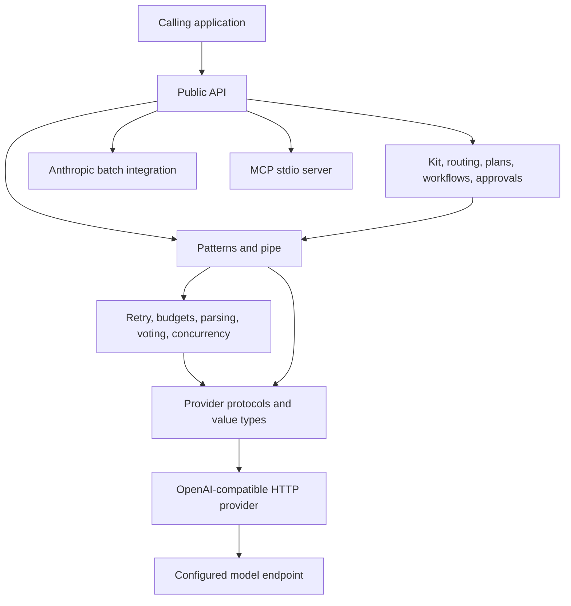

# Architecture

ExecutionKit is an in-process Python library. It provides bounded LLM call
patterns, provider transport, usage accounting, and small coordination
helpers. The calling application owns persistence, scheduling, identity,
authorization, and user interfaces.

## Package boundaries



Dependencies point downward. The engine does not select providers or own
application state. Patterns use the provider protocols, not the concrete HTTP
client.

## Module map

The public and top-level coordination modules are:

| File | Responsibility |
|---|---|
| `executionkit/__init__.py` | Public exports, version, and synchronous wrappers. |
| `executionkit/_constants.py` | Shared internal defaults and limits. |
| `executionkit/_mock.py` | Scripted provider used by tests and examples. |
| `executionkit/types.py` | Result, usage, tool, callback, and enum types. |
| `executionkit/errors.py` | Exception hierarchy. |
| `executionkit/provider.py` | Provider protocols, responses, and OpenAI-compatible HTTP transport. |
| `executionkit/cost.py` | Mutable usage tracker and price arithmetic. |
| `executionkit/kit.py` | Session facade, conversation history, and cumulative usage. |
| `executionkit/compose.py` | Sequential `pipe()` execution. |
| `executionkit/routing.py` | Ordered provider selection rules. |
| `executionkit/planning.py` | Sequential named steps. |
| `executionkit/workflow.py` | Dependency-ordered steps, checkpoints, and resume. |
| `executionkit/approval.py` | Approval requests, decisions, and timeout policy. |
| `executionkit/evals.py` | Deterministic eval cases, conversation scripts, and live-provider opt-in. |
| `executionkit/observability.py` | Trace callbacks and optional OpenTelemetry spans. |
| `executionkit/batches.py` | Anthropic Message Batches client and batch helpers. |
| `executionkit/claude_sdk.py` | Claude Agent SDK transport; authenticates with a Claude subscription rather than an API key. |

Pattern modules are:

| File | Responsibility |
|---|---|
| `executionkit/patterns/__init__.py` | Pattern package exports. |
| `executionkit/patterns/base.py` | Checked provider calls, budgets, retry integration, and checkpoints. |
| `executionkit/patterns/consensus.py` | Concurrent sampling and exact normalized voting. |
| `executionkit/patterns/refine_loop.py` | Generate, evaluate, and revise loop. |
| `executionkit/patterns/react_loop.py` | Tool-call loop, validation, approvals, history limits, and tool execution. |
| `executionkit/patterns/structured.py` | JSON extraction, validation, and repair. |
| `executionkit/patterns/map_reduce.py` | Concurrent map calls followed by one reduce call. |

Engine modules are:

| File | Responsibility |
|---|---|
| `executionkit/engine/__init__.py` | Engine package marker. |
| `executionkit/engine/convergence.py` | Score-threshold and patience-based stopping. |
| `executionkit/engine/json_extraction.py` | JSON extraction from plain or fenced model output. |
| `executionkit/engine/messages.py` | OpenAI-format message constructors. |
| `executionkit/engine/parallel.py` | Strict and resilient async gathering. |
| `executionkit/engine/rate_bucket.py` | Async token bucket and retry-after penalty. |
| `executionkit/engine/retry.py` | Retry classification and jittered backoff. |
| `executionkit/engine/voting.py` | Response normalization and vote tallying. |

MCP modules are:

| File | Responsibility |
|---|---|
| `executionkit/mcp/__init__.py` | MCP package exports. |
| `executionkit/mcp/__main__.py` | `python -m executionkit.mcp` entry point. |
| `executionkit/mcp/_constants.py` | Supported protocol versions and server limits. |
| `executionkit/mcp/_demo_tools.py` | Fixed calculator and echo tools used by the server. |
| `executionkit/mcp/server.py` | JSON-RPC framing and stdio server lifecycle. |
| `executionkit/mcp/tools.py` | MCP tool definitions, argument checks, and pattern handlers. |

## Pattern call lifecycle

A normal pattern call follows this order:

1. Validate pattern arguments.
2. Build provider messages.
3. Check the remaining budget and reserve one LLM call.
4. Apply retry pacing, then call the provider.
5. Parse the response and record returned token usage.
6. Continue the pattern or build a `PatternResult`.
7. Emit trace events and checkpoints at documented boundaries.

Retry attempts repeat steps 3 through 5. A failed attempt therefore consumes a
call slot. It normally adds no token usage because the provider did not return
usage.

## Concurrency and accounting

Concurrent pattern calls share one `CostTracker` inside the pattern. Budget
check and call reservation occur without an `await` between them, so the LLM
call limit cannot be raced by coroutines on one event loop.

The token fields are pre-dispatch checks, not response-size ceilings. A
successful response can exceed a token field because its usage is known only
after completion. The next attempted call is blocked.

`CostTracker`, `TokenBucket`, `Kit`, and workflow state are not designed for
concurrent access from multiple operating-system threads. Create separate
instances or provide application-level locking.

`Kit(rate_limiter=...)` takes one token per top-level Kit method. A
`RetryConfig(rate_limit_strategy=...)` takes one token per provider attempt.
Use the setting that matches the limit being enforced.

## Provider boundary

`LLMProvider` requires one async `complete()` method. `ToolCallingProvider`
adds an explicit tool-support marker. `StreamingProvider` adds `stream()`,
which returns an async iterator.

The concrete `Provider`:

- sends OpenAI-compatible chat-completions requests;
- accepts only `http` and `https` base URLs;
- does not follow redirects;
- redacts credential-like values from HTTP error text;
- uses `httpx` when installed and falls back to `urllib`; and
- does not translate native provider request formats.

Provider and model compatibility remain configuration concerns. The transport
does not discover model capabilities.

## Tool execution boundary

`react_loop()` treats model-requested tool calls as untrusted input.

1. It rejects duplicate tool names when the loop starts.
2. It validates the argument object and the supported top-level schema subset.
3. If `jsonschema` is installed, it applies full JSON Schema validation.
4. It asks the configured `ApprovalGate`, if any.
5. It applies a timeout and runs calls from the same round concurrently.
6. It truncates tool observations before adding them to model history.

These checks do not replace authorization inside a tool. Tool code must still
validate resource identifiers, caller permissions, and side-effect rules.

## State, checkpoints, and resume

Pattern checkpoints are observation callbacks. Exceptions raised by a pattern
checkpoint callback are logged and do not stop that pattern.

Workflow checkpoints are different: they contain completed outputs and
accumulated usage after each ready batch. The caller provides the persistence
function. A workflow resumed from a checkpoint skips step names already found
in `checkpoint.outputs`. Workflow checkpoint callback exceptions propagate to
the caller.

Checkpoint data can contain prompts, outputs, tool observations, and
application context. The caller is responsible for access control, encryption,
retention, and schema migration.

## Value and mutation model

Public result types use frozen, slotted dataclasses. Field reassignment is
blocked, and metadata created by the library is generally wrapped in
`MappingProxyType`.

This is shallow immutability. A caller-supplied nested list or mapping can
remain mutable after it is placed inside another value. Copy untrusted mutable
inputs when a stable snapshot is required.

Stateful helpers are intentionally mutable:

- `CostTracker` accumulates counts;
- `TokenBucket` tracks refill time and penalties;
- `Kit` stores cumulative usage and conversation messages.

## Errors

All library exceptions derive from `ExecutionKitError` and can carry partial
`cost` and diagnostic `metadata`.

```text
ExecutionKitError
├── LLMError
│   ├── RateLimitError
│   ├── PermanentError
│   └── ProviderError
└── PatternError
    ├── BudgetExhaustedError
    ├── ConsensusFailedError
    └── MaxIterationsError
```

Approval denial and timeout errors also derive directly from
`ExecutionKitError`.

Retry behavior is type-based. By default, `RateLimitError` and
`ProviderError` are retryable; `PermanentError` is not.

## Extension rules

- Implement `LLMProvider` for another OpenAI-compatible transport or a test
  double.
- Implement the larger protocols only when the object actually supports tools
  or streaming.
- Write a pattern as an async function that returns `PatternResult` and uses
  the checked-call helpers for consistent retry, budget, trace, and cost
  behavior.
- Put branching, persistence, identity, and business authorization in the
  application.

Architecture changes that alter these boundaries should include an ADR in
[`docs/adr/`](adr/README.md).
