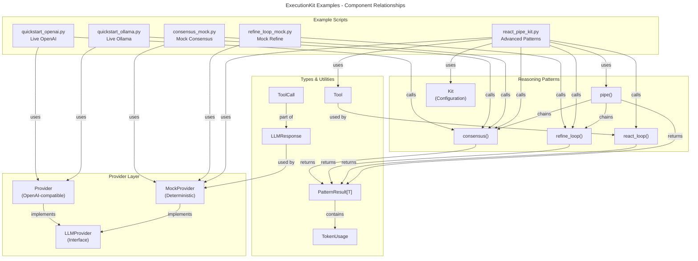

# C4 Code Level: Examples Directory

## Overview

- **Name**: ExecutionKit Examples
- **Description**: Example scripts demonstrating how to use the ExecutionKit library for composable LLM reasoning patterns with both live providers (OpenAI, Ollama) and mock providers
- **Location**: [`examples/`](file:///C:/Users/tandf/source/patternmesh/examples)
- **Language**: Python 3.10+
- **Purpose**: Educational and reference implementations showing practical usage of ExecutionKit's reasoning patterns (consensus, refine_loop, react_loop) and composition capabilities

## Code Elements

### Scripts

#### `quickstart_openai.py`
**Location**: [`examples/quickstart_openai.py`](file:///C:/Users/tandf/source/patternmesh/examples/quickstart_openai.py)

**Purpose**: Demonstrates consensus pattern with live OpenAI API provider. Shows basic setup and error handling.

**Main Function**:
- `main() -> None`
  - Reads `OPENAI_API_KEY` from environment (exits if not set)
  - Creates a `Provider` instance pointing to OpenAI API endpoint
  - Executes `consensus_sync()` with a ticket classification prompt
  - Handles `ProviderError` and `ExceptionGroup` errors gracefully
  - Prints consensus result and token cost

**Key Patterns Demonstrated**:
- Live provider initialization with API key and model configuration
- Consensus pattern for multi-sample agreement on classification task
- Environment-based configuration (API key, model name)
- Error handling for external provider failures
- Metrics access (result value and cost tracking)

**Configuration Parameters**:
- `OPENAI_API_KEY`: Required API key
- `OPENAI_MODEL`: Optional, defaults to "gpt-4o-mini"
- Consensus parameters: `num_samples=3`, `temperature=0.2`

---

#### `quickstart_ollama.py`
**Location**: [`examples/quickstart_ollama.py`](file:///C:/Users/tandf/source/patternmesh/examples/quickstart_ollama.py)

**Purpose**: Demonstrates consensus pattern with local Ollama provider. Shows integration with self-hosted LLM.

**Main Function**:
- `main() -> None`
  - Creates a `Provider` instance pointing to local Ollama endpoint (http://localhost:11434/v1)
  - Executes `consensus_sync()` with a ticket summarization prompt
  - Gracefully handles connection failures or missing Ollama instance
  - Returns early if Ollama is not running (skips rather than fails)
  - Prints consensus result and token cost

**Key Patterns Demonstrated**:
- Local/self-hosted LLM provider configuration
- Consensus pattern for multi-sample agreement on summarization task
- Graceful degradation (skips execution if provider unavailable)
- Same error handling approach as OpenAI example for consistency

**Configuration Parameters**:
- Ollama endpoint: `http://localhost:11434/v1` (hardcoded, expects local server)
- `OLLAMA_MODEL`: Optional, defaults to "llama3.2"
- Consensus parameters: `num_samples=3`, `temperature=0.2`

---

#### `consensus_mock.py`
**Location**: [`examples/consensus_mock.py`](file:///C:/Users/tandf/source/patternmesh/examples/consensus_mock.py)

**Purpose**: Demonstrates consensus pattern with mock provider. Simplest example for testing and CI/CD.

**Main Function**:
- `main() -> None`
  - Creates a `MockProvider` with pre-configured responses (3 LLMResponse objects)
  - Two responses return "billing" (agreement), one returns "support" (disagreement)
  - Executes `consensus_sync()` with a ticket classification prompt
  - Prints consensus result and agreement ratio metadata
  - Demonstrates how consensus handles partial agreement (2 out of 3)

**Key Patterns Demonstrated**:
- Mock provider setup with predetermined responses
- Consensus pattern with disagreement/voting (majority wins)
- Token usage simulation in mock responses
- Metadata extraction (agreement_ratio shows 66.7% agreement)
- Deterministic testing without external API calls

**Mock Configuration**:
- 3 responses: 2x "billing", 1x "support"
- Token counts: input=4, output=1 per response
- Consensus result: "billing" (majority vote)
- Agreement ratio: 0.666... (2 out of 3 agree)

---

#### `refine_loop_mock.py`
**Location**: [`examples/refine_loop_mock.py`](file:///C:/Users/tandf/source/patternmesh/examples/refine_loop_mock.py)

**Purpose**: Demonstrates refine_loop pattern with mock provider. Shows iterative quality improvement.

**Main Function**:
- `main() -> None`
  - Creates a `MockProvider` with 2 pre-configured responses:
    - First: Initial draft response ("Draft answer")
    - Second: Quality score as JSON (`{"score": 9}`)
  - Executes `refine_loop_sync()` with a prompt asking to explain deployment failure
  - Sets quality target: `target_score=0.9` (score of 9 out of 10)
  - Prints final answer and quality score
  - Demonstrates quality-driven iteration

**Key Patterns Demonstrated**:
- Refine_loop pattern for iterative quality improvement
- Two-phase execution: generation followed by scoring
- JSON parsing of quality scores in mock responses
- Target-based loop termination (stops when score >= target)
- Token accounting across multiple LLM calls

**Mock Configuration**:
- Response 1 (generation): "Draft answer" with 8 input, 5 output tokens
- Response 2 (scoring): `{"score": 9}` with 6 input, 1 output token
- Target score: 0.9 (9/10 in decimal)
- Result: Quality threshold met on first iteration

---

#### `react_pipe_kit.py`
**Location**: [`examples/react_pipe_kit.py`](file:///C:/Users/tandf/source/patternmesh/examples/react_pipe_kit.py)

**Purpose**: Demonstrates advanced patterns - react_loop for tool use and Kit.pipe() for pattern composition.

**Main Functions**:

**`run_react_demo() -> None`** (Async)
- Creates a weather lookup tool (Tool dataclass with schema and async executor)
- Tool schema: object with required "city" string parameter
- Mock provider configured with 2 responses:
  - Response 1: Tool call to "weather" with {"city": "Austin"}
  - Response 2: Final answer using tool result
- Executes `react_loop()` with "What should I wear in Austin today?" prompt
- Demonstrates ReAct pattern: Think → Act (call tool) → Observe → Respond
- Prints final result

**`run_pipe_demo() -> None`** (Async)
- Creates `Kit` instance with configured defaults:
  - `temperature=0.2` (deterministic)
  - `max_tokens=256`
  - `max_budget=TokenUsage(llm_calls=6)` (limits total calls)
- Chains patterns using `Kit.pipe()`:
  1. Consensus with `num_samples=2` (classify ticket)
  2. Refine_loop with `target_score=0.9` (turn classification into action)
- Mock provider configured with 4 responses for the pipeline
- Prints pipe result, value, and total cost
- Demonstrates composition and cost tracking across pattern steps

**`main() -> None`** (Async)
- Entry point that runs both demos sequentially
- Uses `asyncio.run()` to execute async code

**Key Patterns Demonstrated**:
- Tool-using agent (ReAct pattern with tool calls and tool results)
- Tool dataclass: name, description, schema (JSON Schema), async executor
- Kit configuration for centralized defaults (temperature, max_tokens, budget)
- Pattern composition: pipe() chains multiple reasoning patterns
- Budget enforcement: Kit's max_budget limits total LLM calls (6 calls max)
- Async/await for concurrent execution support
- Partial function application for pattern configuration in pipe()
- Mock responses simulating tool calls, final answers, and scoring
- Cost tracking across composite patterns

**Configuration Details**:
- Kit settings: temperature=0.2, max_tokens=256, max_budget=6 calls
- Tool: weather lookup with city parameter
- Pattern 1 (consensus): 2 samples per step
- Pattern 2 (refine_loop): target score 0.9
- Total mock responses: 4 (simulates 4 LLM API calls)

---

## Dependencies

### Internal Dependencies (ExecutionKit APIs)

**Core Provider Classes**:
- `Provider` - OpenAI-compatible API wrapper (quickstart_openai.py, quickstart_ollama.py)
- `MockProvider` - Deterministic response simulation (consensus_mock.py, refine_loop_mock.py, react_pipe_kit.py)
- `ProviderError` - Exception for provider-level failures
- `LLMProvider` - Base protocol/interface for all providers
- `ToolCallingProvider` - Extended interface for tool use support

**Reasoning Patterns** (Async and Sync variants):
- `consensus()` / `consensus_sync()` - Multi-sample agreement pattern
- `refine_loop()` / `refine_loop_sync()` - Iterative quality improvement pattern
- `react_loop()` / `react_loop_sync()` - Tool-using agent pattern (ReAct)
- `pipe()` / `pipe_sync()` - Pattern composition and chaining

**Type System**:
- `LLMResponse` - Response object with content, tool_calls, usage, finish_reason
- `ToolCall` - Individual tool invocation (id, name, arguments)
- `Tool` - Tool definition (name, description, parameters schema, async executor)
- `PatternResult[T]` - Generic result wrapper (value, score, cost, metadata)
- `TokenUsage` - Token accounting (input_tokens, output_tokens, llm_calls)
- `VotingStrategy` - Enum for consensus voting (MAJORITY, UNANIMOUS)

**Composition & Configuration**:
- `Kit` - Configuration container for common pattern defaults
- `PatternStep` - Type alias for composable pattern functions
- `ConvergenceDetector` - Quality/convergence detection engine
- `RetryConfig` - Retry behavior configuration
- `CostTracker` - Token usage and cost aggregation

**Error Handling**:
- `ExecutionKitError` - Base exception class
- `ProviderError` - Provider-level failures
- `LLMError` - LLM response errors
- `PatternError` - Pattern execution errors
- `ConsensusFailedError` - Consensus voting didn't achieve threshold
- `MaxIterationsError` - Loop exceeded iteration limit
- `BudgetExhaustedError` - Token budget exceeded
- `RateLimitError` - Provider rate limit hit
- `PermanentError` - Non-retryable error

### External Dependencies

**Live Provider Dependencies**:
- **OpenAI API** (`quickstart_openai.py`): Requires `OPENAI_API_KEY` and network access to `api.openai.com/v1`
- **Ollama** (`quickstart_ollama.py`): Requires local Ollama instance running on `localhost:11434`

**Python Standard Library**:
- `asyncio` - Async runtime (react_pipe_kit.py)
- `os` - Environment variable access (quickstart_openai.py, quickstart_ollama.py)
- `functools.partial` - Function partial application (react_pipe_kit.py)

**Project Dependencies** (from pyproject.toml):
- `executionkit` - Main library package (imported from src/)
- Python 3.10+ for pattern matching and other language features

---

## Relationships

The examples demonstrate how the different ExecutionKit APIs and patterns interact. Below is a code-level architecture diagram showing the relationships between example scripts and ExecutionKit components.



### Pattern Usage Matrix

| Pattern | Script | Use Case | Provider Type |
|---------|--------|----------|---------------|
| `consensus()` | quickstart_openai.py | Ticket classification with agreement | Live (OpenAI) |
| `consensus()` | quickstart_ollama.py | Ticket summarization with agreement | Live (Ollama) |
| `consensus()` | consensus_mock.py | Multi-sample voting demo | Mock |
| `refine_loop()` | refine_loop_mock.py | Iterative quality improvement | Mock |
| `react_loop()` | react_pipe_kit.py | Tool-using agent (weather lookup) | Mock |
| `pipe()` | react_pipe_kit.py | Chained patterns (consensus → refine) | Mock |
| `Kit` | react_pipe_kit.py | Configuration container for all patterns | Mock |

### Data Flow in Examples

1. **Quickstart Examples** (OpenAI/Ollama):
   - User prompt → Provider.call() → LLMResponse → Consensus voting → PatternResult → Print metrics

2. **Mock Examples** (Consensus/Refine):
   - Pre-configured responses → Pattern logic → Agreement/score computation → PatternResult → Print metrics

3. **Advanced Example** (ReAct + Pipe):
   - User prompt → Tool use decision → Tool execution → Final answer (ReAct)
   - OR: Prompt → Consensus classification → Refine to action → Final result (Pipe)
   - Kit enforces temperature, token limits, budget across all patterns

---

## Execution Models

### Synchronous Execution
- `quickstart_openai.py`: `consensus_sync()` - blocks until complete
- `quickstart_ollama.py`: `consensus_sync()` - blocks until complete
- `consensus_mock.py`: `consensus_sync()` - instant (mock responses)
- `refine_loop_mock.py`: `refine_loop_sync()` - instant (mock responses)

**Note**: Sync APIs use `asyncio.run()` internally, cannot run inside existing event loops.

### Asynchronous Execution
- `react_pipe_kit.py`: `asyncio.run(main())` - explicit async/await with `async def`
- `run_react_demo()`: `await react_loop()` - async pattern execution
- `run_pipe_demo()`: `await kit.pipe()` - async composition
- Enables concurrent pattern execution and tool calls

---

## Error Handling Patterns

### Live Provider Examples

**quickstart_openai.py**:
```python
try:
    result = consensus_sync(...)
except ProviderError as exc:
    print(f"OpenAI quickstart failed: {exc}")
except ExceptionGroup as exc:
    first_error = exc.exceptions[0]
    print(f"OpenAI quickstart failed: {first_error}")
```

**quickstart_ollama.py**:
```python
try:
    result = consensus_sync(...)
except ProviderError as exc:
    print(f"Ollama quickstart skipped: {exc}")  # Graceful skip
except ExceptionGroup as exc:
    first_error = exc.exceptions[0]
    print(f"Ollama quickstart skipped: {first_error}")
```

**Key Difference**: OpenAI reports failure, Ollama gracefully skips (expects local service may not be running).

---

## Notes

1. **Environment Configuration**: Live examples expect environment variables for API keys and endpoints
2. **Async Patterns**: Advanced example shows recommended async/await patterns for complex reasoning chains
3. **Cost Tracking**: All examples demonstrate `result.cost` which aggregates TokenUsage across LLM calls
4. **Mock Testing**: Mock examples are deterministic and suitable for unit tests and CI/CD pipelines
5. **Tool Integration**: react_pipe_kit.py shows complete Tool schema structure (JSON Schema format matching OpenAI format)
6. **Budget Management**: Kit's max_budget prevents runaway LLM costs in refine_loop and react_loop patterns
7. **Pattern Composition**: pipe() enables flexible chaining of any pattern combination (not limited to the example)
