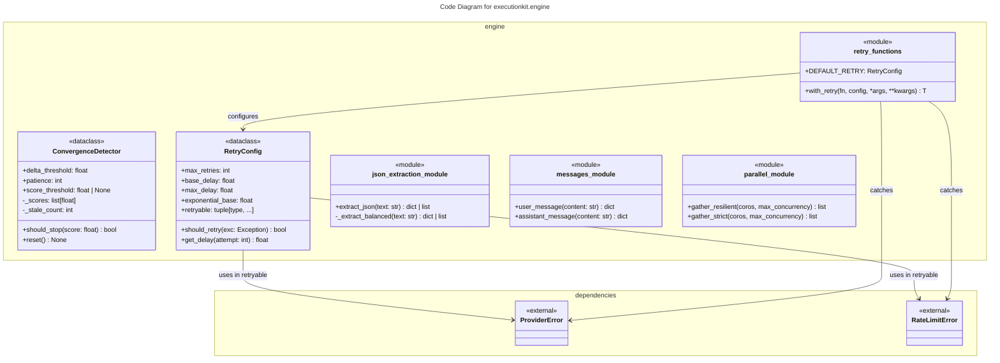
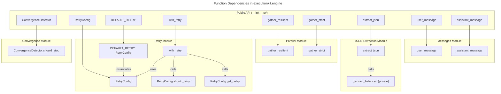

# C4 Code Level: executionkit.engine

## Overview

- **Name**: executionkit.engine (Engine Utilities)
- **Description**: Shared infrastructure utilities for composable LLM reasoning patterns, providing core functionality for retry logic, parallel execution, convergence detection, JSON extraction, and message construction
- **Location**: `executionkit/engine/`
- **Language**: Python 3.10+
- **Purpose**: Provides reusable, production-grade utilities that enable pattern implementations to handle common challenges: transient failures (retry), concurrent operations (parallel), iterative refinement (convergence), LLM response parsing (JSON extraction), and OpenAI-compatible message construction (messages)

## Code Elements

### Module: `__init__.py`

**File**: `executionkit/engine/__init__.py` (lines 1-14)

Public API exports for the engine module. Provides convenient access to the core utilities without requiring direct imports from submodules.

#### Exports

- `DEFAULT_RETRY: RetryConfig` (from `retry.py`)
  - Default retry configuration with sensible defaults for LLM provider errors
  - Location: `retry.py:28`

- `ConvergenceDetector: class` (from `convergence.py`)
  - Detects convergence in iterative processes based on score stability
  - Location: `convergence.py:8`

- `RetryConfig: class` (from `retry.py`)
  - Configuration dataclass for retry behavior
  - Location: `retry.py:14`

- `gather_resilient: async function` (from `parallel.py`)
  - Gathers concurrent tasks with max concurrency, returns results and exceptions mixed
  - Location: `parallel.py:10`

- `gather_strict: async function` (from `parallel.py`)
  - Gathers concurrent tasks with max concurrency, propagates exceptions immediately
  - Location: `parallel.py:31`

- `with_retry: async function` (from `retry.py`)
  - Wraps async functions with retry logic
  - Location: `retry.py:31`

- `user_message: function` (from `messages.py`)
  - Constructs an OpenAI-compatible user role message dict
  - Location: `messages.py:8`

- `assistant_message: function` (from `messages.py`)
  - Constructs an OpenAI-compatible assistant role message dict
  - Location: `messages.py:13`

---

### Module: `convergence.py`

**File**: `executionkit/engine/convergence.py` (lines 1-35)

Implements convergence detection for iterative LLM reasoning patterns. Detects when an iterative process has stabilized by monitoring score deltas and optionally checking absolute score thresholds.

#### Classes

**`ConvergenceDetector`** (lines 7-34)
- **Type**: Dataclass (frozen=False, slots=True)
- **Purpose**: Tracks score progression and detects when iteration should stop
- **Dependencies**: `math` (stdlib), `dataclasses` (stdlib)

##### Attributes

- `delta_threshold: float` (default: 0.01)
  - Maximum allowable change in score between iterations to be considered stable
  - Type: float
  - Mutable: Yes (init parameter)

- `patience: int` (default: 3)
  - Number of consecutive stable iterations required to declare convergence
  - Type: int
  - Mutable: Yes (init parameter)

- `score_threshold: float | None` (default: None)
  - Optional absolute score value that triggers immediate convergence
  - Type: Optional[float]
  - Mutable: Yes (init parameter)

- `_scores: list[float]` (default: [], init=False, repr=False)
  - Internal state: full history of scores, one entry appended per `should_stop()` call
  - Type: list[float]
  - Mutable: Yes (internal)

- `_stale_count: int` (default: 0, init=False, repr=False)
  - Internal state: count of consecutive stale (stable) iterations
  - Type: int
  - Mutable: Yes (internal)

##### Methods

**`should_stop(score: float) -> bool`** (lines 15-34)
- **Description**: Determines whether iteration should terminate based on current score
- **Parameters**:
  - `score: float` - Current iteration score, expected range [0.0, 1.0]
- **Returns**: `bool` - True if convergence detected or threshold reached, False otherwise
- **Validation**: Raises `ValueError` if score is NaN or outside [0.0, 1.0]
- **Logic**:
  1. Validates score is valid (not NaN, in range [0, 1])
  2. Appends score to `_scores` list
  3. If `score_threshold` is set and score meets/exceeds it, stops immediately
  4. Needs at least 2 scores to compute delta — the first call always returns False from the delta check
  5. Calculates delta as `abs(_scores[-1] - _scores[-2])`
  6. Increments `_stale_count` if delta <= `delta_threshold`, resets `_stale_count` to 0 otherwise
  7. Returns True if `_stale_count >= patience` (convergence achieved)
- **Dependencies**: `math.isnan()` for NaN validation
- **Usage Pattern**: Call once per iteration, acting as stateful iterator sentinel

**`reset() -> None`**
- **Description**: Clears all tracked state — empties `_scores` list and resets `_stale_count` to 0
- **Parameters**: None
- **Returns**: None
- **Use case**: Reuse the same detector across multiple independent loops without creating a new instance

---

### Module: `json_extraction.py`

**File**: `executionkit/engine/json_extraction.py` (lines 1-46)

Utilities for extracting JSON objects from unstructured LLM text responses. Implements a stateful JSON parser that handles strings and escape sequences to locate properly balanced JSON objects.

#### Functions

**`extract_json(text: str) -> dict[str, Any] | list[Any]`** (lines 21+)
- **Description**: Extracts and parses the first balanced JSON object or array from raw LLM text
- **Parameters**:
  - `text: str` - Raw text potentially containing JSON (e.g., LLM output)
- **Returns**: `dict[str, Any] | list[Any]` - Parsed JSON value (object or array)
- **Raises**:
  - `ValueError("No JSON object found")` if no opening `{` or `[` exists in text
  - `ValueError("No balanced JSON object found")` if no matching closing brace/bracket
  - `json.JSONDecodeError` if extracted fragment is malformed JSON
- **Algorithm**: Strips markdown code fences (` ```json ... ``` ` and generic ` ``` ... ``` `) from the text first, then delegates to `_extract_balanced()` (private) which scans for the first balanced `{…}` or `[…]` block, and finally parses with `json.loads()`
- **Complexity**: O(n) where n = length of text
- **Edge Cases Handled**: Nested structures, escaped quotes, escaped backslashes, unbalanced braces, markdown-fenced JSON blocks
- **Dependencies**: `json` (stdlib), `_extract_balanced()` (internal private helper)
- **Location**: Lines 21+

**`_extract_balanced(text: str) -> dict[str, Any] | list[Any]`** (lines 71+, private)
- **Description**: Private helper; scans raw text for the first balanced `{…}` or `[…]` block, parses and returns result
- **Not part of the public API** — called internally by `extract_json()`

---

### Module: `messages.py`

**File**: `executionkit/engine/messages.py` (lines 1-15)

Lightweight helpers for constructing OpenAI-compatible chat message dicts. Eliminates repeated inline dict literals throughout pattern implementations and keeps message construction consistent.

#### Functions

**`user_message(content: str) -> dict[str, Any]`** (line 8)
- **Description**: Returns an OpenAI-compatible user role message dict
- **Parameters**:
  - `content: str` - Message text content
- **Returns**: `{"role": "user", "content": content}`
- **Dependencies**: None (pure Python)

**`assistant_message(content: str) -> dict[str, Any]`** (line 13)
- **Description**: Returns an OpenAI-compatible assistant role message dict
- **Parameters**:
  - `content: str` - Message text content
- **Returns**: `{"role": "assistant", "content": content}`
- **Dependencies**: None (pure Python)

---

### Module: `parallel.py`

**File**: `executionkit/engine/parallel.py` (lines 1-52)

Provides utilities for running multiple coroutines concurrently with controlled concurrency limits. Implements two strategies: resilient (returns mixed results and exceptions) and strict (propagates exceptions immediately).

#### Functions

**`gather_resilient(coros: list[Coroutine[Any, Any, Any]], max_concurrency: int = 10) -> list[Any | BaseException]`** (lines 10-28)
- **Description**: Executes multiple coroutines concurrently with controlled concurrency, returning both results and exceptions
- **Parameters**:
  - `coros: list[Coroutine[Any, Any, Any]]` - List of coroutines to execute
  - `max_concurrency: int` (default: 10) - Maximum number of concurrent tasks
- **Returns**: `list[Any | BaseException]` - List with results or exceptions in original order
- **Raises**: `asyncio.CancelledError` if task cancellation is detected
- **Algorithm**:
  1. Creates semaphore with max_concurrency permits
  2. Wraps each coroutine with semaphore-gated executor
  3. Uses `asyncio.gather(..., return_exceptions=True)` to collect results and exceptions
  4. Post-processes to raise any CancelledError encountered
  5. Returns list of results/exceptions in original order
- **Error Handling**:
  - Exceptions from individual tasks are returned as values (not raised)
  - CancelledError is propagated (special handling)
  - Allows caller to examine which tasks failed without losing partial results
- **Concurrency Control**: Semaphore limits concurrent tasks to prevent resource exhaustion
- **Use Cases**: Batch processing where some failures are acceptable (e.g., validating multiple API responses)
- **Dependencies**: `asyncio` (stdlib)
- **Location**: Lines 10-28

**`gather_strict(coros: list[Coroutine[Any, Any, Any]], max_concurrency: int = 10) -> list[Any]`** (lines 31-51)
- **Description**: Executes multiple coroutines concurrently with controlled concurrency, failing fast on first exception
- **Parameters**:
  - `coros: list[Coroutine[Any, Any, Any]]` - List of coroutines to execute
  - `max_concurrency: int` (default: 10) - Maximum number of concurrent tasks
- **Returns**: `list[Any]` - List of results in original order (no exceptions)
- **Raises**:
  - Single exception if one task fails (unwrapped from ExceptionGroup)
  - Multiple exceptions wrapped in ExceptionGroup if multiple tasks fail
- **Algorithm**:
  1. Creates semaphore with max_concurrency permits
  2. Pre-allocates results list with correct length
  3. Wraps each coroutine with semaphore-gated executor
  4. Uses `asyncio.TaskGroup` to create all tasks and track completion
  5. TaskGroup propagates ExceptionGroup if any task fails
  6. Unwraps single-exception ExceptionGroup for cleaner error handling
  7. Casts and returns results list on success
- **Error Handling**:
  - Fails immediately on first exception via TaskGroup
  - Single exceptions are unwrapped (no ExceptionGroup wrapper)
  - Multiple exceptions remain in ExceptionGroup
- **Concurrency Control**: Semaphore limits concurrent tasks (same as gather_resilient)
- **Ordering**: Results array maintains original task order despite concurrent execution
- **Use Cases**: All-or-nothing workloads where partial success is unacceptable (e.g., distributed transaction)
- **Dependencies**: `asyncio` (stdlib)
- **Location**: Lines 31-51

---

### Module: `retry.py`

**File**: `executionkit/engine/retry.py` (lines 1-51)

Implements exponential backoff retry logic for async functions. Provides configurable retry behavior with selective exception handling, exponential delay, and jitter support.

#### Type Variables

**`T`** (line 10)
- Generic type variable for async function return values

#### Classes

**`RetryConfig`** (lines 13-26)
- **Type**: Frozen dataclass (slots=True)
- **Purpose**: Configuration for retry behavior, determines what to retry and how to backoff
- **Dependencies**: `executionkit.provider` (RateLimitError, ProviderError), `dataclasses` (stdlib)

##### Attributes

- `max_retries: int` (default: 3)
  - Maximum number of retry attempts (total attempts = max_retries + 1 initial attempt)
  - Type: int
  - Mutable: No (frozen dataclass)

- `base_delay: float` (default: 1.0)
  - Initial delay in seconds between retries
  - Type: float
  - Mutable: No (frozen dataclass)

- `max_delay: float` (default: 60.0)
  - Maximum delay cap in seconds (exponential backoff is clamped to this value)
  - Type: float
  - Mutable: No (frozen dataclass)

- `exponential_base: float` (default: 2.0)
  - Base for exponential backoff calculation (e.g., 2.0 = double delay each retry)
  - Type: float
  - Mutable: No (frozen dataclass)

- `retryable: tuple[type[Exception], ...]` (default: (RateLimitError, ProviderError))
  - Tuple of exception types that should trigger a retry
  - Type: tuple[type[Exception], ...]
  - Mutable: No (frozen dataclass)
  - Default behavior: Only retries rate limit and provider errors, fails immediately on other exceptions

##### Methods

**`should_retry(exc: Exception) -> bool`** (lines 21-22)
- **Description**: Determines if an exception warrants a retry
- **Parameters**:
  - `exc: Exception` - The exception raised during execution
- **Returns**: `bool` - True if exception type is in retryable tuple, False otherwise
- **Algorithm**: Type check using isinstance against retryable tuple
- **Usage**: Called in exception handler to decide whether to retry or propagate
- **Location**: Lines 21-22

**`get_delay(attempt: int) -> float`** (lines 24-25)
- **Description**: Calculates delay before the next retry attempt using full jitter
- **Parameters**:
  - `attempt: int` - Current attempt number (1-indexed)
- **Returns**: `float` - Delay in seconds (random, jittered)
- **Algorithm**: Full jitter — `random.uniform(0.0, cap)` where `cap = min(base_delay * (exponential_base ^ (attempt - 1)), max_delay)`
- **Example** (with defaults — values are ranges, not exact, due to jitter):
  - attempt 1: uniform(0.0, 1.0) sec
  - attempt 2: uniform(0.0, 2.0) sec
  - attempt 3: uniform(0.0, 4.0) sec
  - attempt 4: uniform(0.0, 8.0) sec, ...cap at 60.0
- **Properties**: Full jitter prevents thundering-herd effects when many clients retry simultaneously
- **Location**: Lines 24-25

#### Constants

**`DEFAULT_RETRY`** (line 28)
- **Type**: RetryConfig instance
- **Value**: RetryConfig() with all default values
- **Purpose**: Provides sensible defaults for LLM provider retry scenarios
- **Location**: Line 28

#### Functions

**`async with_retry(fn: Callable[..., Awaitable[T]], config: RetryConfig, *args: Any, **kwargs: Any) -> T`** (lines 31-50)
- **Description**: Executes an async function with automatic retry on transient failures
- **Parameters**:
  - `fn: Callable[..., Awaitable[T]]` - Async function to execute (e.g., LLM API call)
  - `config: RetryConfig` - Retry configuration controlling behavior
  - `*args: Any` - Positional arguments to pass to function
  - `**kwargs: Any` - Keyword arguments to pass to function
- **Returns**: `T` - Return value of successful function call
- **Raises**:
  - Any exception raised by `fn` if not retryable
  - Last retryable exception if max_retries exhausted
  - `asyncio.CancelledError` if task is cancelled (propagated, not retried)
  - `RuntimeError("Retry loop exited unexpectedly")` if logic error (should not occur)
- **Algorithm**:
  1. If max_retries is 0, execute fn once without retry and return result
  2. Loop from attempt 1 to max_retries + 1:
     - Try to execute fn with provided args/kwargs
     - On success, return result immediately
     - On CancelledError, propagate without retry
     - On other exception:
       - If non-retryable OR last attempt, raise exception
       - Otherwise, sleep for get_delay(attempt) seconds, then retry
  3. Raise RuntimeError if loop exits without return (logic error safeguard)
- **Behavior Details**:
  - Total possible attempts = max_retries + 1 (initial attempt plus retries)
  - Delays occur between attempts (not before first attempt)
  - CancelledError is always propagated (respects cancellation)
  - Non-retryable exceptions fail immediately (no wasted retries)
- **Concurrency**: Safe for concurrent use (each call has independent state)
- **Use Cases**: Wrapping LLM API calls, external service calls, transient failure scenarios
- **Example Usage**:
  ```python
  result = await with_retry(
    api_call, 
    RetryConfig(max_retries=5, base_delay=0.5),
    param1=value1
  )
  ```
- **Dependencies**: `asyncio` (stdlib), `executionkit.provider` (exception types)
- **Location**: Lines 31-50

---

## Dependencies

### Internal Dependencies

- **executionkit.provider** (from `retry.py`)
  - Imports: `ProviderError`, `RateLimitError`
  - Purpose: Exception types for selective retry triggering
  - Location: Used in `RetryConfig.retryable` default tuple

### External Dependencies

- **Python Standard Library**:
  - `asyncio` (modules: `parallel.py`, `retry.py`)
    - Semaphore, gather, TaskGroup, CancelledError, sleep
    - Purpose: Async concurrency management
  
  - `json` (module: `json_extraction.py`)
    - JSONDecodeError, loads()
    - Purpose: JSON parsing

  - `typing` (module: `messages.py`)
    - Any
    - Purpose: Return type annotation for message dicts
  
  - `math` (module: `convergence.py`)
    - isnan()
    - Purpose: NaN validation for score checking
  
  - `dataclasses` (modules: `convergence.py`, `retry.py`)
    - dataclass decorator, field()
    - Purpose: Type-safe configuration and state containers
  
  - `collections.abc` (module: `parallel.py`)
    - Awaitable, Sequence
    - Purpose: Type annotations for async functions and sequences
  
  - `typing` (modules: `parallel.py`, `retry.py`, `json_extraction.py`)
    - TypeVar, Callable, Any, cast
    - Purpose: Generic type support and type annotations

---

## Relationships

### Module Dependency Graph



### Function Call Graph



### Usage Patterns Between Modules

| From Module | To Module | Function | Purpose |
|------------|-----------|----------|---------|
| `__init__.py` | All modules | Re-exports | Public API convenience |
| `retry.py` | `provider` (external) | Exception types | Selective retry decisions |
| `json_extraction.py` | Internal | Function chaining | `extract_json` → `_extract_balanced` → `json.loads` |
| `parallel.py` | stdlib asyncio | Concurrency primitives | Task management |
| `convergence.py` | stdlib math | Validation | NaN checking |
| `messages.py` | _(none)_ | Pure helpers | Message dict construction |

---

## Code Characteristics

### Programming Paradigm

**Functional + Imperative with Dataclass Config Pattern**

- **Convergence Module**: Stateful object (dataclass) tracking internal state across method calls
- **Retry Module**: Configuration object (frozen dataclass) + pure function with side effects (sleep)
- **JSON Extraction**: Pure functions with no state (parsing utilities)
- **Parallel Module**: Async wrapper functions managing asyncio primitives
- **Module Organization**: Functions grouped by responsibility, configuration separated into dataclasses

### Type Safety

- **Type Hints**: Complete type annotations on all public functions and class attributes
- **Generics**: TypeVar `T` used in `retry.py` for generic async return types; `parallel.py` uses `Any` for coroutine inputs and outputs
- **Union Types**: `float | None`, `Any | BaseException`, `dict[str, Any]` for precise types
- **Immutability**: RetryConfig is frozen dataclass (immutable after creation)

### Error Handling

- **Explicit Validation**: `ConvergenceDetector.should_stop()` validates score range
- **Selective Retry**: `RetryConfig.should_retry()` only retries specific exceptions
- **Fast Failure**: `gather_strict()` fails immediately on exceptions via TaskGroup
- **Exception Preservation**: `gather_resilient()` returns exceptions as values
- **CancelledError**: Special handling in both retry and parallel modules to respect cancellation

### Performance Characteristics

- **Convergence**: O(1) per call, O(n) memory where n = number of iterations (stores full score history in `_scores`)
- **JSON Extraction**: O(n) linear scan of text, handles escape sequences correctly
- **Parallel Execution**: O(1) task scheduling, O(max_concurrency) memory for semaphore
- **Retry**: O(total_attempts) with exponential backoff capping at max_delay

### Design Patterns Used

1. **Configuration Object Pattern**: `RetryConfig`, `ConvergenceDetector` as stateful config containers
2. **Semaphore Concurrency Pattern**: Limits concurrent tasks without cancelling non-started ones
3. **Stateful Iterator Pattern**: `ConvergenceDetector.should_stop()` tracks state across calls
4. **Parser Combinator Pattern**: `extract_json()` → `_extract_balanced()` chain parsing steps
5. **Exponential Backoff Pattern**: `RetryConfig.get_delay()` implements standard backoff formula

---

## Testing Considerations

Based on code structure, key test areas:

1. **Convergence Detection**:
   - Edge cases: NaN scores, out-of-range scores, score_threshold boundary
   - Stateful behavior: multiple calls, reset patterns
   - Delta calculation: floating-point precision

2. **JSON Extraction**:
   - Nested objects, escaped quotes, escaped backslashes
   - Error cases: no JSON, unbalanced braces, non-object JSON
   - Edge cases: empty objects, deeply nested structures

3. **Parallel Execution**:
   - Concurrency limits: verify max_concurrency not exceeded
   - Error mixing: gather_resilient handles mixed success/failure
   - Ordering: results maintain original order
   - Cancellation: CancelledError propagates

4. **Retry Logic**:
   - Exponential backoff: verify delay calculation
   - Selective retry: only retryable exceptions trigger retry
   - Exhaustion: correct exception after max_retries
   - Cancellation: CancelledError not retried

---

## Notes

- The `engine` module serves as the foundation for pattern implementations
- Default retry configuration targets LLM provider errors (RateLimitError, ProviderError)
- `ConvergenceDetector` is designed for iterative refinement patterns (e.g., multi-turn reasoning)
- JSON extraction utilities are optimized for LLM output parsing where JSON is embedded in text
- Parallel functions provide two strategies: fault-tolerant (resilient) and all-or-nothing (strict)
- All async functions respect task cancellation (CancelledError propagated immediately)
