# C4 Code Level: executionkit/patterns

## Overview

- **Name**: Patterns Module - Core LLM Reasoning Patterns
- **Description**: Implements four core composable reasoning patterns for LLM applications: consensus-based multi-sample voting, iterative refinement loops with evaluation, and ReAct-style tool-calling agent loops. Provides foundational utilities for cost tracking, budget enforcement, and response handling.
- **Location**: `executionkit/patterns/`
- **Language**: Python 3.11+
- **Purpose**: Provides reusable, budget-aware reasoning patterns for building composable LLM applications with OpenAI-compatible APIs. Patterns support cost tracking, retry logic, tool calling, and evaluation-driven iteration.

## Code Elements

### Functions

#### `validate_score(score: float) -> float`
- **Description**: Validates that an evaluator score is in the valid range [0.0, 1.0] and not NaN.
- **Location**: `base.py:18-21`
- **Dependencies**: `math` module
- **Parameters**:
  - `score: float` - The score value to validate
- **Return Type**: `float` - The validated score
- **Raises**: `ValueError` if score is NaN or outside [0.0, 1.0] range

#### `checked_complete(provider: LLMProvider, messages: Sequence[dict[str, Any]], tracker: CostTracker, budget: TokenUsage | None, retry: RetryConfig | None, **kwargs: Any) -> LLMResponse`
- **Description**: Makes a budget-aware LLM API call with retry logic. Checks token and LLM call budgets before dispatching (via `_check_budget`) and records usage in the cost tracker.
- **Location**: `base.py:24-55`
- **Dependencies**: `LLMProvider`, `CostTracker`, `BudgetExhaustedError`, `with_retry`, `DEFAULT_RETRY`, `TokenUsage`, `RetryConfig`, `LLMResponse`, `_check_budget`, `_BUDGET_FIELD_LABELS`
- **Parameters**:
  - `provider: LLMProvider` - The LLM provider to use
  - `messages: Sequence[dict[str, Any]]` - Messages to send to the LLM
  - `tracker: CostTracker` - Cost tracker instance to record usage
  - `budget: TokenUsage | None` - Optional token budget constraints
  - `retry: RetryConfig | None` - Optional retry configuration
  - `**kwargs: Any` - Additional parameters to pass to provider.complete()
- **Return Type**: `LLMResponse` - Response from the LLM provider
- **Raises**: `BudgetExhaustedError` if any budget constraint would be exceeded

#### `_check_budget(budget: TokenUsage, current: TokenUsage, fields: tuple[str, ...], *, sentinel_suffix: str, exceeded_suffix: str) -> None`
- **Description**: Validates selected `TokenUsage` fields by comparing the configured `budget` against the current accumulated `TokenUsage`. Iterates over the supplied `fields` and raises `BudgetExhaustedError` with a descriptive message if a field has reached a sentinel condition or would exceed its allowed limit.
- **Location**: `base.py`
- **Dependencies**: `TokenUsage`, `BudgetExhaustedError`, `_BUDGET_FIELD_LABELS`
- **Parameters**:
  - `budget: TokenUsage` - Maximum allowed token/call counts
  - `current: TokenUsage` - Current accumulated token/call usage to validate against the budget
  - `fields: tuple[str, ...]` - Names of the `TokenUsage` fields to check
  - `sentinel_suffix: str` - Message suffix used when a budget field is already at its sentinel/exhausted value
  - `exceeded_suffix: str` - Message suffix used when the current usage would exceed the configured budget
- **Return Type**: `None`
- **Raises**: `BudgetExhaustedError` naming the field that hit a sentinel condition or exceeded its budget (e.g., "input_tokens", "llm_calls")

#### `_BUDGET_FIELD_LABELS`
- **Description**: Module-level dict mapping `TokenUsage` field names to human-readable label strings used in `BudgetExhaustedError` messages. Drives the field-loop in `_check_budget`, making it easy to add new budget dimensions without modifying control flow.
- **Location**: `base.py`
- **Type**: `dict[str, str]`
- **Example entries**: `{"input_tokens": "input tokens", "output_tokens": "output tokens", "llm_calls": "LLM calls"}`
- **Dependencies**: None

#### `_note_truncation(response: LLMResponse, metadata: dict[str, Any], context: str) -> None`
- **Description**: Logs a warning and increments truncation counter in metadata if the LLM response was truncated (finish_reason indicates truncation).
- **Location**: `base.py:58-66`
- **Dependencies**: `LLMResponse`, `warnings` module
- **Parameters**:
  - `response: LLMResponse` - The LLM response to check
  - `metadata: dict[str, Any]` - Metadata dictionary to update
  - `context: str` - Context string for warning message
- **Return Type**: `None`
- **Side Effects**: Updates metadata dict, may issue warnings

#### `consensus(provider: LLMProvider, prompt: str, *, num_samples: int = 5, strategy: VotingStrategy | str = "majority", temperature: float = 0.9, max_tokens: int = 4096, max_concurrency: int = 5, retry: RetryConfig | None = None, **_: Any) -> PatternResult[str]`
- **Description**: Runs the consensus pattern - generates multiple LLM samples in parallel and selects the most common response using majority or unanimous voting.
- **Location**: `consensus.py:15-81`
- **Dependencies**: `LLMProvider`, `CostTracker`, `gather_strict`, `RetryConfig`, `ConsensusFailedError`, `LLMResponse`, `PatternResult`, `VotingStrategy`, `checked_complete`, `_note_truncation`
- **Parameters**:
  - `provider: LLMProvider` - The LLM provider to use
  - `prompt: str` - The prompt to send to the LLM
  - `num_samples: int = 5` - Number of samples to generate
  - `strategy: VotingStrategy | str = "majority"` - Voting strategy (majority or unanimous)
  - `temperature: float = 0.9` - Temperature for sampling diversity
  - `max_tokens: int = 4096` - Maximum tokens per response
  - `max_concurrency: int = 5` - Maximum concurrent requests
  - `retry: RetryConfig | None = None` - Optional retry configuration
  - `**_: Any` - Ignored additional arguments
- **Return Type**: `PatternResult[str]` - Result containing the consensus answer, cost, and metadata
- **Raises**: `ConsensusFailedError` if voting strategy cannot be satisfied

#### `refine_loop(provider: LLMProvider, prompt: str, *, evaluator: Evaluator | None = None, target_score: float = 0.9, max_iterations: int = 5, patience: int = 3, delta_threshold: float = 0.01, temperature: float = 0.7, max_tokens: int = 4096, max_cost: TokenUsage | None = None, retry: RetryConfig | None = None, **_: Any) -> PatternResult[str]`
- **Description**: Runs the refinement loop pattern - iteratively generates, evaluates, and refines LLM outputs until target quality is reached or convergence is detected.
- **Location**: `refine_loop.py:18-95`
- **Dependencies**: `LLMProvider`, `CostTracker`, `ConvergenceDetector`, `extract_json`, `RetryConfig`, `MaxIterationsError`, `Evaluator`, `PatternResult`, `TokenUsage`, `_TrackedProvider`, `validate_score`, `_default_evaluator`, `_parse_score`, `_build_refinement_prompt`
- **Parameters**:
  - `provider: LLMProvider` - The LLM provider to use
  - `prompt: str` - The initial prompt/task description
  - `evaluator: Evaluator | None = None` - Optional custom evaluator function; uses default if None
  - `target_score: float = 0.9` - Target quality score [0.0-1.0] to stop iteration
  - `max_iterations: int = 5` - Maximum number of refinement iterations
  - `patience: int = 3` - Patience parameter for convergence detection
  - `delta_threshold: float = 0.01` - Minimum score change to continue iterating
  - `temperature: float = 0.7` - Temperature for generation
  - `max_tokens: int = 4096` - Maximum tokens per response
  - `max_cost: TokenUsage | None = None` - Optional token budget
  - `retry: RetryConfig | None = None` - Optional retry configuration
  - `**_: Any` - Ignored additional arguments
- **Return Type**: `PatternResult[str]` - Result containing refined answer, final score, cost, and metadata
- **Raises**: `MaxIterationsError` if max_iterations reached without meeting stop criteria

#### `react_loop(provider: ToolCallingProvider, prompt: str, tools: Sequence[Tool], *, max_rounds: int = 8, max_observation_chars: int = 12000, max_history_messages: int | None = None, tool_timeout: float | None = None, temperature: float = 0.3, max_tokens: int = 4096, max_cost: TokenUsage | None = None, retry: RetryConfig | None = None, **_: Any) -> PatternResult[str]`
- **Description**: Runs the ReAct pattern - an agent loop where the LLM can call tools, observe results, and reason toward a final answer. Maintains message history for multi-turn interaction.
- **Location**: `react_loop.py:16-88`
- **Dependencies**: `ToolCallingProvider`, `CostTracker`, `RetryConfig`, `LLMResponse`, `MaxIterationsError`, `ToolCall`, `PatternResult`, `TokenUsage`, `Tool`, `checked_complete`, `_note_truncation`, `_execute_tool_call`, `_truncate`, `_validate_tool_args`, `_trim_messages`
- **Parameters**:
  - `provider: ToolCallingProvider` - The tool-calling LLM provider
  - `prompt: str` - Initial user prompt/task
  - `tools: Sequence[Tool]` - Available tools the agent can call
  - `max_rounds: int = 8` - Maximum number of agent rounds
  - `max_observation_chars: int = 12000` - Maximum characters to keep from tool observations
  - `max_history_messages: int | None = None` - When set, trims the message history to at most this many messages before each LLM call (preserving the system message). Prevents context window overflow on long tool-calling loops.
  - `tool_timeout: float | None = None` - Optional timeout override for tool execution
  - `temperature: float = 0.3` - Temperature for LLM (typically low for agent reasoning)
  - `max_tokens: int = 4096` - Maximum tokens per LLM response
  - `max_cost: TokenUsage | None = None` - Optional token budget
  - `retry: RetryConfig | None = None` - Optional retry configuration
  - `**_: Any` - Ignored additional arguments
- **Return Type**: `PatternResult[str]` - Result containing final answer, cost, and metadata
- **Raises**: `TypeError` if provider does not support tool calling, `MaxIterationsError` if max_rounds reached without final answer

#### `_default_evaluator(text: str, provider: LLMProvider) -> float`
- **Description**: Default evaluator for refine_loop, implemented as a nested async function inside `refine_loop`. Uses an LLM to score answers on a 0-10 scale, then calls `_parse_score` to extract the raw score and divides by 10 to normalize it to [0.0, 1.0].
- **Location**: `refine_loop.py:98-116`
- **Dependencies**: `LLMProvider`, `extract_json`, `_parse_score`
- **Parameters**:
  - `text: str` - The text/answer to evaluate
  - `provider: LLMProvider` - The LLM provider to use for evaluation
- **Return Type**: `float` - Normalized score in [0.0, 1.0] range
- **Raises**: May raise ValueError if score cannot be extracted

#### `_parse_score(content: str) -> float`
- **Description**: Parses a numeric score from LLM evaluator response text. Handles JSON payload extraction and fallback number pattern matching. Returns the raw score on the 0-10 scale as a float (no normalization). Normalization to [0.0, 1.0] is performed by the `_default_evaluator` nested function which divides by 10.
- **Location**: `refine_loop.py:119-135`
- **Dependencies**: `extract_json`, `_NUMBER_PATTERN` (regex)
- **Parameters**:
  - `content: str` - The evaluator LLM response content
- **Return Type**: `float` - Raw score on the 0-10 scale
- **Raises**: `ValueError` if no score can be extracted

#### `_build_refinement_prompt(original_prompt: str, answer: str, score: float) -> str`
- **Description**: Constructs a prompt for the refinement iteration telling the LLM to improve a previous answer given its score.
- **Location**: `refine_loop.py:138-145`
- **Dependencies**: None
- **Parameters**:
  - `original_prompt: str` - The original task prompt
  - `answer: str` - The current answer to improve
  - `score: float` - The current score in [0.0-1.0] range
- **Return Type**: `str` - Formatted refinement prompt
- **Side Effects**: None (pure function)

#### `_validate_tool_args(tool_call: ToolCall, tool: Tool) -> None`
- **Description**: Validates tool arguments against the expected tool schema. Raises an error if arguments are invalid.
- **Location**: `react_loop.py`
- **Dependencies**: `ToolCall`, `Tool`
- **Parameters**:
  - `tool_call: ToolCall` - The tool call whose arguments are to be validated
  - `tool: Tool` - The tool definition to validate against
- **Return Type**: `None`
- **Raises**: `ValueError` if tool arguments are invalid

#### `_truncate(text: str, max_chars: int) -> str`
- **Description**: Truncates text to a maximum number of characters, adding ellipsis if truncated.
- **Location**: `react_loop.py`
- **Dependencies**: None
- **Parameters**:
  - `text: str` - The text to truncate
  - `max_chars: int` - Maximum allowed character count
- **Return Type**: `str` - Truncated text
- **Side Effects**: None (pure function)

#### `_trim_messages(messages: list, max_messages: int) -> list`
- **Description**: Trims message history to at most max_messages entries, preserving the system message.
- **Location**: `react_loop.py`
- **Dependencies**: None
- **Parameters**:
  - `messages: list` - The message history to trim
  - `max_messages: int` - Maximum number of messages to retain
- **Return Type**: `list` - Trimmed message list
- **Side Effects**: None (returns new list)

#### `async _execute_tool_call(tool_call: ToolCall, tools: list[Tool]) -> str`
- **Description**: Dispatches a tool call to the appropriate tool, handling validation, execution, and error capturing. Returns error message if tool fails or is unavailable.
- **Location**: `react_loop.py`
- **Dependencies**: `ToolCall`, `Tool`, `_validate_tool_args`, exception handling
- **Parameters**:
  - `tool_call: ToolCall` - The tool call to execute
  - `tools: list[Tool]` - List of available tools
- **Return Type**: `str` - Tool execution result or error message
- **Side Effects**: None (calls external tool, but no side effects on state)

### Classes

#### `_TrackedProvider`
- **Description**: Wrapper around an LLM provider that adds cost tracking, budget enforcement, and metadata collection. Used internally by patterns to monitor resource usage.
- **Location**: `base.py:69-110`
- **Attributes**:
  - `_provider: LLMProvider` - Wrapped provider instance
  - `_tracker: CostTracker` - Tracks cumulative token usage
  - `_metadata: dict[str, Any]` - Metadata dict shared with the pattern
  - `_budget: TokenUsage | None` - Optional token budget constraints
  - `_retry: RetryConfig | None` - Retry configuration
  - `_context: str` - Context string for error messages
- **Properties**:
  - `supports_tools: bool` - Delegates to the wrapped provider's `supports_tools` attribute rather than hardcoding `Literal[True]`; this allows `_TrackedProvider` to accurately reflect the capabilities of the underlying provider at runtime
- **Methods**:
  - `__init__(provider: LLMProvider, tracker: CostTracker, metadata: dict[str, Any], *, budget: TokenUsage | None, retry: RetryConfig | None, context: str) -> None` - Initializes the wrapper with dependencies
  - `complete(messages: Sequence[dict[str, Any]], *, temperature: float | None = None, max_tokens: int | None = None, tools: Sequence[dict[str, Any]] | None = None, **kwargs: Any) -> LLMResponse` - Wraps provider.complete() with budget and truncation checks
- **Dependencies**: `LLMProvider`, `CostTracker`, `checked_complete`, `_note_truncation`

### Module: `__init__.py`
- **Description**: Exposes the three main public pattern functions for the executionkit package.
- **Location**: `__init__.py:1-7`
- **Exports**:
  - `consensus` - Multi-sample voting pattern
  - `react_loop` - Tool-calling agent pattern
  - `refine_loop` - Iterative refinement pattern
- **Dependencies**: `executionkit.patterns.consensus`, `executionkit.patterns.react_loop`, `executionkit.patterns.refine_loop`

## Dependencies

### Internal Dependencies (executionkit modules)

- **executionkit.cost**: `CostTracker` class for tracking token usage
- **executionkit.engine.retry**: `RetryConfig`, `DEFAULT_RETRY`, `with_retry()` for retry logic
- **executionkit.engine.parallel**: `gather_strict()` for concurrent execution
- **executionkit.engine.convergence**: `ConvergenceDetector` for detecting convergence in refinement loops
- **executionkit.engine.json_extraction**: `extract_json` for parsing JSON from LLM responses
- **executionkit.provider**: 
  - `LLMProvider` base class
  - `ToolCallingProvider` subclass for tool-calling agents
  - `LLMResponse` type for LLM responses
  - `ToolCall`, `Tool` types for agent tools
  - Exception types: `BudgetExhaustedError`, `ConsensusFailedError`, `MaxIterationsError`
- **executionkit.types**: 
  - `PatternResult[T]` generic result type
  - `TokenUsage` type for budget tracking
  - `Evaluator` type alias for evaluation functions
  - `VotingStrategy` enum for consensus voting options

### External Dependencies

None - executionkit has zero external runtime dependencies as specified in `pyproject.toml`.

### Standard Library Dependencies

- `asyncio` - For async/await support and task management (react_loop)
- `logging` - Module-level import in `react_loop.py` for structured diagnostic logging
- `collections.Counter` - For vote counting in consensus
- `json` - For serializing tool arguments (react_loop)
- `math` - For NaN checking in score validation
- `re` - For regex number pattern matching (refine_loop)
- `typing` - For type hints (Any, Sequence)
- `warnings` - For logging truncation warnings

## Relationships

The patterns module implements a layered architecture where higher-level patterns build on shared base utilities:

```mermaid
---
title: Code Diagram - Patterns Module Architecture
---
classDiagram
    namespace executionkit_patterns {
        class consensus_fn {
            <<function>>
            +async consensus(provider, prompt, ...) PatternResult
            -sample() LLMResponse
        }
        
        class refine_loop_fn {
            <<function>>
            +async refine_loop(provider, prompt, ...) PatternResult
            -_default_evaluator(text, provider) float
            -_parse_score(content) float
            -_build_refinement_prompt(...) str
        }
        
        class react_loop_fn {
            <<function>>
            +async react_loop(provider, prompt, tools, ...) PatternResult
            -_validate_tool_args(tool_call, tool) None
            -_truncate(text, max_chars) str
            -_trim_messages(messages, max_messages) list
            -async _execute_tool_call(tool_call, tools) str
        }
        
        class TrackedProvider {
            <<class>>
            +supports_tools: bool (property, delegates to _provider)
            -_provider: LLMProvider
            -_tracker: CostTracker
            -_metadata: dict
            -_budget: TokenUsage | None
            -_retry: RetryConfig | None
            -_context: str
            +__init__(...)
            +async complete(messages, ...) LLMResponse
        }
        
        class utilities {
            <<module>>
            +validate_score(score) float
            +checked_complete(provider, messages, ...) LLMResponse
            -_check_budget(tracker, budget) None
            -_BUDGET_FIELD_LABELS dict
            -_note_truncation(response, metadata, context) void
            -_TrackedProvider TrackedProvider
        }
    }

    namespace executionkit_deps {
        class LLMProvider {
            <<interface>>
            +async complete(messages, ...) LLMResponse
        }
        
        class ToolCallingProvider {
            <<interface>>
            +supports_tools: bool
            +async complete(messages, tools=None, ...) LLMResponse
        }
        
        class CostTracker {
            +record(response)
            +to_usage() TokenUsage
        }
        
        class ConvergenceDetector {
            +should_stop(score) bool
        }
        
        class VotingStrategy {
            <<enum>>
            MAJORITY
            UNANIMOUS
        }
        
        class PatternResult {
            <<generic>>
            +value: T
            +cost: TokenUsage
            +score: float | None
            +metadata: dict
        }
    }

    consensus_fn --|> utilities : uses
    consensus_fn --|> LLMProvider : takes
    consensus_fn --|> PatternResult : returns
    consensus_fn --|> VotingStrategy : uses
    
    refine_loop_fn --|> utilities : uses
    refine_loop_fn --|> TrackedProvider : creates
    refine_loop_fn --|> LLMProvider : takes
    refine_loop_fn --|> PatternResult : returns
    refine_loop_fn --|> ConvergenceDetector : uses
    
    react_loop_fn --|> utilities : uses
    react_loop_fn --|> ToolCallingProvider : takes
    react_loop_fn --|> PatternResult : returns
    react_loop_fn --|> Tool : manages
    
    TrackedProvider --|> LLMProvider : wraps
    TrackedProvider --|> CostTracker : uses
    TrackedProvider --|> utilities : calls checked_complete
```

### Pattern Execution Flow

**Consensus Pattern**:
1. Takes a prompt and spawns `num_samples` parallel LLM calls with high temperature
2. Collects normalized responses and counts occurrences
3. Applies voting strategy (MAJORITY or UNANIMOUS) to select winner
4. Returns PatternResult with winning text, agreement metrics, and cost

**Refine Loop Pattern**:
1. Wraps provider in `_TrackedProvider` for budget enforcement
2. Iteratively generates text with initial prompt
3. Evaluates with custom evaluator or `_default_evaluator` (uses LLM)
4. If score meets target or convergence detected, returns result
5. Otherwise, builds refinement prompt with score feedback and iterates
6. Raises MaxIterationsError if iteration limit reached

**ReAct Loop Pattern**:
1. Validates provider supports tool calling
2. Maintains message history starting with user prompt
3. Each round: sends messages with tool schemas, gets response
4. If response has no tool calls, returns final answer
5. Otherwise, executes each tool call, truncates observations, appends to history
6. Continues until final answer or max_rounds reached
7. Raises MaxIterationsError if stuck in tool loops

### Cross-Pattern Dependencies

- **All patterns** use:
  - `checked_complete()` for budget-aware LLM calls
  - `_note_truncation()` for response truncation warning
  - `CostTracker` for usage aggregation
  - `PatternResult` for consistent result type

- **Refine Loop** adds:
  - `_TrackedProvider` for continuous budget enforcement across iterations
  - `ConvergenceDetector` for early stopping based on score plateau

- **ReAct Loop** adds:
  - Message history management for multi-turn interaction
  - Tool execution and timeout handling
  - Observation truncation to manage context window

## Code Style & Patterns

### Async Design
- All three main patterns are async functions using `await` for LLM calls and tool execution
- Uses `asyncio.wait_for()` for timeout enforcement in react_loop
- Uses `gather_strict()` for safe concurrent execution in consensus

### Type Annotations
- Full type hints on all function signatures following PEP 484
- Generic `PatternResult[T]` for type-safe result handling
- Union types for optional parameters (e.g., `RetryConfig | None`)
- Sequence types for flexible input (not just List)

### Error Handling
- Explicit error checking for budget exhaustion before LLM calls
- Custom exception types propagated from provider (ConsensusFailedError, MaxIterationsError)
- Graceful tool failure handling with error strings returned to agent
- Score validation with clear ValueError messages

### Immutability
- Response objects treated as immutable, never modified in-place
- Metadata dicts created fresh for each pattern run
- Tool call dicts reconstructed from original objects rather than modified

### Code Organization
- Shared utilities in `base.py` (`validate_score`, `checked_complete`, `_TrackedProvider`)
- Helper functions prefixed with `_` for internal implementation details
- Each pattern in its own file with clear responsibility boundaries

## Notes

- **Python 3.11+ Required**: Uses modern type hint syntax (`X | None` instead of `Optional[X]`)
- **Async Throughout**: All patterns are async - no blocking I/O
- **Budget Awareness**: All patterns respect TokenUsage budgets and raise BudgetExhaustedError if exceeded
- **Cost Tracking**: All patterns return cost metadata for monitoring resource usage
- **Metadata Collection**: Patterns collect iteration counts, stop reasons, truncation counts, and pattern-specific metrics
- **Retry Policy**: All patterns respect optional RetryConfig for transient failure handling
- **Tool Calling**: ReAct loop requires ToolCallingProvider with tool schema support; basic patterns work with any LLMProvider
- **Convergence Detection**: Refine loop uses ConvergenceDetector to stop early when improvement plateaus, respecting patience parameter
- **Default Evaluator**: Refine loop includes LLM-based default evaluator for convenience, but supports custom evaluators
