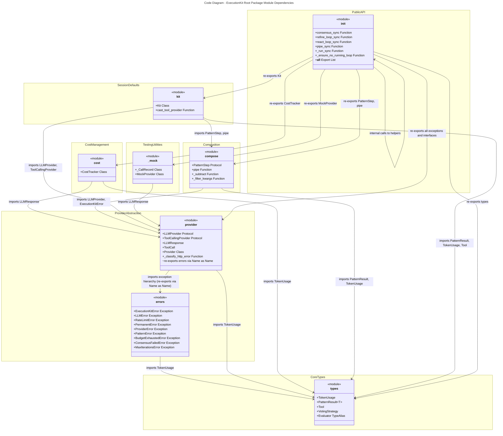
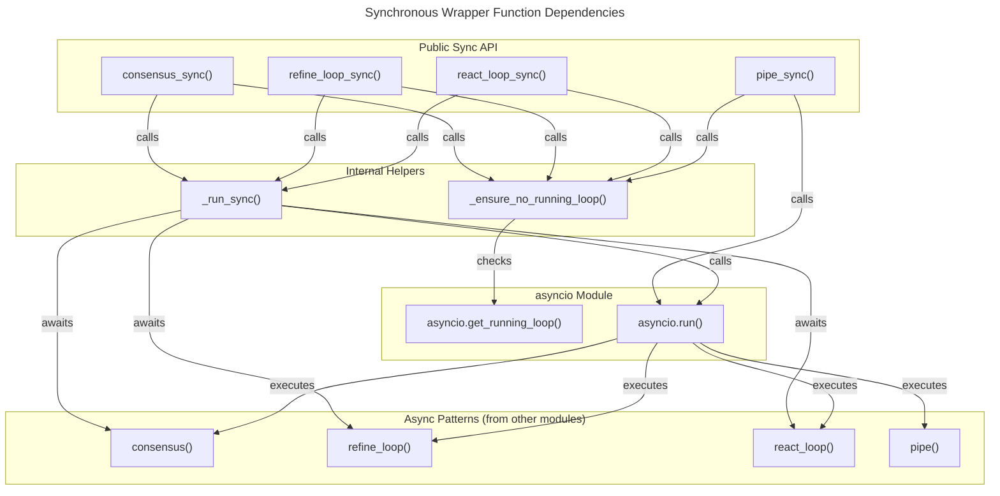
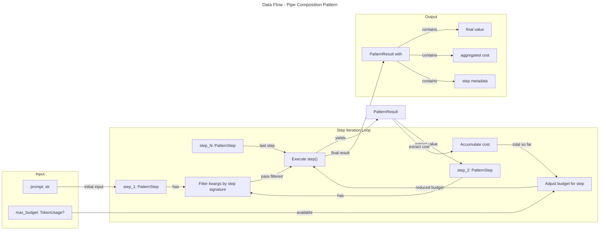
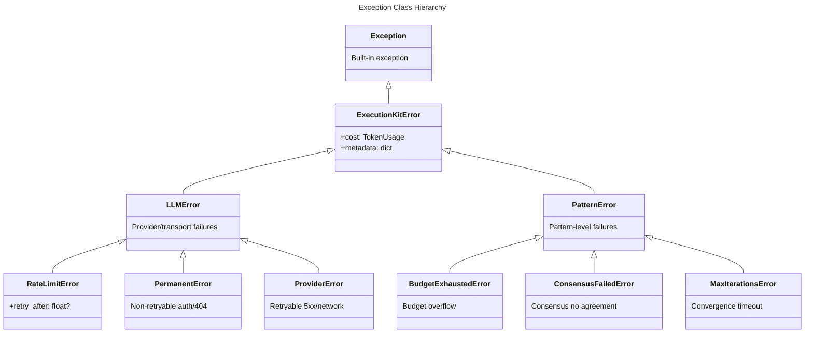

# C4 Code Level: executionkit Root Package

## Overview

- **Name**: ExecutionKit Root Package
- **Description**: Core types, provider abstractions, composition primitives, cost tracking, mock testing utilities, and public API for a Python library enabling composable LLM reasoning patterns
- **Location**: `executionkit/` ([GitHub](https://github.com/tafreeman/executionkit/tree/main/executionkit))
- **Language**: Python 3.11+
- **Purpose**: Provides the foundational API surface, type definitions, provider abstractions, and utility functions for building modular LLM-based applications with support for multiple reasoning patterns (consensus, refinement loops, React-style tool use)

## Code Elements

> **Scope note:** This document covers all code in the root `executionkit/` package files (not subdirectories). Public API elements are marked; private implementation helpers (prefixed `_`) are included because this is a C4 Level 4 (code-level) document — they form the internal structure of the public contracts.

### Classes/Dataclasses

#### `TokenUsage`
- **Type**: Frozen dataclass
- **Location**: `executionkit/types.py:14-25`
- **Description**: Immutable aggregate of token consumption metrics tracking input tokens, output tokens, and LLM call count
- **Attributes**:
  - `input_tokens: int` - Number of input tokens consumed
  - `output_tokens: int` - Number of output tokens generated
  - `llm_calls: int` - Total number of LLM API calls made
- **Methods**:
  - `__add__(other: TokenUsage) -> TokenUsage` - Returns new TokenUsage with summed counters (supports cost accumulation)
- **Dependencies**: None

#### `PatternResult[T]`
- **Type**: Frozen generic dataclass
- **Location**: `executionkit/types.py:28-36`
- **Description**: Generic container for pattern execution results, encapsulating value, optional score, cost metrics, and metadata
- **Type Parameters**: `T` - Type of the result value
- **Attributes**:
  - `value: T` - The actual result value from pattern execution
  - `score: float | None` - Optional numeric score (e.g., confidence, quality metric)
  - `cost: TokenUsage` - Token usage incurred during execution
  - `metadata: dict[str, Any]` - Structured metadata about execution (pattern-specific)
- **Methods**:
  - `__str__() -> str` - Returns string representation of value
- **Dependencies**: `TokenUsage`

#### `Tool`
- **Type**: Frozen dataclass
- **Location**: `executionkit/types.py:39-55`
- **Description**: Specification for an executable tool that LLMs can invoke, with schema generation capability
- **Attributes**:
  - `name: str` - Tool identifier
  - `description: str` - Human-readable tool purpose
  - `parameters: dict[str, Any]` - JSON Schema defining tool parameters
  - `execute: Callable[..., Awaitable[str]]` - Async function to execute the tool
  - `timeout: float` - Maximum execution time (default: 30.0 seconds)
- **Methods**:
  - `to_schema() -> dict[str, Any]` - Converts tool to OpenAI-compatible function schema dict
- **Dependencies**: None

#### `ToolCall`
- **Type**: Frozen dataclass
- **Location**: `executionkit/provider.py:85-89`
- **Description**: Represents a single tool invocation requested by the LLM
- **Attributes**:
  - `id: str` - Unique identifier for this tool call
  - `name: str` - Name of the tool being invoked
  - `arguments: dict[str, Any]` - Parsed arguments passed to the tool
- **Dependencies**: None

#### `LLMResponse`
- **Type**: Frozen dataclass
- **Location**: `executionkit/provider.py:92-118`
- **Description**: Structured response from an LLM provider, extracting content, tool calls, token usage, and metadata
- **Attributes**:
  - `content: str` - Text content in the response
  - `tool_calls: tuple[ToolCall, ...]` - Tuple of tool invocations requested by LLM
  - `finish_reason: str` - Reason completion stopped (default: "stop")
  - `usage: dict[str, Any]` - Raw token usage dict from provider
  - `raw: Any` - Original unprocessed response from provider
- **Properties**:
  - `input_tokens: int` (read-only) - Extracted input token count (alias-aware: tries "input_tokens" then "prompt_tokens")
  - `output_tokens: int` (read-only) - Extracted output token count (alias-aware: tries "output_tokens" then "completion_tokens")
  - `total_tokens: int` (read-only) - Sum of input + output tokens
  - `has_tool_calls: bool` (read-only) - True if tool_calls list is non-empty
  - `was_truncated: bool` (read-only) - True if finish_reason is "length" or "max_tokens"
- **Dependencies**: `ToolCall`

#### `Provider`
- **Type**: Dataclass
- **Location**: `executionkit/provider.py:121-192`
- **Description**: Generic HTTP-based LLM provider implementation supporting OpenAI-compatible APIs with built-in error handling, rate limit detection, and tool call parsing
- **Attributes**:
  - `base_url: str` - Base URL for provider API (e.g., "https://api.openai.com/v1")
  - `model: str` - Model identifier to request
  - `api_key: str` - API key for authentication (default: "")
  - `default_temperature: float` - Default temperature for sampling (default: 0.7)
  - `default_max_tokens: int` - Default max tokens per response (default: 4096)
  - `timeout: float` - HTTP request timeout in seconds (default: 120.0)
  - `supports_tools: Literal[True]` - Indicates provider supports tool calling (default: True)
- **Methods**:
  - `async complete(messages: Sequence[dict[str, Any]], *, temperature: float | None = None, max_tokens: int | None = None, tools: Sequence[dict[str, Any]] | None = None, **kwargs: Any) -> LLMResponse` - Sends request to provider and parses response
  - `async _post(endpoint: str, payload: dict[str, Any]) -> dict[str, Any]` - Low-level HTTP POST with error handling
  - `_parse_response(data: dict[str, Any]) -> LLMResponse` - Parses provider response into LLMResponse
- **Dependencies**: `LLMResponse`, `ToolCall`, `RateLimitError`, `PermanentError`, `ProviderError` (all exception types now imported from `errors.py`; also uses `_classify_http_error` internally to map HTTP status codes to exceptions)

### Module: `errors.py`

- **Location**: `executionkit/errors.py`
- **Purpose**: Exception hierarchy for all ExecutionKit errors, extracted from `provider.py` to give errors a dedicated module with a single responsibility
- **Exports**:
  - `ExecutionKitError` — base exception carrying `cost: TokenUsage` and `metadata: dict`
  - `LLMError` — base for provider/transport failures
  - `RateLimitError` — HTTP 429; includes `retry_after: float | None`
  - `PermanentError` — non-retryable errors (auth failure, 404)
  - `ProviderError` — retryable errors (5xx, network timeout)
  - `PatternError` — base for pattern-level failures
  - `BudgetExhaustedError` — token/call budget exceeded before next dispatch
  - `ConsensusFailedError` — voting strategy could not be satisfied
  - `MaxIterationsError` — iterative pattern hit iteration limit without converging
- **Dependencies**: `types.py` (`TokenUsage`)
- **Backwards compatibility**: `provider.py` re-exports all nine names using the `Name as Name` idiom so existing imports from `executionkit.provider` continue to work without change

---

#### `CostTracker`
- **Type**: Regular class
- **Location**: `executionkit/cost.py:7-39`
- **Description**: Stateful accumulator for token usage metrics across multiple LLM responses, with property-based access to individual and total counts
- **Attributes** (private):
  - `_input: int` - Accumulated input tokens
  - `_output: int` - Accumulated output tokens
  - `_calls: int` - Count of LLM calls recorded
- **Methods**:
  - `__init__() -> None` - Initializes counters to zero
  - `record(response: LLMResponse) -> None` - Adds tokens from an LLMResponse to accumulators and increments `_calls`
  - `record_without_call(response: LLMResponse) -> None` - Records tokens from a response without incrementing the call counter; used by `checked_complete` pre-increment pattern
  - `reserve_call() -> None` - Pre-increments `_calls` before async dispatch to prevent TOCTOU races
  - `release_call() -> None` - Decrements `_calls` if dispatch fails after a prior `reserve_call()`
  - `add_usage(usage: TokenUsage) -> None` - Adds pre-computed token counts from a TokenUsage object to the accumulators
  - `input_tokens: int` (property) - Returns accumulated input tokens
  - `output_tokens: int` (property) - Returns accumulated output tokens
  - `llm_calls: int` (property) - Returns number of calls recorded
  - `call_count: int` (property) - Returns `self._calls` (alias for llm_calls via direct field access)
  - `total_tokens: int` (property) - Returns sum of input and output tokens (`self._input + self._output`)
  - `to_usage() -> TokenUsage` - Converts accumulated metrics to a TokenUsage instance
- **Dependencies**: `LLMResponse`, `TokenUsage`

#### `Kit`
- **Type**: Regular class (not a dataclass)
- **Location**: `executionkit/kit.py`
- **Description**: Convenience wrapper that binds an LLM provider and optional cost tracking to a set of pattern methods, providing a unified session object for running consensus, refine, react, and pipe patterns
- **Constructor**:
  - `__init__(provider: LLMProvider, *, track_cost: bool = True) -> None` - Binds a provider and initialises an internal cost tracker when `track_cost` is True
- **Properties**:
  - `usage: TokenUsage` (read-only) - Cumulative token usage across all calls made through this Kit; returns a zero TokenUsage when cost tracking is disabled
- **Private methods**:
  - `_record(cost: TokenUsage) -> None` - Adds a TokenUsage value to the internal tracker; no-op when tracking is disabled
- **Methods**:
  - `async consensus(prompt: str, **kwargs: Any) -> PatternResult[str]` - Delegates to the consensus pattern; all kwargs forwarded unchanged to the underlying function
  - `async refine(prompt: str, **kwargs: Any) -> PatternResult[str]` - Delegates to the refine pattern; all kwargs forwarded unchanged
  - `async react(prompt: str, tools: Sequence[Tool], **kwargs: Any) -> PatternResult[str]` - Delegates to the react pattern; all kwargs forwarded unchanged
  - `async pipe(prompt: str, *steps: Callable[..., Any], **kwargs: Any) -> PatternResult[Any]` - Delegates to the pipe composition; all kwargs forwarded unchanged
- **Dependencies**: `LLMProvider`, `PatternResult`, `TokenUsage`, `Tool`, `consensus`, `refine`, `react`, `pipe`

#### `_CallRecord`
- **Type**: Dataclass
- **Location**: `executionkit/_mock.py`
- **Description**: Internal record of a single `complete()` invocation captured by MockProvider for test assertions
- **Attributes**:
  - `messages: list[dict[str, Any]]` - Messages passed to complete()
  - `temperature: float | None` - Temperature argument passed
  - `max_tokens: int | None` - max_tokens argument passed
  - `tools: list[dict[str, Any]] | None` - Tools argument passed
  - `kwargs: dict[str, Any]` - Remaining keyword arguments passed
- **Dependencies**: None

#### `MockProvider`
- **Type**: Dataclass
- **Location**: `executionkit/_mock.py`
- **Description**: Testing utility providing scripted, deterministic LLM responses with round-robin response cycling and call history tracking
- **Attributes** (init):
  - `responses: list[str | LLMResponse]` - Ordered list of responses to return (default: empty list)
  - `exception: Exception | None` - If set, raised from complete() after recording the call (default: None)
- **Attributes** (non-init, derived):
  - `supports_tools: Literal[True]` - Always True; marks provider as tool-capable (set by `field(default=True, init=False)`)
  - `calls: list[_CallRecord]` - Chronological record of all complete() invocations (default: empty list)
  - `_index: int` - Internal cycling index; not shown in repr (default: 0)
- **Methods**:
  - `async complete(messages, *, temperature, max_tokens, tools, **kwargs) -> LLMResponse` - Records call into `calls`, then raises `exception` if set; otherwise returns `responses[_index % len(responses)]` (incrementing `_index`); returns `LLMResponse(content="")` when `responses` is empty
- **Properties**:
  - `call_count: int` - Number of calls recorded; equivalent to `len(self.calls)`
  - `last_call: _CallRecord | None` - Most recent call record, or None if no calls have been made
- **Dependencies**: `LLMResponse`, `_CallRecord`

### Protocols

#### `LLMProvider`
- **Type**: Runtime-checkable protocol
- **Location**: `executionkit/provider.py:67-77`
- **Description**: Interface that any LLM provider must implement; defines the async complete method signature
- **Methods**:
  - `async complete(messages: Sequence[dict[str, Any]], *, temperature: float | None = None, max_tokens: int | None = None, tools: Sequence[dict[str, Any]] | None = None, **kwargs: Any) -> LLMResponse` - Completes a conversation and returns structured response
- **Notes**: Runtime-checkable via `@runtime_checkable` decorator, enabling `isinstance()` checks
- **Dependencies**: `LLMResponse`

#### `ToolCallingProvider`
- **Type**: Runtime-checkable protocol
- **Location**: `executionkit/provider.py:80-82`
- **Description**: Specialization of LLMProvider indicating tool/function calling support
- **Extends**: `LLMProvider`
- **Attributes**:
  - `supports_tools: Literal[True]` - Marker attribute asserting tool support
- **Dependencies**: `LLMProvider`

#### `PatternStep`
- **Type**: Protocol
- **Location**: `executionkit/compose.py:11-17`
- **Description**: Callable contract for composition steps; any async function matching this signature can be used in pipe()
- **Signature**: `(provider: LLMProvider, prompt: str, **kwargs: Any) -> Awaitable[PatternResult[Any]]`
- **Notes**: Enables generic composition of different pattern functions with flexible kwargs
- **Dependencies**: `LLMProvider`, `PatternResult`

### Enums

#### `VotingStrategy`
- **Type**: String enum
- **Location**: `executionkit/types.py:58-60`
- **Description**: Voting strategy for consensus patterns
- **Values**:
  - `MAJORITY = "majority"` - Consensus reached if > 50% votes match
  - `UNANIMOUS = "unanimous"` - Consensus requires 100% agreement
- **Dependencies**: None

### Exception Classes

> **Note on module location**: All nine exception classes were extracted from `provider.py` into `executionkit/errors.py`. `provider.py` re-exports all of them using the `Name as Name` idiom (e.g., `from executionkit.errors import ExecutionKitError as ExecutionKitError`) to preserve backwards compatibility. Import paths through `provider.py` or directly from `errors.py` are both supported.

#### `ExecutionKitError`
- **Type**: Exception subclass
- **Location**: `executionkit/errors.py` (re-exported from `executionkit/provider.py` for backwards compatibility)
- **Description**: Base exception for all ExecutionKit errors; carries cost and metadata
- **Attributes**:
  - `cost: TokenUsage` - Token cost of failed operation (default: empty TokenUsage)
  - `metadata: dict[str, Any]` - Structured error context (default: empty dict)
- **Methods**:
  - `__init__(message: str, *, cost: TokenUsage | None = None, metadata: dict[str, Any] | None = None) -> None` - Initializes error with optional cost and metadata
- **Dependencies**: `TokenUsage`

#### `LLMError`
- **Type**: Exception subclass
- **Location**: `executionkit/errors.py` (re-exported from `executionkit/provider.py` for backwards compatibility)
- **Description**: Base class for provider and transport failures (network, protocol, auth)
- **Parent**: `ExecutionKitError`
- **Dependencies**: `ExecutionKitError`

#### `RateLimitError`
- **Type**: Exception subclass
- **Location**: `executionkit/errors.py` (re-exported from `executionkit/provider.py` for backwards compatibility)
- **Description**: Raised for HTTP 429 rate limit responses; includes retry timing info
- **Attributes**:
  - `retry_after: float | None` - Seconds to wait before retry
- **Methods**:
  - `__init__(message: str, *, retry_after: float | None = None, cost: TokenUsage | None = None, metadata: dict[str, Any] | None = None) -> None`
- **Parent**: `LLMError`
- **Dependencies**: `LLMError`, `TokenUsage`

#### `PermanentError`
- **Type**: Exception subclass
- **Location**: `executionkit/errors.py` (re-exported from `executionkit/provider.py` for backwards compatibility)
- **Description**: Non-retryable provider error (authentication failure, 404, etc.)
- **Parent**: `LLMError`
- **Dependencies**: `LLMError`

#### `ProviderError`
- **Type**: Exception subclass
- **Location**: `executionkit/errors.py` (re-exported from `executionkit/provider.py` for backwards compatibility)
- **Description**: Retryable provider or transport error (5xx, network timeout, etc.)
- **Parent**: `LLMError`
- **Dependencies**: `LLMError`

#### `PatternError`
- **Type**: Exception subclass
- **Location**: `executionkit/errors.py` (re-exported from `executionkit/provider.py` for backwards compatibility)
- **Description**: Base class for pattern-level execution failures (e.g., convergence issues)
- **Parent**: `ExecutionKitError`
- **Dependencies**: `ExecutionKitError`

#### `BudgetExhaustedError`
- **Type**: Exception subclass
- **Location**: `executionkit/errors.py` (re-exported from `executionkit/provider.py` for backwards compatibility)
- **Description**: Raised when remaining token budget is insufficient for next dispatch
- **Parent**: `PatternError`
- **Dependencies**: `PatternError`

#### `ConsensusFailedError`
- **Type**: Exception subclass
- **Location**: `executionkit/errors.py` (re-exported from `executionkit/provider.py` for backwards compatibility)
- **Description**: Raised when consensus cannot be established among LLM outputs
- **Parent**: `PatternError`
- **Dependencies**: `PatternError`

#### `MaxIterationsError`
- **Type**: Exception subclass
- **Location**: `executionkit/errors.py` (re-exported from `executionkit/provider.py` for backwards compatibility)
- **Description**: Raised when iterative pattern (e.g., refine_loop) fails to converge within iteration limit
- **Parent**: `PatternError`
- **Dependencies**: `PatternError`

### Type Aliases

#### `Evaluator`
- **Location**: `executionkit/types.py:63`
- **Definition**: `Callable[[str, "LLMProvider"], Awaitable[float]]`
- **Description**: Async function that evaluates an output string using an LLM provider and returns a numeric score
- **Dependencies**: `LLMProvider`

### Functions (Module-Level)

#### `pipe(provider: LLMProvider, prompt: str, *steps: PatternStep, max_budget: TokenUsage | None = None, **shared_kwargs: Any) -> Coroutine[Any, Any, PatternResult[Any]]`
- **Type**: Async function
- **Location**: `executionkit/compose.py:20-61`
- **Description**: Chains multiple PatternStep functions in sequence, passing output of each step as prompt to the next, with automatic cost accumulation and budget enforcement
- **Parameters**:
  - `provider: LLMProvider` - Shared provider for all steps
  - `prompt: str` - Initial input prompt
  - `*steps: PatternStep` - Variable-length sequence of pattern steps to execute
  - `max_budget: TokenUsage | None` - Optional total token budget; enforced across all steps
  - `**shared_kwargs: Any` - Shared kwargs passed to all steps (filtered by step signature)
- **Returns**: `PatternResult[Any]` with final value, aggregated cost, and metadata including step_count and step_metadata array
- **Raises**: `ExecutionKitError` (with cost) if any step fails
- **Behavior**:
  - Returns result with original prompt value if steps is empty
  - Automatically filters kwargs per step based on signature
  - Accumulates TokenUsage across all steps
  - Reduces max_budget dynamically as tokens are consumed
  - Wraps step exceptions with accumulated cost before re-raising
- **Dependencies**: `LLMProvider`, `PatternStep`, `PatternResult`, `TokenUsage`, `ExecutionKitError`

#### `_subtract(max_budget: TokenUsage, used: TokenUsage) -> TokenUsage`
- **Type**: Function (private)
- **Location**: `executionkit/compose.py:64-69`
- **Description**: Subtracts used tokens from budget, clamping to zero (never negative)
- **Parameters**:
  - `max_budget: TokenUsage` - Total budget
  - `used: TokenUsage` - Already consumed tokens
- **Returns**: `TokenUsage` with remaining budget (all fields >= 0)
- **Dependencies**: `TokenUsage`

#### `_filter_kwargs(step: PatternStep, kwargs: dict[str, Any]) -> dict[str, Any]`
- **Type**: Function (private)
- **Location**: `executionkit/compose.py:72-83`
- **Description**: Filters kwargs dict to only include parameters accepted by a given step function
- **Parameters**:
  - `step: PatternStep` - The step function to inspect
  - `kwargs: dict[str, Any]` - Full kwargs dict
- **Returns**: Filtered dict with only parameters that step accepts
- **Behavior**:
  - Always filters out "provider" and "prompt"
  - If step accepts **kwargs, returns all kwargs unfiltered
  - Otherwise, inspects signature and only includes POSITIONAL_OR_KEYWORD and KEYWORD_ONLY params
- **Dependencies**: `PatternStep`

#### `consensus_sync(provider: LLMProvider, prompt: str, **kwargs: Any) -> PatternResult[str]`
- **Type**: Function (synchronous wrapper)
- **Location**: `executionkit/__init__.py:75-77`
- **Description**: Synchronous wrapper for async consensus pattern; raises RuntimeError if called inside event loop
- **Parameters**:
  - `provider: LLMProvider` - The LLM provider
  - `prompt: str` - Input prompt
  - `**kwargs: Any` - Additional arguments passed to consensus()
- **Returns**: `PatternResult[str]`
- **Raises**: `RuntimeError` if called from within running event loop
- **Dependencies**: `LLMProvider`, `PatternResult`, `_ensure_no_running_loop`, `_run_sync`

#### `refine_loop_sync(provider: LLMProvider, prompt: str, **kwargs: Any) -> PatternResult[str]`
- **Type**: Function (synchronous wrapper)
- **Location**: `executionkit/__init__.py:80-82`
- **Description**: Synchronous wrapper for async refine_loop pattern; raises RuntimeError if called inside event loop
- **Parameters**:
  - `provider: LLMProvider` - The LLM provider
  - `prompt: str` - Input prompt
  - `**kwargs: Any` - Additional arguments passed to refine_loop()
- **Returns**: `PatternResult[str]`
- **Raises**: `RuntimeError` if called from within running event loop
- **Dependencies**: `LLMProvider`, `PatternResult`, `_ensure_no_running_loop`, `_run_sync`

#### `react_loop_sync(provider: ToolCallingProvider, prompt: str, tools: Sequence[Tool], **kwargs: Any) -> PatternResult[str]`
- **Type**: Function (synchronous wrapper)
- **Location**: `executionkit/__init__.py:85-92`
- **Description**: Synchronous wrapper for async react_loop pattern; raises RuntimeError if called inside event loop
- **Parameters**:
  - `provider: ToolCallingProvider` - Tool-capable provider
  - `prompt: str` - Input prompt
  - `tools: Sequence[Tool]` - Available tools for LLM to invoke
  - `**kwargs: Any` - Additional arguments passed to react_loop()
- **Returns**: `PatternResult[str]`
- **Raises**: `RuntimeError` if called from within running event loop
- **Dependencies**: `ToolCallingProvider`, `Tool`, `PatternResult`, `_ensure_no_running_loop`, `_run_sync`

#### `pipe_sync(provider: LLMProvider, prompt: str, *steps: PatternStep, **kwargs: Any) -> PatternResult[Any]`
- **Type**: Function (synchronous wrapper)
- **Location**: `executionkit/__init__.py:95-102`
- **Description**: Synchronous wrapper for async pipe composition; raises RuntimeError if called inside event loop
- **Parameters**:
  - `provider: LLMProvider` - Shared provider for all steps
  - `prompt: str` - Initial prompt
  - `*steps: PatternStep` - Pattern steps to compose
  - `**kwargs: Any` - Shared kwargs for all steps
- **Returns**: `PatternResult[Any]`
- **Raises**: `RuntimeError` if called from within running event loop
- **Dependencies**: `LLMProvider`, `PatternStep`, `PatternResult`, `pipe`, `_ensure_no_running_loop`

#### `_run_sync(awaitable: Coroutine[Any, Any, T], api_name: str) -> T`
- **Type**: Function (private helper)
- **Location**: `executionkit/__init__.py:105-107`
- **Description**: Executes an async coroutine in a new event loop using asyncio.run()
- **Parameters**:
  - `awaitable: Coroutine[Any, Any, T]` - Async coroutine to execute
  - `api_name: str` - Function name for error messages
- **Returns**: Result of awaitable
- **Behavior**: Calls `asyncio.run(awaitable)` after ensuring no loop is running
- **Dependencies**: `_ensure_no_running_loop`

#### `_ensure_no_running_loop(api_name: str) -> None`
- **Type**: Function (private helper)
- **Location**: `executionkit/__init__.py:110-117`
- **Description**: Checks if an event loop is currently running; raises RuntimeError with helpful message if so
- **Parameters**:
  - `api_name: str` - Function name for error message (e.g., "consensus")
- **Returns**: None
- **Raises**: `RuntimeError` if event loop is active, with message suggesting use of async version
- **Behavior**: Catches RuntimeError from `asyncio.get_running_loop()` (which is expected when no loop exists) and returns; re-raises if loop is running
- **Dependencies**: None

#### Helper Functions in `provider.py` (private utilities)

##### `_classify_http_error(status_code: int, payload: dict[str, Any], headers: Any) -> ExecutionKitError`
- **Location**: `executionkit/provider.py`
- **Description**: Centralizes HTTP status code → exception mapping; converts an HTTP error response into the appropriate typed exception (`RateLimitError` for 429, `PermanentError` for 4xx, `ProviderError` for 5xx). Previously this logic was duplicated inside both `_post_httpx` and `_post_urllib`; extracting it eliminates the duplication and ensures consistent error semantics regardless of which HTTP backend is used.
- **Parameters**:
  - `status_code: int` - HTTP response status code
  - `payload: dict[str, Any]` - Parsed response body
  - `headers: Any` - Response headers (used to extract `Retry-After` for 429 responses)
- **Returns**: A typed `ExecutionKitError` subclass instance (never raises)
- **Dependencies**: `RateLimitError`, `PermanentError`, `ProviderError`, `_format_http_error`, `_parse_retry_after`

##### `_first_choice(data: dict[str, Any]) -> dict[str, Any]`
- **Location**: `executionkit/provider.py:195-202`
- **Description**: Extracts first choice from provider response dict
- **Raises**: `ProviderError` if choices missing or empty

##### `_extract_content(content: Any) -> str`
- **Location**: `executionkit/provider.py:205-229`
- **Description**: Robustly extracts text content from various content formats (string, list of dicts, nested structures)

##### `_parse_tool_calls(raw_tool_calls: Any) -> list[ToolCall]`
- **Location**: `executionkit/provider.py:232-257`
- **Description**: Parses tool calls from provider response with validation

##### `_parse_tool_arguments(arguments: Any) -> dict[str, Any]`
- **Location**: `executionkit/provider.py:260-275`
- **Description**: Parses tool arguments from dict or JSON string

##### `_int_alias(payload: dict[str, Any], *names: str) -> int`
- **Location**: `executionkit/provider.py:278-287`
- **Description**: Gets first non-None value from dict keys with names, defaults to 0

##### `_load_json(raw: bytes) -> dict[str, Any]`
- **Location**: `executionkit/provider.py:290-299`
- **Description**: Decodes JSON from bytes with error handling

##### `_format_http_error(status_code: int, payload: dict[str, Any]) -> str`
- **Location**: `executionkit/provider.py:302-310`
- **Description**: Formats HTTP error response into readable message

##### `_parse_retry_after(value: str | None) -> float | None`
- **Location**: `executionkit/provider.py:313-319`
- **Description**: Parses "Retry-After" header value to float seconds

## Dependencies

### Internal Dependencies

- **From other executionkit modules**:
  - `executionkit.errors`: `ExecutionKitError`, `LLMError`, `RateLimitError`, `PermanentError`, `ProviderError`, `PatternError`, `BudgetExhaustedError`, `ConsensusFailedError`, `MaxIterationsError` (canonical source; `provider.py` re-exports all of these via `Name as Name`)
  - `executionkit.provider`: `LLMProvider`, `ToolCallingProvider`, `LLMResponse`, `ToolCall`, `Provider` (exception names also importable here for backwards compatibility)
  - `executionkit.types`: `TokenUsage`, `PatternResult`, `Tool`, `VotingStrategy`, `Evaluator`
  - `executionkit.compose`: `PatternStep`, `pipe`
  - `executionkit.cost`: `CostTracker`
  - `executionkit._mock`: `MockProvider`
  - `executionkit.engine.retry`: `RetryConfig`
  - `executionkit.engine.convergence`: `ConvergenceDetector`
  - `executionkit.patterns.base`: `checked_complete`, `validate_score`
  - `executionkit.patterns.consensus`: `consensus`
  - `executionkit.patterns.react_loop`: `react_loop`
  - `executionkit.patterns.refine_loop`: `refine_loop`

### External Dependencies

- **Python Standard Library**:
  - `asyncio`: Event loop control (`get_running_loop()`, `run()`, `to_thread()`)
  - `collections`: `deque` (FIFO queue for MockProvider)
  - `collections.abc`: `Awaitable`, `Callable`, `Coroutine`, `Sequence`
  - `dataclasses`: `dataclass`, `field` decorators
  - `enum`: `StrEnum`
  - `inspect`: Function signature inspection (`signature()`, `isawaitable()`)
  - `json`: JSON encoding/decoding
  - `typing`: Type hints (`Any`, `Generic`, `TypeVar`, `Literal`, `Protocol`, `TypeAlias`, `TypedDict`, `TYPE_CHECKING`, `runtime_checkable`)
  - `urllib`: HTTP client (`error`, `request` modules)

- **No third-party runtime dependencies** - Pure Python using stdlib only

## Relationships

### Module Dependency Direction

### Call Graph - Synchronous Wrapper Functions

### Data Flow - Pipe Composition

### Exception Hierarchy

## Notes

- **Immutability**: `TokenUsage` and `PatternResult` are frozen dataclasses following immutable data patterns; composition primitives don't mutate state
- **Protocol-based design**: `LLMProvider` and `PatternStep` are protocols enabling duck-typing and multiple implementations without inheritance
- **Cost tracking**: All errors carry TokenUsage cost to enable budget accounting even on failures
- **Async/sync duality**: Root package provides both async patterns (native) and sync wrappers (using `asyncio.run()`) for compatibility with sync code
- **Provider abstraction**: `Provider` class implements generic OpenAI-compatible HTTP client; custom providers implement `LLMProvider` protocol
- **Test utilities**: `MockProvider` supports direct string/LLMResponse values with round-robin cycling, optional exception injection, and call history via `_CallRecord`
- **Budget management**: `Kit` wraps a provider with optional cost tracking and exposes pattern methods; `pipe()` reduces budget dynamically across steps
- **Kwargs filtering**: `pipe()` automatically filters kwargs per step using inspection to avoid "unexpected keyword" errors
