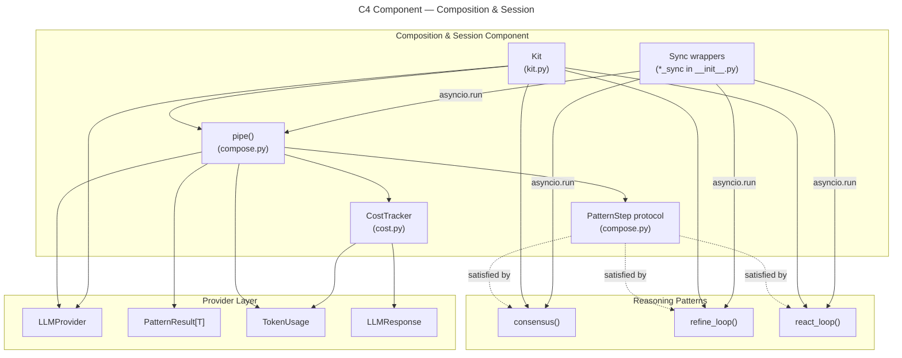

# C4 Component: Composition & Session

## Overview

| Field | Value |
|-------|-------|
| **Name** | Composition & Session |
| **Type** | Component |
| **Technology** | Python 3.10+, `asyncio`, `inspect` (stdlib) |
| **Purpose** | Allows callers to chain multiple reasoning patterns into a sequential pipeline (`pipe`), apply shared defaults and a budget ceiling across all patterns (`Kit`), and track cumulative token consumption (`CostTracker`) |

## Software Features

- **`pipe` function** (`compose.py`) — chains any number of `PatternStep` callables sequentially; passes the `value` of each `PatternResult` as the `prompt` of the next step; automatically filters `**kwargs` per step's signature to avoid unexpected-keyword errors; reduces `max_budget` dynamically after each step; accumulates costs and step metadata
- **`PatternStep` protocol** (`compose.py`) — lightweight callable contract enabling any async function with `(provider, prompt, **kwargs) -> PatternResult[Any]` signature to participate in pipe composition
- **`Kit` class** (`kit.py`) — session-level wrapper around an `LLMProvider`; accepts `track_cost` flag to enable cumulative cost tracking via an internal `_record` helper; delegates to `consensus`, `refine`, `react`, and `pipe`; exposes cumulative token usage via the `usage` property; validates that the provider supports tools before allowing `react`
- **`CostTracker` class** (`cost.py`) — mutable accumulator; called by `checked_complete` after every LLM response; converts to an immutable `TokenUsage` snapshot via `to_usage()`
- **Sync wrappers** (`__init__.py`) — `consensus_sync`, `refine_loop_sync`, `react_loop_sync`, `pipe_sync` bridge async patterns to synchronous callers via `asyncio.run()`; raise `RuntimeError` if called inside an existing event loop

## Code Elements

| Element | Kind | Location |
|---------|------|----------|
| `pipe` | Async function | [c4-code-src-executionkit.md](c4-code-src-executionkit.md) → `compose.py:20-61` |
| `PatternStep` | Protocol | [c4-code-src-executionkit.md](c4-code-src-executionkit.md) → `compose.py:11-17` |
| `_subtract` | Private function | [c4-code-src-executionkit.md](c4-code-src-executionkit.md) → `compose.py:64-69` |
| `_filter_kwargs` | Private function | [c4-code-src-executionkit.md](c4-code-src-executionkit.md) → `compose.py:72-83` |
| `Kit` | Class | [c4-code-src-executionkit.md](c4-code-src-executionkit.md) → `kit.py:17-64` |
| `CostTracker` | Class | [c4-code-src-executionkit.md](c4-code-src-executionkit.md) → `cost.py:7-39` |
| `consensus_sync` | Sync wrapper function | [c4-code-src-executionkit.md](c4-code-src-executionkit.md) → `__init__.py:75-77` |
| `refine_loop_sync` | Sync wrapper function | [c4-code-src-executionkit.md](c4-code-src-executionkit.md) → `__init__.py:80-82` |
| `react_loop_sync` | Sync wrapper function | [c4-code-src-executionkit.md](c4-code-src-executionkit.md) → `__init__.py:85-92` |
| `pipe_sync` | Sync wrapper function | [c4-code-src-executionkit.md](c4-code-src-executionkit.md) → `__init__.py:95-102` |

## Interfaces (Public API)

```python
# PatternStep protocol — composable unit in a pipe
class PatternStep(Protocol):
    async def __call__(
        self,
        provider: LLMProvider,
        prompt: str,
        **kwargs: Any,
    ) -> PatternResult[Any]: ...

# Sequential pipeline composition
async def pipe(
    provider: LLMProvider,
    prompt: str,
    *steps: PatternStep,
    max_budget: TokenUsage | None = None,
    **shared_kwargs: Any,
) -> PatternResult[Any]: ...

# Session-level defaults and delegation
class Kit:
    def __init__(self, provider: LLMProvider, *, track_cost: bool = True) -> None: ...

    @property
    def usage(self) -> TokenUsage: ...  # cumulative token usage across all calls

    async def consensus(self, prompt: str, **kwargs: Any) -> PatternResult[str]: ...
    async def refine(self, prompt: str, **kwargs: Any) -> PatternResult[str]: ...
    async def react(self, prompt: str, tools: Sequence[Tool], **kwargs: Any) -> PatternResult[str]: ...
    async def pipe(self, prompt: str, *steps: PatternStep, **kwargs: Any) -> PatternResult[Any]: ...

# Token usage accumulator
class CostTracker:
    def record(self, response: LLMResponse) -> None: ...
    @property
    def input_tokens(self) -> int: ...
    @property
    def output_tokens(self) -> int: ...
    @property
    def llm_calls(self) -> int: ...
    @property
    def total_tokens(self) -> int: ...
    def to_usage(self) -> TokenUsage: ...

# Synchronous convenience wrappers
def consensus_sync(provider: LLMProvider, prompt: str, **kwargs: Any) -> PatternResult[str]: ...
def refine_loop_sync(provider: LLMProvider, prompt: str, **kwargs: Any) -> PatternResult[str]: ...
def react_loop_sync(provider: ToolCallingProvider, prompt: str, tools: Sequence[Tool], **kwargs: Any) -> PatternResult[str]: ...
def pipe_sync(provider: LLMProvider, prompt: str, *steps: PatternStep, **kwargs: Any) -> PatternResult[Any]: ...
```

## Dependencies

### Inbound (consumers of this component)
- **Test & Dev Utilities** — example scripts use `Kit`, `pipe`, and sync wrappers; `CostTracker` is indirectly consumed via `checked_complete` in patterns

### Outbound (dependencies of this component)
- **Provider Layer** — `LLMProvider`, `ToolCallingProvider`, `PatternResult`, `TokenUsage`, `Tool`, `ExecutionKitError`, `LLMResponse`
- **Reasoning Patterns** — delegates to `consensus`, `refine_loop`, `react_loop`
- **Execution Engine** — `RetryConfig` (carried through Kit defaults)
- **Python stdlib**: `asyncio`, `inspect`, `typing`

## Mermaid Diagram


