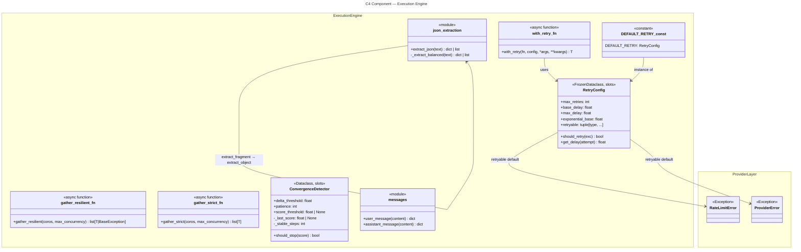

# C4 Component: Execution Engine

## Overview

| Field | Value |
|-------|-------|
| **Name** | Execution Engine |
| **Type** | Component |
| **Technology** | Python 3.10+, `asyncio`, `json`, `math`, `dataclasses` (all stdlib) |
| **Purpose** | Shared infrastructure utilities that power all reasoning patterns: exponential-backoff retry, bounded-concurrency async execution, iterative convergence detection, and JSON extraction from LLM text |

## Software Features

- **Retry with exponential backoff** (`retry.py`) — `RetryConfig` frozen dataclass configures max attempts, base delay, exponent, and retryable exception types; `with_retry()` wraps any async callable, propagates `CancelledError`, and is safe for concurrent use
- **Bounded parallel execution** (`parallel.py`) — two strategies: `gather_resilient` returns mixed results-and-exceptions (fault-tolerant batch jobs); `gather_strict` fails immediately via `asyncio.TaskGroup` (all-or-nothing workloads); both enforce a semaphore-based concurrency cap
- **Convergence detection** (`convergence.py`) — `ConvergenceDetector` stateful dataclass tracks score progression across iterations; declares convergence when score delta is below `delta_threshold` for `patience` consecutive steps, or when an absolute `score_threshold` is crossed
- **JSON extraction** (`json_extraction.py`) — `extract_json` scans raw text for the first balanced `{…}` or `[…]` block (handles nested objects, escaped strings) via private `_extract_balanced`, then parses with `json.loads`
- **Message construction** (`messages.py`) — `user_message` and `assistant_message` return OpenAI-compatible role message dicts; eliminates repeated inline dict literals in pattern implementations

## Code Elements

| Element | Kind | Location |
|---------|------|----------|
| `RetryConfig` | Frozen dataclass | [c4-code-src-executionkit-engine.md](c4-code-src-executionkit-engine.md) → `retry.py:13-26` |
| `DEFAULT_RETRY` | `RetryConfig` constant | [c4-code-src-executionkit-engine.md](c4-code-src-executionkit-engine.md) → `retry.py:28` |
| `with_retry` | Async function | [c4-code-src-executionkit-engine.md](c4-code-src-executionkit-engine.md) → `retry.py:31-50` |
| `gather_resilient` | Async function | [c4-code-src-executionkit-engine.md](c4-code-src-executionkit-engine.md) → `parallel.py:10-28` |
| `gather_strict` | Async function | [c4-code-src-executionkit-engine.md](c4-code-src-executionkit-engine.md) → `parallel.py:31-51` |
| `ConvergenceDetector` | Dataclass | [c4-code-src-executionkit-engine.md](c4-code-src-executionkit-engine.md) → `convergence.py:7-34` |
| `extract_json` | Function | [c4-code-src-executionkit-engine.md](c4-code-src-executionkit-engine.md) → `json_extraction.py:21+` |
| `user_message` | Pure function | [c4-code-src-executionkit-engine.md](c4-code-src-executionkit-engine.md) → `messages.py:8` |
| `assistant_message` | Pure function | [c4-code-src-executionkit-engine.md](c4-code-src-executionkit-engine.md) → `messages.py:13` |

## Interfaces (Public API)

```python
# Retry configuration (immutable)
@dataclass(frozen=True, slots=True)
class RetryConfig:
    max_retries: int = 3
    base_delay: float = 1.0
    max_delay: float = 60.0
    exponential_base: float = 2.0
    retryable: tuple[type[Exception], ...] = (RateLimitError, ProviderError)

    def should_retry(self, exc: Exception) -> bool: ...
    def get_delay(self, attempt: int) -> float: ...

DEFAULT_RETRY: RetryConfig  # RetryConfig() with all defaults

async def with_retry(
    fn: Callable[..., Awaitable[T]],
    config: RetryConfig,
    *args: object,
    **kwargs: object,
) -> T: ...

# Bounded parallel execution
async def gather_resilient(
    coros: Sequence[Awaitable[T]],
    max_concurrency: int = 10,
) -> list[T | BaseException]: ...

async def gather_strict(
    coros: Sequence[Awaitable[T]],
    max_concurrency: int = 10,
) -> list[T]: ...

# Convergence detection (stateful, per pattern run)
@dataclass(slots=True)
class ConvergenceDetector:
    delta_threshold: float = 0.01
    patience: int = 3
    score_threshold: float | None = None

    def should_stop(self, score: float) -> bool: ...

# JSON extraction from LLM text
def extract_json(text: str) -> dict[str, Any] | list[Any]: ...

# Message construction helpers
def user_message(content: str) -> dict[str, Any]: ...
def assistant_message(content: str) -> dict[str, Any]: ...
```

## Dependencies

### Inbound (consumers of this component)
- **Reasoning Patterns** — imports `with_retry`, `DEFAULT_RETRY`, `RetryConfig`, `gather_strict`, `gather_resilient`, `ConvergenceDetector`, `extract_json`, `user_message`, `assistant_message`
- **Composition & Session** — `Kit` and `pipe` rely on `RetryConfig` flowing through to patterns

### Outbound (dependencies of this component)
- **Provider Layer** — imports `ProviderError`, `RateLimitError` for `RetryConfig.retryable` defaults
- **Python stdlib**: `asyncio`, `json`, `math`, `dataclasses`, `collections.abc`, `typing`, `__future__`

## Mermaid Diagram


