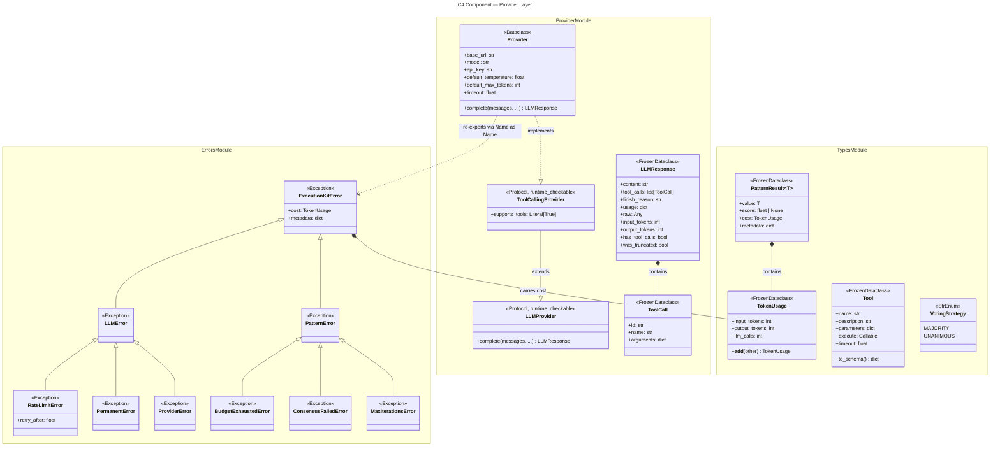

# C4 Component: Provider Layer

## Overview

| Field | Value |
|-------|-------|
| **Name** | Provider Layer |
| **Type** | Component |
| **Technology** | Python 3.10+, stdlib `urllib` (HTTP), `typing.Protocol` |
| **Purpose** | Defines the contract every LLM backend must fulfil, ships a generic OpenAI-compatible HTTP implementation, and declares the full error hierarchy used across the library |
| **Files** | `provider.py`, `errors.py`, `types.py` |

## Software Features

- **LLMProvider protocol** — runtime-checkable duck-type interface for any LLM backend; requires only `async complete()`
- **ToolCallingProvider protocol** — narrows `LLMProvider` to backends that expose function/tool calling (`supports_tools: Literal[True]`)
- **Provider class** — zero-dependency HTTP client built on `urllib`; handles OpenAI-compatible chat-completions, tool-call parsing, rate-limit detection, and response normalisation
- **`_classify_http_error()` function** — centralises HTTP status code → exception mapping for all HTTP backends (`_post_httpx` and `_post_urllib`); eliminates previously duplicated branching logic and ensures consistent error semantics regardless of transport
- **LLMResponse dataclass** — structured, immutable view of one completion: text content, tool calls, finish reason, token usage, and raw provider data
- **ToolCall dataclass** — single tool invocation (id, name, parsed arguments)
- **Exception hierarchy** (`errors.py`) — nine typed exceptions from `ExecutionKitError` root, extracted into a dedicated module; `provider.py` re-exports all nine via `Name as Name` for backwards compatibility; gives callers precise error semantics for retry decisions, budget accounting, and pattern-level failures

## Code Elements

| Element | Kind | Location |
|---------|------|----------|
| `LLMProvider` | Protocol (runtime-checkable) | [c4-code-src-executionkit.md](c4-code-src-executionkit.md) → `provider.py:67-77` |
| `ToolCallingProvider` | Protocol | [c4-code-src-executionkit.md](c4-code-src-executionkit.md) → `provider.py:80-82` |
| `Provider` | Dataclass / HTTP client | [c4-code-src-executionkit.md](c4-code-src-executionkit.md) → `provider.py:121-192` |
| `_classify_http_error` | Private function | [c4-code-src-executionkit.md](c4-code-src-executionkit.md) → `provider.py` |
| `LLMResponse` | Frozen dataclass | [c4-code-src-executionkit.md](c4-code-src-executionkit.md) → `provider.py:92-118` |
| `ToolCall` | Frozen dataclass | [c4-code-src-executionkit.md](c4-code-src-executionkit.md) → `provider.py:85-89` |
| `ExecutionKitError` | Base exception | [c4-code-src-executionkit.md](c4-code-src-executionkit.md) → `errors.py` (re-exported from `provider.py`) |
| `LLMError` | Exception | [c4-code-src-executionkit.md](c4-code-src-executionkit.md) → `errors.py` (re-exported from `provider.py`) |
| `RateLimitError` | Exception | [c4-code-src-executionkit.md](c4-code-src-executionkit.md) → `errors.py` (re-exported from `provider.py`) |
| `PermanentError` | Exception | [c4-code-src-executionkit.md](c4-code-src-executionkit.md) → `errors.py` (re-exported from `provider.py`) |
| `ProviderError` | Exception | [c4-code-src-executionkit.md](c4-code-src-executionkit.md) → `errors.py` (re-exported from `provider.py`) |
| `PatternError` | Exception | [c4-code-src-executionkit.md](c4-code-src-executionkit.md) → `errors.py` (re-exported from `provider.py`) |
| `BudgetExhaustedError` | Exception | [c4-code-src-executionkit.md](c4-code-src-executionkit.md) → `errors.py` (re-exported from `provider.py`) |
| `ConsensusFailedError` | Exception | [c4-code-src-executionkit.md](c4-code-src-executionkit.md) → `errors.py` (re-exported from `provider.py`) |
| `MaxIterationsError` | Exception | [c4-code-src-executionkit.md](c4-code-src-executionkit.md) → `errors.py` (re-exported from `provider.py`) |
| `TokenUsage` | Frozen dataclass | [c4-code-src-executionkit.md](c4-code-src-executionkit.md) → `types.py:14-25` |
| `VotingStrategy` | StrEnum | [c4-code-src-executionkit.md](c4-code-src-executionkit.md) → `types.py:58-60` |
| `Tool` | Frozen dataclass | [c4-code-src-executionkit.md](c4-code-src-executionkit.md) → `types.py:39-55` |
| `PatternResult[T]` | Frozen generic dataclass | [c4-code-src-executionkit.md](c4-code-src-executionkit.md) → `types.py:28-36` |
| `Evaluator` | Type alias | [c4-code-src-executionkit.md](c4-code-src-executionkit.md) → `types.py:63` |

## Interfaces (Public API)

```python
# LLMProvider protocol — any object satisfying this is a valid provider
class LLMProvider(Protocol):
    async def complete(
        self,
        messages: Sequence[dict[str, Any]],
        *,
        temperature: float | None = None,
        max_tokens: int | None = None,
        tools: Sequence[dict[str, Any]] | None = None,
        **kwargs: Any,
    ) -> LLMResponse: ...

# ToolCallingProvider adds a marker attribute
class ToolCallingProvider(LLMProvider, Protocol):
    supports_tools: Literal[True]

# Concrete HTTP provider
@dataclass
class Provider:
    base_url: str
    model: str
    api_key: str = ""
    default_temperature: float = 0.7
    default_max_tokens: int = 4096
    timeout: float = 120.0
    supports_tools: Literal[True] = True

    async def complete(
        self,
        messages: Sequence[dict[str, Any]],
        *,
        temperature: float | None = None,
        max_tokens: int | None = None,
        tools: Sequence[dict[str, Any]] | None = None,
        **kwargs: Any,
    ) -> LLMResponse: ...

# Core response type
@dataclass(frozen=True)
class LLMResponse:
    content: str
    tool_calls: tuple[ToolCall, ...]
    finish_reason: str
    usage: MappingProxyType[str, Any]
    raw: Any

    @property
    def input_tokens(self) -> int: ...
    @property
    def output_tokens(self) -> int: ...
    @property
    def total_tokens(self) -> int: ...
    @property
    def has_tool_calls(self) -> bool: ...
    @property
    def was_truncated(self) -> bool: ...

# Shared result container
@dataclass(frozen=True)
class PatternResult(Generic[T]):
    value: T
    score: float | None
    cost: TokenUsage
    metadata: MappingProxyType[str, Any]

# Token budget
@dataclass(frozen=True)
class TokenUsage:
    input_tokens: int
    output_tokens: int
    llm_calls: int
    def __add__(self, other: TokenUsage) -> TokenUsage: ...

# Tool definition for agents
@dataclass(frozen=True)
class Tool:
    name: str
    description: str
    parameters: dict[str, Any]
    execute: Callable[..., Awaitable[str]]
    timeout: float = 30.0
    def to_schema(self) -> dict[str, Any]: ...
```

## Dependencies

### Inbound (consumers of this component)
- **Execution Engine** — imports `ProviderError`, `RateLimitError` for retry decisions
- **Reasoning Patterns** — imports `LLMProvider`, `ToolCallingProvider`, `LLMResponse`, `ToolCall`, `PatternResult`, `TokenUsage`, all exception types
- **Composition & Session** — imports `LLMProvider`, `ToolCallingProvider`, `PatternResult`, `TokenUsage`, `Tool`, `PatternStep`, all exception types
- **Test & Dev Utilities** — imports `LLMResponse` to build mock responses

### Outbound (dependencies of this component)
- **Python stdlib only**: `urllib.request`, `urllib.error`, `json`, `asyncio`, `dataclasses`, `typing`, `enum`, `collections.abc`
- **No third-party runtime dependencies**

## Mermaid Diagram


