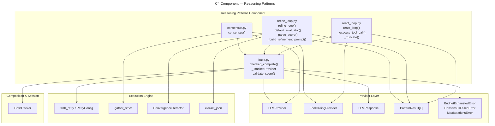

# C4 Component: Reasoning Patterns

## Overview

| Field | Value |
|-------|-------|
| **Name** | Reasoning Patterns |
| **Type** | Component |
| **Technology** | Python 3.11+, `asyncio`, `collections.Counter`, `re`, `warnings` (all stdlib) |
| **Purpose** | Three composable, budget-aware LLM reasoning strategies — consensus (multi-sample voting), refine_loop (iterative quality improvement), and react_loop (tool-calling agent) — sharing a common base layer for budget enforcement and cost tracking |

## Software Features

- **Consensus pattern** (`consensus.py`) — generates `num_samples` parallel LLM completions at high temperature, then applies `MAJORITY` or `UNANIMOUS` voting to select the winner; reports agreement ratio in metadata
- **Refine loop pattern** (`refine_loop.py`) — wraps the provider in `_TrackedProvider` for per-call budget enforcement, iterates generate → score → refine until quality target is met, `ConvergenceDetector` provides patience-based early stopping, default evaluator uses an LLM to score on 0–10 scale
- **ReAct loop pattern** (`react_loop.py`) — maintains a growing message history, dispatches tool calls with timeout enforcement, truncates observations to fit context window, returns the first response that contains no tool calls as the final answer
- **Base utilities** (`base.py`) — `checked_complete` performs pre-call budget validation then records usage; `_TrackedProvider` wraps any `LLMProvider` with budget+retry+truncation-warning logic; `validate_score` guards against NaN and out-of-range scores

## Code Elements

| Element | Kind | Location |
|---------|------|----------|
| `consensus` | Async function | [c4-code-src-executionkit-patterns.md](c4-code-src-executionkit-patterns.md) → `consensus.py:15-81` |
| `refine_loop` | Async function | [c4-code-src-executionkit-patterns.md](c4-code-src-executionkit-patterns.md) → `refine_loop.py:18-95` |
| `react_loop` | Async function | [c4-code-src-executionkit-patterns.md](c4-code-src-executionkit-patterns.md) → `react_loop.py:16-88` |
| `checked_complete` | Async function | [c4-code-src-executionkit-patterns.md](c4-code-src-executionkit-patterns.md) → `base.py:24-55` |
| `_TrackedProvider` | Class | [c4-code-src-executionkit-patterns.md](c4-code-src-executionkit-patterns.md) → `base.py:69-110` |
| `validate_score` | Function | [c4-code-src-executionkit-patterns.md](c4-code-src-executionkit-patterns.md) → `base.py:18-21` |
| `_default_evaluator` | Private async function | [c4-code-src-executionkit-patterns.md](c4-code-src-executionkit-patterns.md) → `refine_loop.py:98-116` |
| `_parse_score` | Private function | [c4-code-src-executionkit-patterns.md](c4-code-src-executionkit-patterns.md) → `refine_loop.py:119-135` |
| `_build_refinement_prompt` | Private function | [c4-code-src-executionkit-patterns.md](c4-code-src-executionkit-patterns.md) → `refine_loop.py:138-145` |
| `_execute_tool_call` | Private async function | [c4-code-src-executionkit-patterns.md](c4-code-src-executionkit-patterns.md) → `react_loop.py:109-128` |
| `_truncate` | Private function | [c4-code-src-executionkit-patterns.md](c4-code-src-executionkit-patterns.md) → `react_loop.py:131-138` |

## Interfaces (Public API)

```python
# Multi-sample voting
async def consensus(
    provider: LLMProvider,
    prompt: str,
    *,
    num_samples: int = 5,
    strategy: VotingStrategy | str = VotingStrategy.MAJORITY,
    temperature: float = 0.9,
    max_tokens: int = 4096,
    max_concurrency: int = 5,
    retry: RetryConfig | None = None,
    **_: Any,
) -> PatternResult[str]: ...

# Iterative quality refinement
async def refine_loop(
    provider: LLMProvider,
    prompt: str,
    *,
    evaluator: Evaluator | None = None,
    target_score: float = 0.9,
    max_iterations: int = 5,
    patience: int = 3,
    delta_threshold: float = 0.01,
    temperature: float = 0.7,
    max_tokens: int = 4096,
    max_cost: TokenUsage | None = None,
    retry: RetryConfig | None = None,
    **_: Any,
) -> PatternResult[str]: ...

# Tool-calling ReAct agent
async def react_loop(
    provider: ToolCallingProvider,
    prompt: str,
    tools: Sequence[Tool],
    *,
    max_rounds: int = 8,
    max_observation_chars: int = 12000,
    max_history_messages: int | None = None,
    tool_timeout: float | None = None,
    temperature: float = 0.3,
    max_tokens: int = 4096,
    max_cost: TokenUsage | None = None,
    retry: RetryConfig | None = None,
    **_: Any,
) -> PatternResult[str]: ...

# Shared base utility (used by all three patterns)
async def checked_complete(
    provider: LLMProvider,
    messages: Sequence[dict[str, Any]],
    tracker: CostTracker,
    budget: TokenUsage | None,
    retry: RetryConfig | None,
    **kwargs: Any,
) -> LLMResponse: ...

def validate_score(score: float) -> float: ...
```

## Dependencies

### Inbound (consumers of this component)
- **Composition & Session** — `pipe`, `Kit` call all three pattern functions
- **Test & Dev Utilities** — example scripts call patterns directly
- **Public API** — `__init__` re-exports `consensus`, `refine_loop`, `react_loop` and provides sync wrappers

### Outbound (dependencies of this component)
- **Provider Layer** — `LLMProvider`, `ToolCallingProvider`, `LLMResponse`, `ToolCall`, `Tool`, `PatternResult`, `TokenUsage`, `VotingStrategy`, `Evaluator`, `BudgetExhaustedError`, `ConsensusFailedError`, `MaxIterationsError`
- **Execution Engine** — `with_retry`, `DEFAULT_RETRY`, `RetryConfig`, `gather_strict`, `ConvergenceDetector`, `extract_json`
- **Composition & Session** — `CostTracker` (from `cost.py`)
- **Python stdlib**: `asyncio`, `collections.Counter`, `json`, `math`, `re`, `typing`, `warnings`

## Mermaid Diagram


