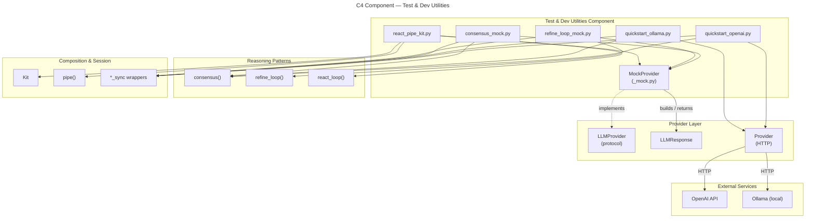

# C4 Component: Test & Dev Utilities

## Overview

| Field | Value |
|-------|-------|
| **Name** | Test & Dev Utilities |
| **Type** | Component |
| **Technology** | Python 3.10+, `asyncio`, `os` (all stdlib) |
| **Purpose** | Provides deterministic, zero-network testing infrastructure (`MockProvider`) and runnable reference implementations (example scripts) so developers can validate library behaviour without live LLM credentials |

## Software Features

- **`MockProvider`** (`_mock.py`) — scripted response list; accepts `responses: list[str | LLMResponse]` and optional `exception: Exception | None`; cycles through the list using index modulo (so it wraps rather than exhausting); tracks all `complete()` invocations in `.calls` (a list of `_CallRecord` inner dataclasses) for assertion in tests; exposes `call_count: int` and `last_call: _CallRecord | None` properties
- **Example scripts** (`examples/`) — five runnable scripts covering all public patterns with both live providers and mocks; serve as integration smoke-tests and copy-paste starting points

### Example scripts

| Script | Pattern demonstrated | Provider |
|--------|---------------------|----------|
| `quickstart_openai.py` | `consensus_sync` | Live OpenAI |
| `quickstart_ollama.py` | `consensus_sync` | Live Ollama (graceful skip) |
| `consensus_mock.py` | `consensus_sync` + voting | MockProvider |
| `refine_loop_mock.py` | `refine_loop_sync` + scoring | MockProvider |
| `react_pipe_kit.py` | `react_loop` + `Kit.pipe` | MockProvider |

## Code Elements

| Element | Kind | Location |
|---------|------|----------|
| `MockProvider` | Dataclass | [c4-code-src-executionkit.md](c4-code-src-executionkit.md) → `_mock.py:15-63` |
| `quickstart_openai.py` | Example script | [c4-code-examples.md](c4-code-examples.md) |
| `quickstart_ollama.py` | Example script | [c4-code-examples.md](c4-code-examples.md) |
| `consensus_mock.py` | Example script | [c4-code-examples.md](c4-code-examples.md) |
| `refine_loop_mock.py` | Example script | [c4-code-examples.md](c4-code-examples.md) |
| `react_pipe_kit.py` | Example script | [c4-code-examples.md](c4-code-examples.md) |

## Interfaces (Public API)

```python
# Scripted mock provider
@dataclass
class MockProvider:
    # Init fields
    responses: list[str | LLMResponse]
    exception: Exception | None = None

    # Non-init fields (set by the class, not the caller)
    supports_tools: Literal[True]       # always True
    calls: list[_CallRecord]            # field(default_factory=list)
    _index: int                         # tracks next response position

    # Inner dataclass recorded per complete() call
    @dataclass
    class _CallRecord:
        messages: Sequence[dict[str, Any]]
        temperature: float | None
        max_tokens: int | None
        tools: Sequence[dict[str, Any]] | None
        kwargs: dict[str, Any]

    @property
    def call_count(self) -> int: ...

    @property
    def last_call(self) -> _CallRecord | None: ...

    async def complete(
        self,
        messages: Sequence[dict[str, Any]],
        *,
        temperature: float | None = None,
        max_tokens: int | None = None,
        tools: Sequence[dict[str, Any]] | None = None,
        **kwargs: Any,
    ) -> LLMResponse: ...
```

## Dependencies

### Inbound (consumers of this component)
- **End users / test suites** — import `MockProvider` to write unit and integration tests without live LLM calls
- **CI/CD pipelines** — run example scripts as smoke tests

### Outbound (dependencies of this component)
- **Provider Layer** — `LLMResponse` (to build mock responses and satisfy `LLMProvider` protocol)
- **Composition & Session** — example scripts use `Kit`, `pipe`, sync wrappers
- **Reasoning Patterns** — example scripts call `consensus`, `refine_loop`, `react_loop`
- **External (live examples only)**: OpenAI API (`api.openai.com/v1`), local Ollama (`localhost:11434`)
- **Python stdlib**: `asyncio`, `os`, `typing`

## Mermaid Diagram


