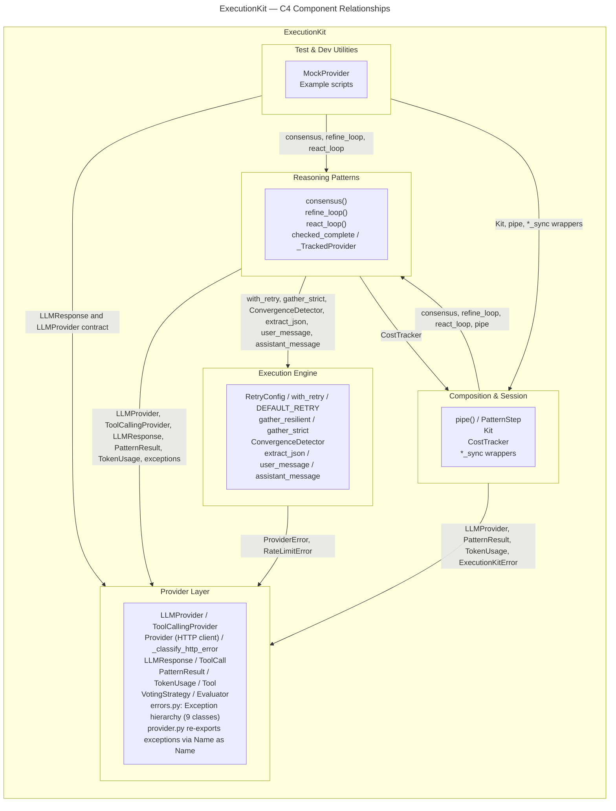

# C4 Component Level: ExecutionKit

This document is the master index for all C4 Component-level documentation for the **ExecutionKit** Python library. Each component corresponds to a logical grouping of source modules with a coherent responsibility boundary.

## Components

| # | Component | Files | Responsibility |
|---|-----------|-------|----------------|
| 1 | [Provider Layer](c4-component-provider-layer.md) | `provider.py`, `errors.py`, `types.py` | LLM provider protocols, concrete HTTP client, all data types, error hierarchy |
| 2 | [Execution Engine](c4-component-execution-engine.md) | `engine/retry.py`, `engine/parallel.py`, `engine/convergence.py`, `engine/json_extraction.py` | Retry/backoff, bounded concurrency, convergence detection, JSON extraction |
| 3 | [Reasoning Patterns](c4-component-reasoning-patterns.md) | `patterns/consensus.py`, `patterns/refine_loop.py`, `patterns/react_loop.py`, `patterns/base.py` | Three composable LLM reasoning strategies with shared budget/cost base |
| 4 | [Composition & Session](c4-component-composition-session.md) | `compose.py`, `kit.py`, `cost.py`, `__init__.py` (sync wrappers) | Pipeline chaining, session defaults, cost tracking, sync convenience API |
| 5 | [Test & Dev Utilities](c4-component-test-dev-utilities.md) | `_mock.py`, `examples/` | Scripted mock provider, reference example scripts |

---

## Component Relationship Graph

The diagram below shows every component, the direction of dependency (arrow = "depends on"), and the key interface points.

---

## Dependency Direction Summary

| Component | Depends On | Depended on By |
|-----------|-----------|----------------|
| **Provider Layer** | _(none — foundation)_ | Execution Engine, Reasoning Patterns, Composition & Session, Test & Dev Utilities |
| **Execution Engine** | Provider Layer (exception types) | Reasoning Patterns |
| **Reasoning Patterns** | Provider Layer, Execution Engine, CostTracker from Composition & Session | Composition & Session, Test & Dev Utilities |
| **Composition & Session** | Provider Layer, Reasoning Patterns | Test & Dev Utilities |
| **Test & Dev Utilities** | Provider Layer, Reasoning Patterns, Composition & Session | _(none — leaf consumer)_ |

---

## Key Design Properties

- **Zero third-party runtime dependencies** — every component uses only the Python standard library at runtime
- **Protocol-based provider abstraction** — `LLMProvider` and `PatternStep` are `typing.Protocol` contracts; any conforming object plugs in without inheritance
- **Immutability by default** — `TokenUsage`, `PatternResult`, `LLMResponse`, `Tool`, `ToolCall`, and `RetryConfig` are all frozen dataclasses
- **Cost propagation on failure** — `ExecutionKitError` carries a `TokenUsage` cost field so callers can account for tokens consumed even when a pattern fails
- **Async-native, sync-bridged** — all patterns are `async`; Composition & Session provides `asyncio.run`-based sync wrappers for non-async callers
