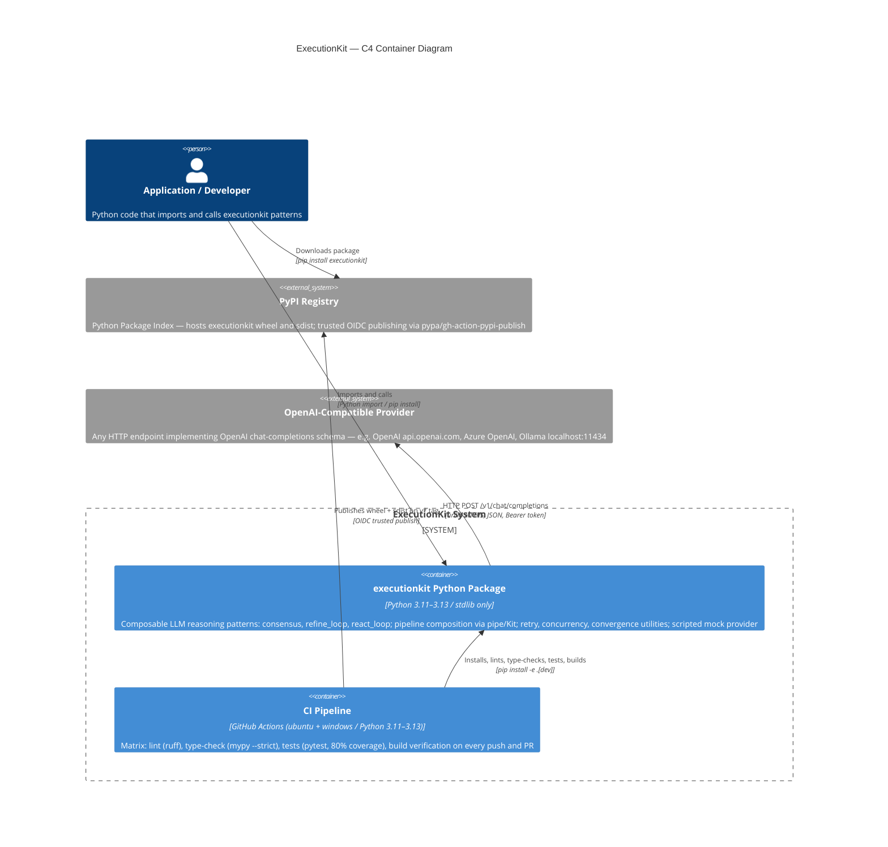

# C4 Container Level: ExecutionKit

ExecutionKit is a **Python library** — not a web service. In C4 terms, the "containers" are the independently deployable or independently operated runtime units that together make the system work. There is no server process; the library is imported and runs in the caller's process.

---

## Containers

### 1. executionkit Python Package

| Field | Value |
|-------|-------|
| **Name** | executionkit Python Package |
| **Type** | Library / Distributable Package |
| **Technology** | Python 3.11–3.13, pure stdlib (no third-party runtime deps), hatchling build backend |
| **Deployment** | `pip install executionkit`; installed into the caller's Python environment |
| **Distribution format** | Wheel (`executionkit-*.whl`) + source dist (`executionkit-*.tar.gz`) |
| **Package source** | `executionkit/` |
| **Purpose** | Provides all five components (Provider Layer, Execution Engine, Reasoning Patterns, Composition & Session, Test & Dev Utilities) as an importable, versioned Python package. Callers import from `executionkit` and instantiate a `Provider` or `MockProvider`, then call patterns directly or via a `Kit` session. |

**Components hosted in this container:**

| Component | Files | Purpose |
|-----------|-------|---------|
| [Provider Layer](c4-component-provider-layer.md) | `provider.py`, `types.py` | LLM provider protocols, HTTP client, data types, error hierarchy |
| [Execution Engine](c4-component-execution-engine.md) | `engine/retry.py`, `engine/parallel.py`, `engine/convergence.py`, `engine/json_extraction.py` | Retry/backoff, bounded concurrency, convergence detection, JSON extraction |
| [Reasoning Patterns](c4-component-reasoning-patterns.md) | `patterns/consensus.py`, `patterns/refine_loop.py`, `patterns/react_loop.py`, `patterns/base.py` | Three composable LLM reasoning strategies |
| [Composition & Session](c4-component-composition-session.md) | `compose.py`, `kit.py`, `cost.py`, `__init__.py` (sync wrappers) | Pipeline chaining, session defaults, cost tracking, sync API |
| [Test & Dev Utilities](c4-component-test-dev-utilities.md) | `_mock.py`, `examples/` | Scripted mock provider, reference example scripts |

**Public API surface (pip-installable Python API):**

```python
from executionkit import (
    # Provider
    Provider, LLMProvider, ToolCallingProvider,
    # Data types
    LLMResponse, ToolCall, PatternResult, TokenUsage, Tool,
    VotingStrategy,
    # Patterns (async)
    consensus, refine_loop, react_loop,
    # Composition
    pipe, Kit, CostTracker, PatternStep,
    # Sync convenience wrappers
    consensus_sync, refine_loop_sync, react_loop_sync, pipe_sync,
    # Engine (re-exported)
    RetryConfig, ConvergenceDetector,
    # Exceptions
    ExecutionKitError, LLMError, RateLimitError, PermanentError,
    ProviderError, PatternError, BudgetExhaustedError,
    ConsensusFailedError, MaxIterationsError,
    # Testing
    MockProvider,
)
```

**Version:** 0.1.0 (Alpha)
**License:** MIT
**Python compatibility:** >=3.11

---

### 2. CI Pipeline

| Field | Value |
|-------|-------|
| **Name** | CI Pipeline |
| **Type** | Build / Test Pipeline |
| **Technology** | GitHub Actions; matrix: ubuntu-latest + windows-latest × Python 3.11/3.12/3.13 |
| **Trigger** | Every `push` and `pull_request` |
| **Purpose** | Validates the package on all supported platforms and Python versions; enforces lint, type safety, test coverage, and build integrity on every commit |

**Pipeline steps (per matrix cell):**

| Step | Tool | Gate |
|------|------|------|
| Lint | `ruff check .` | Fails on any lint error |
| Format | `ruff format . --check` | Fails on formatting drift |
| Type check | `mypy --strict src` | Fails on any type error |
| Tests | `pytest --cov-fail-under=80` | Fails below 80% branch coverage |
| Build verification | `python -m build` | Fails if wheel/sdist cannot be built |

**Matrix:** 2 OS × 3 Python versions = 6 parallel jobs per run. `fail-fast: false` — all cells run to completion even if one fails.

**Dev dependencies** (installed via `pip install -e .[dev]`):

| Package | Purpose |
|---------|---------|
| `build>=1.2.2` | Wheel and sdist building |
| `mypy>=1.18` | Static type checking |
| `pytest>=8.4` | Test runner |
| `pytest-asyncio>=1.2` | Async test support |
| `pytest-cov>=7.0` | Coverage measurement and reporting |
| `ruff>=0.14.0` | Linting and formatting |

---

### 3. PyPI Registry (External)

| Field | Value |
|-------|-------|
| **Name** | PyPI Registry |
| **Type** | External Package Registry |
| **Technology** | Python Package Index (pypi.org) |
| **Operator** | Python Software Foundation (external) |
| **Purpose** | Hosts published `executionkit` wheel and sdist so users can install via `pip install executionkit` |

**Publish workflow** (`.github/workflows/publish.yml`):
- Triggered by `v*` tag push or `workflow_dispatch`
- Builds distributions on `ubuntu-latest` / Python 3.13
- Uploads `dist/` artifacts, then publishes via `pypa/gh-action-pypi-publish` using **OIDC trusted publishing** (no stored API token — `id-token: write` permission only)
- Environment: `pypi` (GitHub environment with protection rules)

---

### 4. OpenAI-Compatible Provider (External)

| Field | Value |
|-------|-------|
| **Name** | OpenAI-Compatible Provider |
| **Type** | External LLM API |
| **Technology** | HTTP/HTTPS REST, OpenAI chat-completions schema (`/v1/chat/completions`) |
| **Operator** | Caller-configured; examples include OpenAI (`api.openai.com`), Azure OpenAI, Ollama (`localhost:11434`), or any compatible endpoint |
| **Purpose** | Executes LLM inference; `Provider` sends requests here and normalises responses into `LLMResponse` objects |

**Connection details (configured in `Provider` constructor):**

| Parameter | Default | Notes |
|-----------|---------|-------|
| `base_url` | (required) | Full URL to the `/v1`-style endpoint |
| `api_key` | `""` | Bearer token; empty string for keyless endpoints (e.g. Ollama) |
| `model` | (required) | Model identifier string (e.g. `gpt-4o`, `llama3`) |
| `timeout` | `120.0 s` | Per-request timeout |
| `default_temperature` | `0.7` | Overridable per call |
| `default_max_tokens` | `4096` | Overridable per call |

**Transport:** `urllib.request` (Python stdlib) — zero third-party HTTP dependency.

---

## Container Dependencies

| From | To | Interface | Notes |
|------|----|-----------|-------|
| Caller application | executionkit Python Package | `import executionkit` / `pip install executionkit` | Python import; synchronous or async |
| executionkit Python Package | OpenAI-Compatible Provider | HTTPS REST (`urllib`) | At runtime only, when `Provider.complete()` is called |
| CI Pipeline | executionkit Python Package | `pip install -e .[dev]` + `pytest`, `mypy`, `ruff` | Build-time validation |
| CI Pipeline (publish) | PyPI Registry | `pypa/gh-action-pypi-publish` via OIDC | On tag push; trusted publishing |
| User (pip install) | PyPI Registry | `pip install executionkit` | Package download |
| PyPI Registry | executionkit Python Package | Hosts wheel/sdist | After publish workflow completes |

---

## Infrastructure Details

### Build system

- **Backend:** `hatchling>=1.27`
- **Package discovery:** explicit — `packages = ["executionkit"]`
- **Single config source:** `pyproject.toml`
- **Lint config:** `ruff` (target `py311`, line-length 100, rules: B, C4, E, F, I, RUF, UP)
- **Format config:** `ruff format` (double quotes)
- **Type config:** `mypy --strict`, `python_version = "3.11"`
- **Test config:** `pytest-asyncio` `asyncio_mode = "auto"`, coverage source `executionkit`, branch coverage, fail-under 80

### Runtime characteristics

- **No runtime dependencies** — zero `pip` installs beyond Python stdlib
- **Async-native** — all three patterns (`consensus`, `refine_loop`, `react_loop`) are `async def`; sync wrappers use `asyncio.run()`
- **Protocol-based** — `LLMProvider` and `PatternStep` are `typing.Protocol`; no inheritance required from callers
- **Immutable data** — all result and configuration types are frozen dataclasses
- **Cost-on-failure** — `ExecutionKitError.cost: TokenUsage` allows callers to account for tokens consumed even on failed calls

---

## Mermaid C4Container Diagram



---

## Key Design Properties (Container Level)

- **Single deployable unit** — the entire library ships as one wheel; there is no service mesh, no microservices, no runtime process to operate
- **Zero operational overhead** — callers add `executionkit` to `requirements.txt`; no servers, containers, or infrastructure to provision
- **Provider-agnostic at runtime** — the library does not hard-code any LLM vendor; the `base_url` + `api_key` + `model` triple at construction time points to any compatible endpoint
- **OIDC-only publishing** — no long-lived PyPI API tokens stored in GitHub secrets; publish uses GitHub's OIDC identity token (trusted publishing)
- **Hermetic CI** — the `fail-fast: false` matrix ensures regressions on any OS/Python combination are surfaced without masking other results
