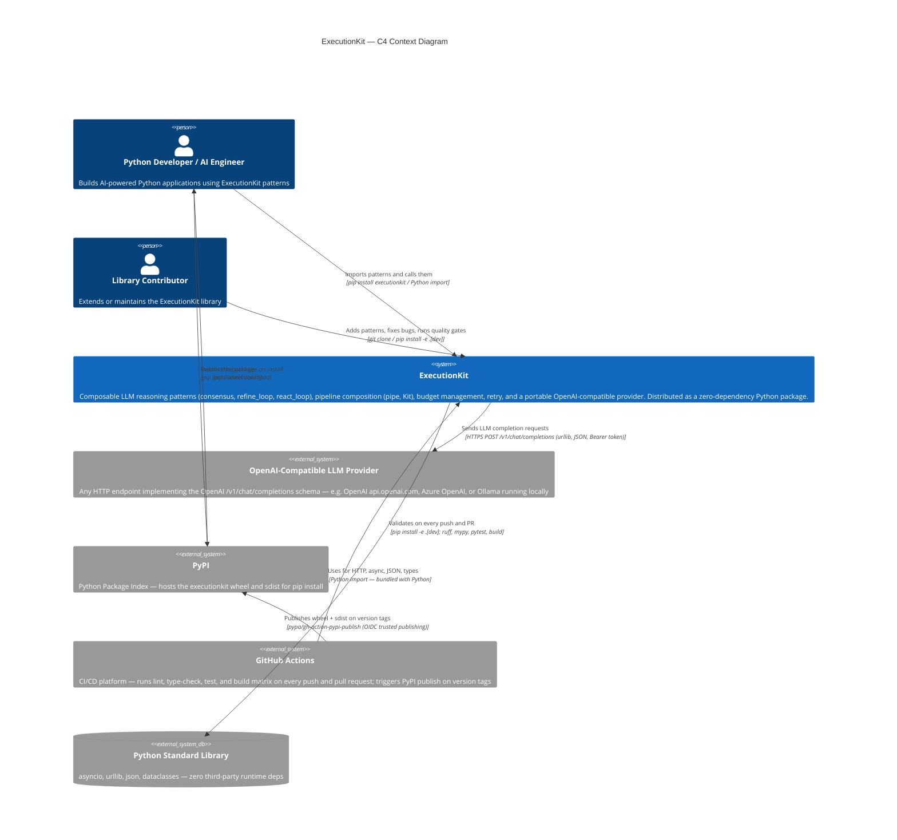

# C4 Context Level: ExecutionKit

## System Overview

**In one sentence:** ExecutionKit is a Python library that gives developers composable, budget-aware reasoning patterns — `consensus`, `refine_loop`, and `react_loop` — for building reliable AI-powered applications on top of any OpenAI-compatible language model.

**In detail:**

Building AI applications with raw language model (LLM) calls is fragile. A single prompt can return inconsistent answers, hallucinate, or silently consume large amounts of tokens with no guardrails. ExecutionKit sits between one-off prompt calls and heavyweight agent frameworks, offering a small set of well-defined patterns that make LLM calls more reliable:

- **Consensus** asks the model the same question multiple times and aggregates votes, surface-level confidence, and agreement ratios — useful when a single answer cannot be trusted on its own.
- **Refine Loop** sends a response through repeated rounds of evaluator feedback, stopping when the answer converges or a budget is exhausted — useful for iterative drafting, grading, or summarization tasks.
- **React Loop** executes a tool-calling loop: the model decides which tool to call, the tools run, observations feed back to the model, and the cycle repeats until the model signals it is done — the building block for autonomous task agents.
- **Pipe** chains any of these patterns together in a budget-aware pipeline, automatically propagating remaining token budgets from one step to the next.
- **Kit** provides a lightweight session object so an application can set shared defaults (model, temperature, retry policy, budget) once and reuse them across many pattern calls.

The entire library ships as a single Python package with zero third-party runtime dependencies. It works with any API that speaks the OpenAI chat-completions format, including OpenAI's own API, Azure OpenAI, and locally-hosted models via Ollama.

---

## Personas

### Human Personas

| Persona | Who they are | What they need from ExecutionKit |
|---------|-------------|----------------------------------|
| **Python Developer / AI Engineer** | Application builders writing Python code that calls language models — data scientists, backend engineers, or ML engineers adding AI capabilities to a product | Composable, reliable patterns they can call with a few lines of code; predictable budget controls; easy testing via `MockProvider` |
| **Library Contributor** | Developers who extend or maintain ExecutionKit itself — they may add new patterns, fix bugs, improve the engine, or update tooling | A clear development environment setup, defined quality gates (lint, type check, tests, build), and scope guardrails that keep the library focused |

### Programmatic Personas

| Persona | What it is | What it needs |
|---------|-----------|---------------|
| **CI/CD System** | GitHub Actions workflow that runs on every push and pull request | Ability to install the package in editable mode, run `ruff`, `mypy`, `pytest`, and `python -m build` on Ubuntu and Windows across Python 3.11/3.12/3.13, and report pass/fail results |
| **PyPI Consumer** | A `pip install executionkit` command executed during deployment or environment setup — run by a developer, a Docker build, or an automated deploy pipeline | A published wheel on PyPI that installs cleanly with no extra dependencies |

---

## System Features

The following table maps high-level features to the components and Python symbols that implement them.

| Feature | What it does | Key API |
|---------|-------------|---------|
| **Consensus** | Runs the same prompt multiple times; tallies votes; returns the majority (or unanimous) answer with confidence metadata | `consensus()` / `consensus_sync()` · `VotingStrategy.MAJORITY` / `UNANIMOUS` |
| **Refine Loop** | Iteratively improves a response using evaluator feedback; stops on convergence or budget exhaustion | `refine_loop()` / `refine_loop_sync()` · `ConvergenceDetector` |
| **React Loop** | Tool-calling reasoning loop: model chooses a tool, tool runs, observation feeds back; repeats until done | `react_loop()` / `react_loop_sync()` · `Tool` · `ToolCall` · `ToolCallingProvider` |
| **Pipeline composition** | Chains patterns sequentially; propagates remaining token budget to each step | `pipe()` / `pipe_sync()` · `PatternStep` |
| **Session defaults (Kit)** | Wraps a provider and default settings; pattern calls inherit defaults without repetition | `Kit` |
| **Budget management** | Soft token-cap pre-dispatch checks; hard `llm_calls` ceiling; remaining budget forwarded by `pipe()` | `TokenUsage` · `checked_complete` · `BudgetExhaustedError` |
| **Retry and backoff** | Exponential backoff on rate-limit and provider errors; `PermanentError` never retried | `RetryConfig` · `with_retry` · `DEFAULT_RETRY` |
| **Provider abstraction** | Single HTTP client targeting any OpenAI `/v1/chat/completions` endpoint; zero SDK deps | `Provider` · `LLMProvider` protocol |
| **Cost tracking** | Accumulates token and call usage across a session; carried on all results and errors | `CostTracker` · `TokenUsage` · `PatternResult.cost` |
| **Testing utilities** | Scriptable mock provider with response queuing and call recording; no live API needed | `MockProvider` |

---

## User Journeys

### Journey 1 — Python Developer classifies support tickets with `consensus`

**Goal:** Route incoming support tickets to the correct team by asking an LLM to classify them, using repeated sampling to reduce misclassification.

1. Developer installs the library: `pip install executionkit`
2. Developer creates a `Provider`, pointing it at their OpenAI-compatible endpoint with an API key and model name.
3. Developer calls `await consensus(provider, ticket_text, num_samples=5, voting_strategy=VotingStrategy.MAJORITY)`.
4. ExecutionKit sends the ticket to the LLM five times concurrently, with retry/backoff on any rate-limit errors.
5. ExecutionKit tallies the five responses and returns a `PatternResult` with `value` (the winning label), `cost` (total tokens used), and `metadata["agreement_ratio"]`.
6. If the agreement ratio is below a threshold, the developer flags the ticket for human review instead of routing automatically.
7. On test runs, the developer substitutes `MockProvider` with pre-scripted responses to validate routing logic without spending tokens.

---

### Journey 2 — Python Developer builds an agentic task runner with `react_loop`

**Goal:** Let an LLM autonomously answer a user question by searching a knowledge base and performing calculations.

1. Developer defines `Tool` objects, each with a name, description, parameter schema, and an async `execute` callback.
2. Developer calls `await react_loop(provider, user_question, tools=[search_tool, calc_tool], max_iterations=10)`.
3. ExecutionKit sends the question plus tool descriptions to the LLM.
4. The LLM returns a tool call decision; ExecutionKit dispatches the tool, captures the result, and feeds the observation back to the LLM.
5. Steps 3–4 repeat until the model signals completion or `max_iterations` is reached (raising `MaxIterationsError`).
6. The final `PatternResult` contains the answer, total cost, and the full observation history in `metadata`.

---

### Journey 3 — Python Developer composes patterns with `pipe()` and a token budget

**Goal:** Run a multi-stage pipeline — classify, then refine — while staying within a token budget.

1. Developer creates a `Kit` with shared defaults: model, temperature, total `max_cost`.
2. Developer defines two `PatternStep` callables wrapping `consensus` (classify) and `refine_loop` (improve the draft).
3. Developer calls `await pipe(kit.provider, initial_prompt, classify_step, refine_step, max_budget=budget)`.
4. `pipe()` runs `classify_step` first, subtracts tokens used, passes the remaining budget to `refine_step`.
5. If the budget runs out mid-pipeline, `BudgetExhaustedError` is raised, carrying the cost consumed so far.
6. On success, the final `PatternResult` reflects the accumulated cost across both stages.

---

### Journey 4 — Library Contributor sets up the dev environment and runs quality gates

**Goal:** Make a code change to an existing pattern and verify it meets all quality standards before opening a pull request.

1. Contributor forks the repository and clones it locally.
2. Contributor creates a Python 3.11+ virtual environment and runs `pip install -e .[dev]` to install the package in editable mode with all development tools.
3. Contributor makes their change in `executionkit/`.
4. Before opening a PR, contributor runs the same quality gates as CI:
   - `ruff check .` — linting
   - `ruff format . --check` — formatting
   - `mypy --strict src` — strict type checking
   - `pytest --cov-fail-under=80` — tests with ≥80% branch coverage
   - `python -m build` — wheel and sdist build verification
5. Contributor opens a pull request. CI runs the same gates on Ubuntu and Windows across Python 3.11, 3.12, and 3.13. All six matrix cells must pass.

---

### Journey 5 — CI/CD System validates a pull request

**Goal:** Automatically verify that no pull request breaks correctness, type safety, code style, or the ability to build a distributable package.

1. A pull request is opened against the repository.
2. GitHub Actions triggers the CI workflow.
3. The workflow fans out to a 2×3 matrix (Ubuntu + Windows × Python 3.11/3.12/3.13), running six parallel jobs.
4. Each job installs `executionkit` in editable mode with dev dependencies, then runs: lint (`ruff check`), format check (`ruff format --check`), type check (`mypy --strict`), tests (`pytest --cov-fail-under=80`), and build (`python -m build`).
5. `fail-fast: false` ensures all six cells complete and report independently — a failure on one OS does not hide failures on another.
6. GitHub reports the combined status to the pull request. A contributor may not merge until all jobs pass.
7. On a `v*` tag push, a separate publish workflow builds and uploads the wheel and sdist to PyPI using OIDC trusted publishing (no stored API tokens).

---

## External Systems and Dependencies

| System | Type | How ExecutionKit interacts with it |
|--------|------|-----------------------------------|
| **OpenAI-Compatible LLM Provider** | External HTTP API (runtime) | `Provider` sends HTTPS POST requests to `/v1/chat/completions` using Python's stdlib `urllib`. Any endpoint implementing the OpenAI chat-completions schema works — OpenAI, Azure OpenAI, Ollama, and others. Configured by the caller at construction time via `base_url`, `api_key`, and `model`. |
| **PyPI** | External package registry (distribution) | Hosts the published `executionkit` wheel and source distribution. End users install via `pip install executionkit`. The publish workflow uploads using `pypa/gh-action-pypi-publish` and GitHub OIDC trusted publishing — no long-lived API tokens required. |
| **GitHub Actions** | CI/CD platform (quality gate) | Runs the automated test matrix on every push and pull request. Hosts the publish workflow triggered by version tags. ExecutionKit has no runtime dependency on GitHub Actions; it is purely a development and release infrastructure concern. |
| **Python stdlib** | Runtime dependency (bundled with Python) | ExecutionKit uses `asyncio`, `urllib.request`, `json`, `dataclasses`, `typing`, `warnings`, and other standard library modules. There are **zero third-party runtime dependencies** — callers do not need to install anything beyond `executionkit` itself. |

---

## System Context Diagram

---

## Related Documentation

- [C4 Container Level](c4-container.md) — the independently deployable units: the Python package, the CI pipeline, PyPI, and the LLM provider.
- [C4 Component Level](c4-component.md) — the internal logical components of the `executionkit` package: Provider Layer, Execution Engine, Reasoning Patterns, Composition & Session, and Test & Dev Utilities, with their dependency graph.
