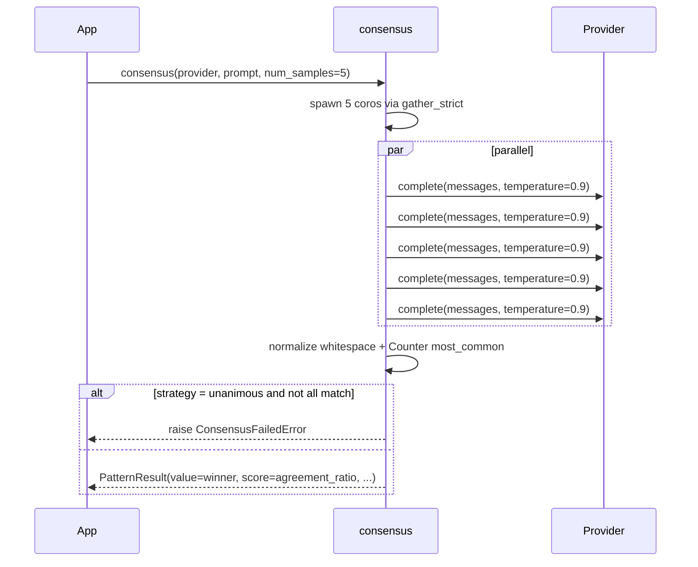

---
tags:
  - pattern
  - voting
---

# Consensus

`consensus()` runs **N independent completions in parallel** with the same prompt at higher temperature, normalizes whitespace, and votes on the result. The winning response is returned with an `agreement_ratio` score so the caller can gate on confidence.

## When to use / when not to use

| Use it when… | Avoid it when… |
|--------------|----------------|
| The answer is a short factual or classification label. | The answer is long-form prose — voting on long strings rarely matches. |
| You can tolerate `N×` cost and want an agreement signal across independent samples. | Latency matters more than reliability. |
| You can run calls in parallel (the provider supports concurrency). | The model is rate-limited tightly enough that `N` parallel calls trigger 429s. |
| Tie-handling is acceptable (you check `tie_count`). | You require a single deterministic answer per prompt. |

## Call flow



## Minimal example

```python
import asyncio
import os
from executionkit import Provider, consensus

async def main() -> None:
    async with Provider(
        base_url="https://api.openai.com/v1",
        api_key=os.environ["OPENAI_API_KEY"],
        model="gpt-4o-mini",
    ) as provider:
        result = await consensus(
            provider,
            "Classify this support ticket as exactly one of "
            "'billing', 'tech', or 'other':\n\n"
            "'My card was charged twice this month.'",
            num_samples=5,
            strategy="majority",                # or "unanimous"
        )

        print(result.value)                          # 'billing'
        print(result.metadata["agreement_ratio"])    # e.g. 0.8 = 4 of 5
        print(result.metadata["unique_responses"])   # 2
        print(result.metadata["tie_count"])          # 1 = no tie
        print(result.cost.llm_calls)                 # 5

asyncio.run(main())
```

## Configuration knobs

| Parameter | Default | Description |
|-----------|---------|-------------|
| `num_samples` | `5` | Parallel completions to run. Must be `>= 1`. |
| `strategy` | `"majority"` | `"majority"` or `"unanimous"`. Accepts `VotingStrategy` enum or string. |
| `temperature` | `0.9` | Higher = more diverse samples (better for voting). |
| `max_tokens` | `4096` | Per-completion token cap. |
| `max_concurrency` | `5` | Semaphore limit for parallel calls. |
| `retry` | `DEFAULT_RETRY` | Per-call retry config for transient errors. |
| `max_cost` | `None` | `TokenUsage` budget shared across all samples. |

## Metadata keys

| Key | Type | Meaning |
|-----|------|---------|
| `agreement_ratio` | `float` | Fraction of samples matching the winner (`top_count / num_samples`). |
| `unique_responses` | `int` | Number of distinct response strings observed (after whitespace normalization). |
| `tie_count` | `int` | Number of responses tied for the top vote count. `1` = clean win. |

## Cost characteristics

- **`O(num_samples)` LLM calls.** All calls are issued concurrently up to `max_concurrency`.
- **Parallelizable.** Total wall-clock latency ≈ slowest sample, not the sum.
- **Budget enforcement is TOCTOU-safe.** `checked_complete` reserves the call slot *before* awaiting, so concurrent samples cannot race past `max_cost.llm_calls`; failed retries count as dispatched attempts.
- **No retry amplification by default.** Each sample uses the shared `RetryConfig`; transient failures retry the failing sample only.

## Errors

| Exception | Cause |
|-----------|-------|
| `ValueError` | `num_samples < 1`. |
| `ConsensusFailedError` | `strategy="unanimous"` and responses differ. |
| `BudgetExhaustedError` | `max_cost` exceeded mid-sample. |
| `RateLimitError` / `ProviderError` | Bubbled from `Provider.complete` after retry exhaustion. |

## Tips

- **Whitespace is normalized for voting** (`re.sub(r"\s+", " ", text.strip())`). Two responses differing only in trailing newlines count as identical. The original (un-normalized) winning string is returned.
- **Use higher `temperature`** (`0.7–1.0`) than you would for a single call — diverse samples are what voting fixes.
- **Constrain the answer space** in the prompt ("answer with exactly one of: …"). Free-form responses rarely vote cleanly.
- **Gate on `agreement_ratio`** before trusting the answer:

  ```python
  if result.metadata["agreement_ratio"] < 0.6:
      # Fall back to a stronger model or human review
      ...
  ```

## Source

[`executionkit/patterns/consensus.py`](https://github.com/tafreeman/executionkit/blob/main/executionkit/patterns/consensus.py)
