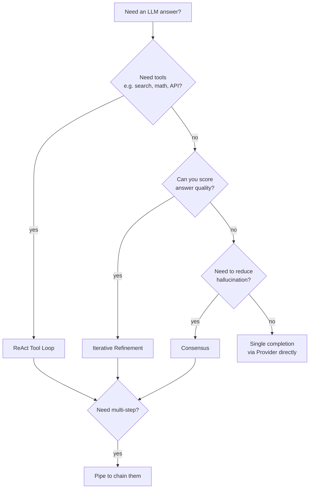

# Patterns Overview

ExecutionKit ships **four composable patterns**. Each is a single async function that takes a provider and a prompt and returns a `PatternResult` carrying the answer, a score, accumulated cost, and per-pattern metadata.

| Pattern | Use when… | Cost shape |
|---------|-----------|------------|
| [Consensus](consensus.md) | You need to reduce hallucination on a factual or classification answer. | `O(num_samples)` parallel calls. |
| [Iterative Refinement](iterative-refinement.md) | Quality of the answer matters more than latency, and you can score it. | `O(2 × max_iterations)` sequential calls (one to refine, one to evaluate, per round). |
| [ReAct Tool Loop](react-loop.md) | The model needs to call tools to gather information before answering. | `O(rounds)` sequential calls; bounded by `max_rounds`. |
| [Pipe](pipe.md) | You want to chain patterns end-to-end with a shared budget. | Sum of the individual pattern costs. |

## Choosing a pattern



## Common contract

Every pattern function returns a `PatternResult[T]`:

```python
@dataclass(frozen=True, slots=True)
class PatternResult(Generic[T]):
    value: T                                      # the answer
    score: float | None = None                    # quality score (pattern-specific)
    cost: TokenUsage = TokenUsage()               # tokens + LLM calls used
    metadata: MappingProxyType[str, Any] = ...    # immutable, pattern-specific keys
```

`metadata` is a read-only `MappingProxyType` — frozen at construction. Each pattern's docstring lists its metadata keys; do not rely on undocumented ones.

## Common kwargs

Every pattern accepts these (all optional):

| Kwarg | Default | Purpose |
|-------|---------|---------|
| `temperature` | pattern-specific | Sampling temperature override per call. |
| `max_tokens` | `4096` | Per-completion token cap. |
| `max_cost` | `None` | `TokenUsage` budget. Raises `BudgetExhaustedError` when exceeded. |
| `retry` | `DEFAULT_RETRY` | `RetryConfig` for transient errors (429, 5xx). |

`max_cost` enforcement uses two-phase accounting (`reserve_call` before the await, `record_without_call` after). This makes the budget guard TOCTOU-safe under `consensus`'s parallel calls.

## Sync wrappers

Every pattern has a `_sync` twin in the package root for use outside an async context:

```python
from executionkit import consensus_sync, refine_loop_sync, react_loop_sync, pipe_sync
```

The wrappers raise `RuntimeError` if called inside a running event loop — use `await` directly there (e.g. Jupyter, FastAPI handlers).

## Errors

All exceptions inherit from `ExecutionKitError` and carry `.cost` (the `TokenUsage` accumulated up to the failure) and `.metadata`. See [API → Core](../api/core.md#errors) for the full hierarchy.
