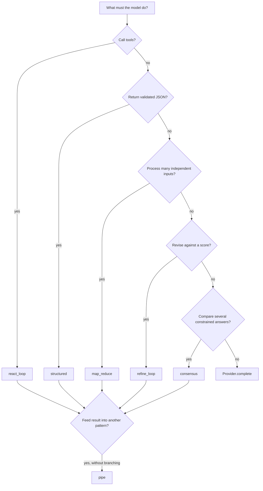

# Patterns overview

ExecutionKit provides six async call patterns. Each takes a provider and
returns `PatternResult`.

| Pattern | Choose it when | Model-call shape |
|---|---|---|
| [Consensus](consensus.md) | Several independent calls can return a short answer from a constrained set, and exact-answer agreement is useful. | `num_samples` calls, concurrent up to `max_concurrency`. |
| [Iterative refinement](iterative-refinement.md) | You can score an answer and want bounded revisions. | One generation and one score per round with the default evaluator. |
| [ReAct tool loop](react-loop.md) | The model needs registered tools before it can answer. | One model call per round; tool calls within a round run concurrently. |
| [Structured output](structured.md) | You need a JSON object or array with an application validator. | One initial call plus up to `max_retries` repair calls. |
| [Pipe](pipe.md) | Each step can use the previous result as its next prompt. | Sum of the step costs. |
| [Map-reduce](map-reduce.md) | Independent inputs need the same operation before one combined result. | One call per input, then one reduce call. |

Retries can increase every model-call count in the table.

## Decision guide


```mermaid
flowchart TD
    A["What must the model do?"] --> B{"Call tools?"}
    B -- "yes" --> C["react_loop"]
    B -- "no" --> D{"Return validated JSON?"}
    D -- "yes" --> E["structured"]
    D -- "no" --> F{"Process many independent inputs?"}
    F -- "yes" --> G["map_reduce"]
    F -- "no" --> H{"Revise against a score?"}
    H -- "yes" --> I["refine_loop"]
    H -- "no" --> J{"Compare several constrained answers?"}
    J -- "yes" --> K["consensus"]
    J -- "no" --> L["Provider.complete"]
    C --> M{"Feed result into another pattern?"}
    E --> M
    G --> M
    I --> M
    K --> M
    M -- "yes, without branching" --> N["pipe"]
```

Use ordinary async Python when you need branching or when later work needs
several earlier outputs. `pipe()` intentionally passes only the string form of
the previous value.

## Return contract

```python
result.value
result.score
result.cost
result.metadata
```

- `value` is the pattern output.
- `score` is `None` unless the pattern defines a score.
- `cost` is `TokenUsage(input_tokens, output_tokens, llm_calls)`.
- `metadata` is a read-only mapping with keys listed on the pattern page.

`llm_calls` counts dispatched attempts, including retries. Token counts come
from successful provider responses.

## Shared controls

Most call patterns accept:

| Parameter | Meaning |
|---|---|
| `temperature` | Sampling temperature sent to the provider. The default differs by pattern. |
| `max_tokens` | Per-response output-token request limit. |
| `max_cost` | Token and call budget checked before dispatch. |
| `retry` | `RetryConfig` for retryable provider errors. |
| `trace` | Sync or async callback receiving `TraceEvent`. |

Some patterns also accept `on_checkpoint` callbacks. These callbacks expose
progress state but do not persist it; storage belongs to the caller.

Read [Execution controls](../guides/execution-controls.md) before relying on
budgets. Call-count limits are strict within one asyncio event loop, while a
completed response can take a recorded token total beyond its pre-dispatch
limit.

## Synchronous wrappers

Each pattern has a package-root wrapper:

```python
from executionkit import (
    consensus_sync,
    map_reduce_sync,
    pipe_sync,
    react_loop_sync,
    refine_loop_sync,
    structured_sync,
)
```

The wrappers call `asyncio.run()`. Use the async functions inside notebooks,
async web handlers, or any other active event loop.

## Exceptions

Provider failures derive from `LLMError`. Pattern failures derive from
`PatternError`. Both derive from `ExecutionKitError` and carry partial `cost`
and `metadata`.

See [Execution helper API](../api/execution.md#exceptions).
