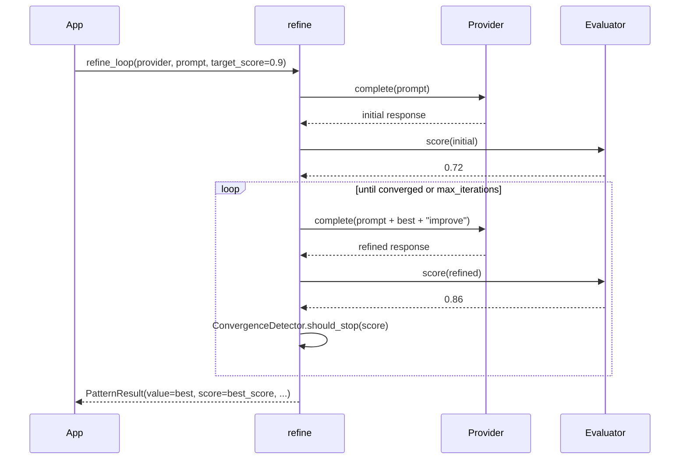

---
tags:
  - pattern
  - quality
---

# Iterative Refinement

`refine_loop()` generates an initial response, scores it, then asks the model to improve it. The loop stops when the score crosses `target_score`, score deltas stall beyond `patience`, or `max_iterations` is hit. The best-scoring response is returned.

## When to use / when not to use

| Use it when… | Avoid it when… |
|--------------|----------------|
| You can write or pick an evaluator that scores quality on `[0.0, 1.0]`. | Latency matters more than quality. |
| Quality matters more than cost (writing, code review, summaries). | Each iteration is unlikely to actually improve the answer (e.g. multiple-choice). |
| You can bound iterations (e.g. `max_iterations=4`). | The task is purely factual — use [Consensus](consensus.md) instead. |
| You want a quality gate (`target_score`) on output. | The default LLM-as-judge evaluator is unsafe for adversarial input — write a custom evaluator. |

## Call flow



## Minimal example

```python
import asyncio
import os
from executionkit import Provider, refine_loop

async def main() -> None:
    async with Provider(
        base_url="https://api.openai.com/v1",
        api_key=os.environ["OPENAI_API_KEY"],
        model="gpt-4o-mini",
    ) as provider:
        result = await refine_loop(
            provider,
            "Write a one-paragraph explanation of the Turing test "
            "for a non-technical reader.",
            target_score=0.85,
            max_iterations=4,
            patience=2,
        )

        print(result.value)                            # best response
        print(result.score)                            # e.g. 0.91
        print(result.metadata["iterations"])           # e.g. 2
        print(result.metadata["converged"])            # True
        print(result.metadata["score_history"])        # [0.72, 0.86, 0.91]

asyncio.run(main())
```

## Custom evaluator

For production, supply your own evaluator. The default uses an LLM-as-judge prompt with XML-delimiter sandboxing — fine for development, but you should write a deterministic or domain-specific scorer when input may contain adversarial content.

```python
async def length_evaluator(text: str, _: object) -> float:
    """Score 1.0 for 80–200 word answers, lower for outliers."""
    n = len(text.split())
    if 80 <= n <= 200:
        return 1.0
    if n < 80:
        return n / 80
    return max(0.0, 1.0 - (n - 200) / 200)

result = await refine_loop(
    provider,
    "Summarize the Turing test in 80–200 words.",
    evaluator=length_evaluator,
    target_score=0.95,
)
```

## Configuration knobs

| Parameter | Default | Description |
|-----------|---------|-------------|
| `evaluator` | `None` | `async (text, provider) -> float in [0,1]`. `None` uses the default LLM-as-judge. |
| `max_eval_chars` | `32_768` | Truncation limit for text passed to the default evaluator. |
| `target_score` | `0.9` | Convergence target. The loop stops when score >= this. |
| `max_iterations` | `5` | Maximum refinement iterations *after* the initial generation. |
| `patience` | `3` | Stale-delta iterations before declaring convergence. |
| `delta_threshold` | `0.01` | Minimum meaningful score improvement. |
| `temperature` | `0.7` | Sampling temperature for generation calls (evaluator uses `0.1`). |
| `max_tokens` | `4096` | Per-completion token cap. |
| `max_cost` | `None` | Optional `TokenUsage` budget across all calls. |
| `retry` | `DEFAULT_RETRY` | Per-call retry config. |

## Metadata keys

| Key | Type | Meaning |
|-----|------|---------|
| `iterations` | `int` | Refinement iterations performed (`0` = converged on first attempt). |
| `converged` | `bool` | `True` if the loop converged before `max_iterations`. |
| `score_history` | `list[float]` | Score at each iteration, including the initial generation. |

## Cost characteristics

- **Up to `2 × (1 + max_iterations)` LLM calls** when using the default evaluator (one generation + one evaluation per round). A custom evaluator that doesn't call the LLM cuts this in half.
- **Sequential.** Each iteration depends on the previous response — no parallelism.
- **Best-result tracking.** The returned `value` is always the highest-scoring response seen, even if a later iteration regressed.
- **`max_cost` is checked before every call** and raises `BudgetExhaustedError` immediately on overrun.

## Errors

| Exception | Cause |
|-----------|-------|
| `ValueError` | Default evaluator parsed a score outside `[0, 10]`. |
| `BudgetExhaustedError` | `max_cost` exceeded between iterations. |
| `RateLimitError` / `ProviderError` | Bubbled from `Provider.complete` after retry exhaustion. |

## Security note

The default evaluator wraps the text being scored in `<response_to_rate>` XML delimiters and instructs the LLM to ignore any instructions inside them. This mitigates **prompt injection attacks** where adversarial content in a generated response would otherwise override the scoring instruction. Text is also truncated to `max_eval_chars` (default 32 768) before being sent to the evaluator. **Even with these defenses, LLM-as-judge is not safe against motivated attackers** — write a custom evaluator for production workloads with untrusted input.

## Source

[`executionkit/patterns/refine_loop.py`](https://github.com/tafreeman/executionkit/blob/main/executionkit/patterns/refine_loop.py)
