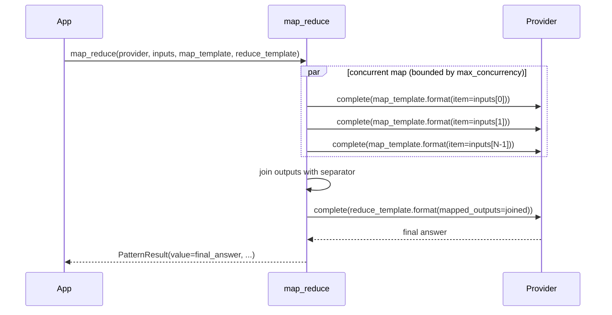

---
tags:
  - pattern
  - parallel
---

# Map-Reduce

`map_reduce()` fans out a prompt template over many inputs concurrently, then folds all results into a single answer with a reduce prompt. It is the canonical way to apply the same LLM operation to a list of items and synthesise the outputs.

## When to use / when not to use

| Use it when… | Avoid it when… |
|--------------|----------------|
| You need to process N independent items with the same prompt. | Items depend on each other's outputs — use sequential chaining instead. |
| The final answer benefits from combining partial results (summaries, classifications, extractions). | N is very large and token cost per item is high — bound with `max_concurrency` and monitor `cost`. |
| You want to parallelize and then synthesize (fan-out/fan-in). | The reduce step doesn't need the map outputs — call the provider directly. |

## Call flow



## Minimal example

```python
import asyncio
import os
from executionkit import Provider, map_reduce

DOCS = [
    "ExecutionKit ships zero runtime dependencies.",
    "All patterns are async coroutines returning PatternResult.",
    "MockProvider is used in tests to avoid real API calls.",
]

async def main() -> None:
    async with Provider(
        base_url="https://api.openai.com/v1",
        api_key=os.environ["OPENAI_API_KEY"],
        model="gpt-4o-mini",
    ) as provider:
        result = await map_reduce(
            provider,
            inputs=DOCS,
            map_prompt_template="Extract one key fact from: {item}",
            reduce_prompt_template=(
                "You have these key facts:\n{mapped_outputs}\n\n"
                "Write a two-sentence executive summary."
            ),
        )
        print(result.value)
        print(result.metadata["map_count"])    # 3
        print(result.metadata["total_calls"])  # 4  (3 map + 1 reduce)
        print(result.cost.llm_calls)           # 4

asyncio.run(main())
```

## Template placeholders

| Placeholder | Used in | Replaced with |
|-------------|---------|---------------|
| `{item}` | `map_prompt_template` | Each input string in turn |
| `{mapped_outputs}` | `reduce_prompt_template` | All map results joined by `\n\n---\n\n` |

Both placeholders are **required**. A `ValueError` is raised at call time if either is absent.

## Configuration knobs

| Parameter | Default | Description |
|-----------|---------|-------------|
| `max_concurrency` | `10` | Semaphore limit for parallel map calls. Must be `>= 1`. |
| `temperature` | `0.3` | Sampling temperature for both map and reduce calls. |
| `max_tokens` | `4096` | Per-completion token cap. |
| `max_cost` | `None` | `TokenUsage` budget shared across all calls. |
| `retry` | `DEFAULT_RETRY` | Per-call retry config for transient errors. |
| `trace` | `None` | Optional callback for `llm_call_*` events. |

## Empty inputs

When `inputs` is empty the map phase is skipped entirely. The reduce step is still called once with `{mapped_outputs}` replaced by an empty string, allowing the reduce prompt to handle the zero-item case gracefully.

```python
result = await map_reduce(
    provider,
    inputs=[],
    map_prompt_template="Summarize: {item}",
    reduce_prompt_template="Items: {mapped_outputs}. No items were provided.",
)
# result.metadata["map_count"] == 0
# result.metadata["total_calls"] == 1
```

## Metadata keys

| Key | Type | Meaning |
|-----|------|---------|
| `map_count` | `int` | Number of items mapped (length of `inputs`). |
| `reduce_calls` | `int` | Always `1` (one reduce completion). |
| `total_calls` | `int` | `map_count + 1`. |

## Cost characteristics

- **`O(map_count + 1)` LLM calls.** Map calls run concurrently; wall-clock latency is bounded by the slowest map call plus the reduce call.
- **Reduce prompt grows with N.** Each map output is appended to the reduce prompt. For large N or verbose map outputs, monitor `result.cost.input_tokens`.
- **Budget enforcement is TOCTOU-safe** via `checked_complete` — concurrent map calls cannot race past `max_cost.llm_calls`.

## Errors

| Exception | Cause |
|-----------|-------|
| `ValueError` | `max_concurrency < 1`, `max_tokens < 1`, or missing template placeholder. |
| `BudgetExhaustedError` | `max_cost` exceeded during map or reduce phase. |
| `RateLimitError` / `ProviderError` | Bubbled from `Provider.complete` after retry exhaustion. |

## Source

[`executionkit/patterns/map_reduce.py`](https://github.com/tafreeman/executionkit/blob/main/executionkit/patterns/map_reduce.py)
