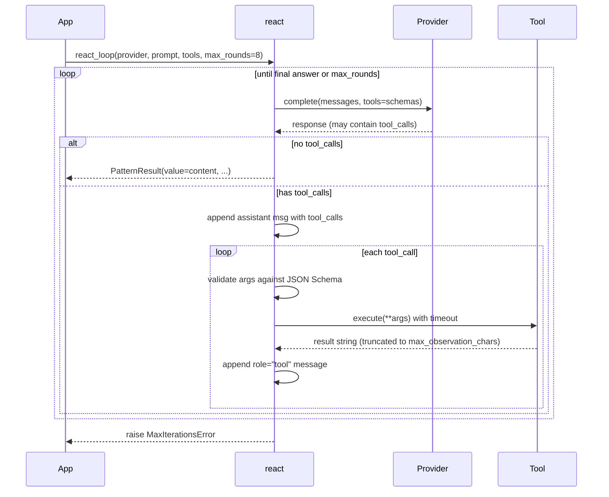

---
tags:
  - pattern
  - tools
---

# ReAct Tool Loop

`react_loop()` runs the standard **think → act → observe** loop with tool calling. Each round, the LLM may either return a final answer or request one or more tool calls. Tool calls are executed (with timeout and JSON-Schema argument validation), their results appended to the conversation, and the loop continues until the model answers or `max_rounds` is hit.

## When to use / when not to use

| Use it when… | Avoid it when… |
|--------------|----------------|
| The model needs external information (search, API lookup, math, file access). | The model can answer from its own knowledge — single completion is cheaper. |
| Each tool returns a bounded, summarizable result. | Tool outputs are large blobs (PDFs, full HTML pages). Pre-summarize before returning. |
| You can bound the loop (`max_rounds`). | You need long-running stateful agents — use a runtime like agentic-runtimes. |
| Your provider supports OpenAI-style tool calling. | Your provider is text-only — tools won't work. |

## Call flow



## Minimal example

```python
import asyncio
import ast
import operator
import os
from executionkit import Provider, Tool, react_loop

# Safe AST-based math evaluator — never use eval() on LLM output.
_OPS = {
    ast.Add: operator.add, ast.Sub: operator.sub,
    ast.Mult: operator.mul, ast.Div: operator.truediv,
    ast.Pow: operator.pow, ast.USub: operator.neg,
}

def _safe_eval(node: ast.AST) -> float:
    if isinstance(node, ast.Constant) and isinstance(node.value, (int, float)):
        return node.value
    if isinstance(node, ast.BinOp):
        return _OPS[type(node.op)](_safe_eval(node.left), _safe_eval(node.right))
    if isinstance(node, ast.UnaryOp):
        return _OPS[type(node.op)](_safe_eval(node.operand))
    raise ValueError(f"Unsupported expression node: {type(node).__name__}")

async def calculator(expression: str) -> str:
    tree = ast.parse(expression, mode="eval")
    return str(_safe_eval(tree.body))

calc = Tool(
    name="calculator",
    description="Evaluate an arithmetic expression. Supports + - * / ** and unary -.",
    parameters={
        "type": "object",
        "properties": {"expression": {"type": "string"}},
        "required": ["expression"],
        "additionalProperties": False,
    },
    execute=calculator,
    timeout=2.0,
)

async def main() -> None:
    async with Provider(
        base_url="https://api.openai.com/v1",
        api_key=os.environ["OPENAI_API_KEY"],
        model="gpt-4o-mini",
    ) as provider:
        result = await react_loop(
            provider,
            "What is (17 * 83) + (12 ** 3)? Use the calculator.",
            tools=[calc],
            max_rounds=4,
        )
        print(result.value)                              # 3139
        print(result.metadata["rounds"])                 # 2
        print(result.metadata["tool_calls_made"])        # 2

asyncio.run(main())
```

## Configuration knobs

| Parameter | Default | Description |
|-----------|---------|-------------|
| `max_rounds` | `8` | Maximum think-act-observe cycles. Raises `MaxIterationsError` if hit. |
| `max_observation_chars` | `12000` | Truncation limit for each tool result before appending to history. |
| `tool_timeout` | `None` | Per-call timeout override. Falls back to `Tool.timeout` (default `30.0s`). |
| `temperature` | `0.3` | Lower = more deterministic tool selection. |
| `max_tokens` | `4096` | Per-completion token cap. |
| `max_cost` | `None` | `TokenUsage` budget across all rounds. |
| `retry` | `DEFAULT_RETRY` | Per-call retry config. |
| `max_history_messages` | `None` | Cap message history length per round. Always preserves the original prompt. |

## Tool definition

```python
@dataclass(frozen=True, slots=True)
class Tool:
    name: str
    description: str
    parameters: Mapping[str, Any]                # JSON Schema for arguments
    execute: Callable[..., Awaitable[str]]       # async function returning a string
    timeout: float = 30.0
```

Arguments are validated against `parameters` (JSON Schema) before `execute` is called. Validation covers `required`, `additionalProperties: false`, and primitive type checks (`string`, `integer`, `number`, `boolean`, `array`, `object`) — using stdlib only, no `jsonschema` dependency.

`execute` must be **async** and return a **string**. Convert non-string results yourself.

## Metadata keys

| Key | Type | Meaning |
|-----|------|---------|
| `rounds` | `int` | Think-act-observe cycles completed. |
| `tool_calls_made` | `int` | Total individual tool invocations across all rounds. |
| `truncated_responses` | `int` | LLM responses cut off due to `finish_reason=length`. |
| `truncated_observations` | `int` | Tool results truncated due to `max_observation_chars`. |
| `messages_trimmed` | `int` | Rounds where history was trimmed by `max_history_messages`. |

## Cost characteristics

- **`O(rounds)` LLM calls.** Bounded by `max_rounds`. Each round = one completion regardless of how many tools are called.
- **Sequential.** Each round depends on prior tool outputs — no parallelism across rounds. (Tools *within* a round run sequentially in the current implementation.)
- **Context grows with every round** unless `max_history_messages` is set. For loops > ~20 rounds or with verbose tools, set `max_history_messages` to bound the prompt size.
- **Tool failures don't crash the loop.** Unknown tools, schema violations, timeouts, and exceptions return an error string as the observation; the LLM gets a chance to recover.

## Errors

| Exception | Cause |
|-----------|-------|
| `TypeError` | Provider does not satisfy `ToolCallingProvider` (missing `supports_tools=True`). |
| `MaxIterationsError` | `max_rounds` exhausted without a final answer. Includes `cost` and `metadata`. |
| `BudgetExhaustedError` | `max_cost` exceeded mid-loop. |

## Security notes

- **Never `eval()` LLM output.** The example above uses a safe AST walker. Treat all tool inputs as adversarial.
- **Tool errors return only the exception class name** to the LLM (e.g. `"Tool 'X' failed: TimeoutError"`), not the full message — this prevents leaking internal details to the model.
- **JSON-Schema validation runs before** `execute` is called. Tools with `additionalProperties: false` reject unknown keys; missing `required` fields are caught.
- **Tool timeout defaults to 30 s** but is overridable per-call via `tool_timeout=`. Set short timeouts for network tools.

## Source

[`executionkit/patterns/react_loop.py`](https://github.com/tafreeman/executionkit/blob/main/executionkit/patterns/react_loop.py)
