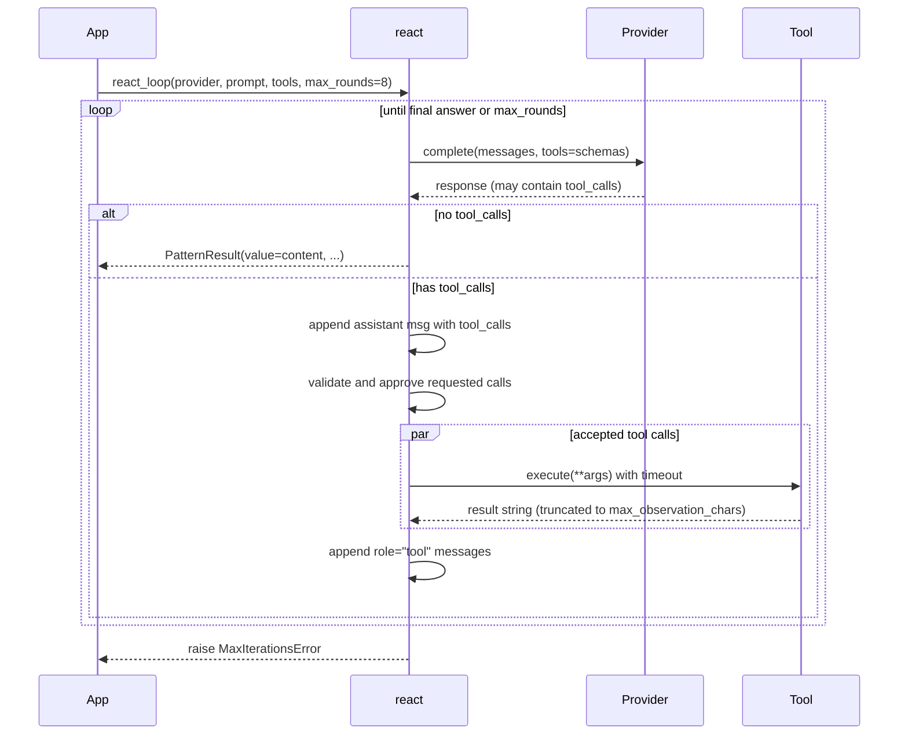

---
tags:
  - pattern
  - tools
---

# ReAct Tool Loop

`react_loop()` lets a model request registered tools inside a bounded loop.
Each round returns either a final answer or one or more tool calls. The loop
validates and optionally approves the calls, runs them with timeouts, adds
their results to the conversation, and asks the model again.

## When to use / when not to use

| Use it when… | Avoid it when… |
|--------------|----------------|
| The model needs external information (search, API lookup, math, file access). | The model can answer from its own knowledge — single completion is cheaper. |
| Each tool returns a bounded, summarizable result. | Tool outputs are large blobs (PDFs, full HTML pages). Pre-summarize before returning. |
| You can bound the loop (`max_rounds`). | You need long-running stateful agents — use a runtime like [agentic-runtime-platform](https://github.com/tafreeman/agentic-runtime-platform). |
| Your provider supports OpenAI-style tool calling. | Your provider is text-only — tools won't work. |

## Call flow


```mermaid
sequenceDiagram
    participant App
    participant react
    participant Provider
    participant Tool
    App->>react: react_loop(provider, prompt, tools, max_rounds=8)
    loop until final answer or max_rounds
        react->>Provider: complete(messages, tools=schemas)
        Provider-->>react: response (may contain tool_calls)
        alt no tool_calls
            react-->>App: PatternResult(value=content, ...)
        else has tool_calls
            react->>react: append assistant msg with tool_calls
            react->>react: validate and approve requested calls
            par accepted tool calls
                react->>Tool: execute(**args) with timeout
                Tool-->>react: result string (truncated to max_observation_chars)
            end
            react->>react: append role="tool" messages
        end
    end
    react-->>App: raise MaxIterationsError
```

## Minimal example

```python
import asyncio
import os
from executionkit import Provider, Tool, react_loop


async def get_status(service: str) -> str:
    statuses = {
        "billing": "operational",
        "orders": "maintenance",
    }
    return statuses.get(service, "unknown service")

status_tool = Tool(
    name="get_status",
    description="Return the current status of a named service.",
    parameters={
        "type": "object",
        "properties": {"service": {"type": "string"}},
        "required": ["service"],
        "additionalProperties": False,
    },
    execute=get_status,
    timeout=2.0,
)

async def main() -> None:
    async with Provider(
        base_url=os.environ["LLM_BASE_URL"],
        api_key=os.environ.get("LLM_API_KEY", ""),
        model=os.environ["LLM_MODEL"],
    ) as provider:
        result = await react_loop(
            provider,
            "Check the billing service and report its status.",
            tools=[status_tool],
            max_rounds=4,
        )
        print(result.value)
        print(result.metadata["rounds"])
        print(result.metadata["tool_calls_made"])

asyncio.run(main())
```

## Parameters

| Parameter | Default | Description |
|-----------|---------|-------------|
| `max_rounds` | `8` | Maximum think-act-observe cycles. Raises `MaxIterationsError` if hit. |
| `max_observation_chars` | `12000` | Truncation limit for each tool result before appending to history. |
| `tool_timeout` | `None` | Per-call timeout override. Falls back to `Tool.timeout` (default `30.0s`). |
| `max_tool_calls_per_round` | `32` | Maximum requested calls executed in one round. Surplus calls receive rejection observations. |
| `temperature` | `0.3` | Sampling temperature sent to the provider. |
| `max_tokens` | `4096` | Per-completion token cap. |
| `max_cost` | `None` | `TokenUsage` budget across all rounds. |
| `retry` | `DEFAULT_RETRY` | Per-call retry config. |
| `max_history_messages` | `None` | Cap message history length per round. Always preserves the original prompt. |
| `trace` | `None` | Optional callback for `llm_call_*` and `tool_call_*` events. |
| `approval_gate` | `None` | Optional `ApprovalGate` checked before each tool body is executed. Denied calls become tool observations so the model can recover. |
| `redact_trace_args` | `True` | Replace tool argument values in start events with `"[redacted]"`. |
| `on_checkpoint` | `None` | Sync or async callback after each tool-using round. |
| `summarizer` | `None` | Optional async summary callback for history removed from the active window. |

## Tool definition

```python
@dataclass(frozen=True, slots=True)
class Tool:
    name: str
    description: str
    parameters: Mapping[str, Any]                # JSON Schema for arguments
    execute: Callable[..., Awaitable[str]]       # async function returning a string
    timeout: float = 30.0
```

Arguments are validated before `execute` is called. The base install checks
top-level required fields, `additionalProperties: false`, and primitive types.
If a schema uses constraints outside that subset, such as nested properties,
array items, `enum`, ranges, or patterns, the call is rejected unless the
`jsonschema` extra is installed:

```bash
python -m pip install "executionkit[jsonschema]"
```

Even full JSON Schema validation checks data shape, not application
authorization. A tool must still validate paths, identifiers, permissions,
SQL inputs, shell inputs, and other domain rules before acting.

`execute` must be **async** and return a **string**. Convert non-string results yourself.

## Approval gates

Pass an `ApprovalGate` when a human, policy service, or test double should approve tool execution before side effects happen:

```python
from executionkit import ApprovalDecision, ApprovalGate, react_loop

gate = ApprovalGate(
    lambda request: ApprovalDecision(
        approved=request.subject == "read_only_search",
        reason="writes require review",
    )
)

result = await react_loop(provider, prompt, tools, approval_gate=gate)
```

The gate receives an `ApprovalRequest` whose `subject` is the tool name and whose `metadata["arguments"]` holds the parsed tool arguments (with `metadata["tool_call_id"]` for correlation). A denial does not call the tool; it appends a bounded observation such as `Tool 'name' blocked by approval: reason` and lets the model continue.

## Metadata keys

| Key | Type | Meaning |
|-----|------|---------|
| `rounds` | `int` | Think-act-observe cycles completed. |
| `tool_calls_made` | `int` | Total individual tool invocations across all rounds. |
| `rejected_tool_calls` | `int` | Requested calls not executed because the round exceeded `max_tool_calls_per_round`. |
| `truncated_responses` | `int` | LLM responses cut off due to `finish_reason=length`. |
| `truncated_observations` | `int` | Tool results truncated due to `max_observation_chars`. |
| `messages_trimmed` | `int` | Rounds where history was trimmed by `max_history_messages`. |
| `summarized` | `int` | Rounds where a caller-supplied summary was inserted into the active window. |
| `messages` | `tuple[dict, ...]` | Full stored transcript after the run. |
| `termination_reason` | `TerminationReason` | `NATURAL` on a returned answer; `MAX_ITERATIONS` on the raised limit error. |

## Cost characteristics

- **`O(rounds)` LLM calls.** Bounded by `max_rounds`. Each round = one completion regardless of how many tools are called.
- **Rounds are sequential.** Tool calls inside one round run concurrently, up
  to `max_tool_calls_per_round`.
- **Context grows with every round** unless `max_history_messages` is set. A
  caller-supplied `summarizer` can add a summary of removed messages to the
  active request window.
- **Tool failures don't crash the loop.** Unknown tools, schema violations, timeouts, and exceptions return an error string as the observation; the LLM gets a chance to recover.

## Errors

| Exception | Cause |
|-----------|-------|
| `TypeError` | Provider does not satisfy `ToolCallingProvider` (missing `supports_tools=True`). |
| `ValueError` | Invalid limits, both/neither of `prompt` and `messages`, or duplicate tool names. |
| `MaxIterationsError` | `max_rounds` exhausted without a final answer. Includes `cost` and `metadata`. |
| `BudgetExhaustedError` | `max_cost` exceeded mid-loop. |

## Security notes

- **Never pass model-generated text to `eval()`, `exec()`, or a shell.** Treat
  every tool argument as untrusted input.
- **Tool errors return only the exception class name** to the LLM (for example,
  `"Tool 'X' failed: TimeoutError"`), not the full message or traceback.
- **JSON-Schema validation runs before** `execute` is called. Tools with `additionalProperties: false` reject unknown keys; missing `required` fields are caught.
- **Tool timeout defaults to 30 s** but is overridable per-call via `tool_timeout=`. Set short timeouts for network tools.

## Source

[`executionkit/patterns/react_loop.py`](https://github.com/tafreeman/executionkit/blob/main/executionkit/patterns/react_loop.py)
