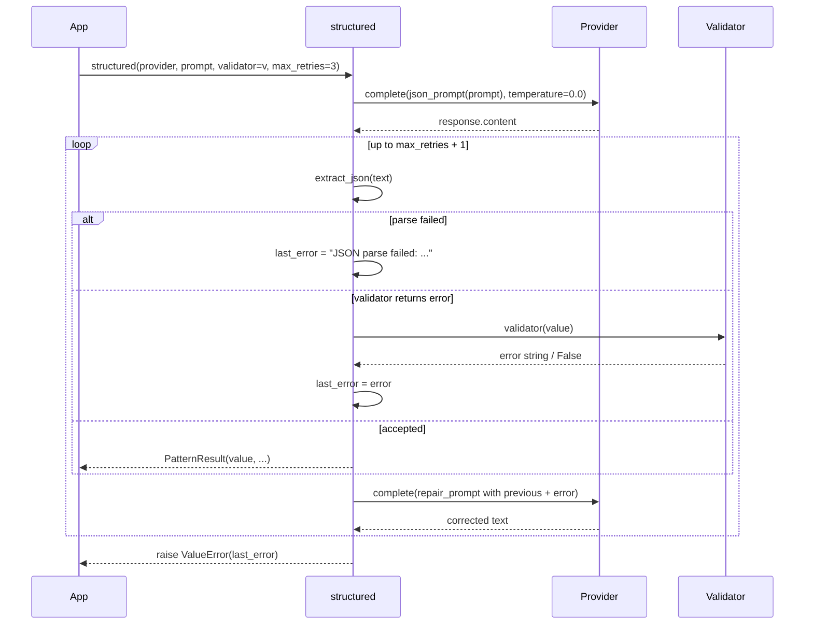

---
tags:
  - pattern
  - json
---

# Structured Output

`structured()` requests a JSON object or array from the model, parses it, and (optionally) validates it against a custom predicate. On parse or validation failure, it sends a **repair prompt** that includes the previous response and the error, then retries — up to `max_retries` times.

## When to use / when not to use

| Use it when… | Avoid it when… |
|--------------|----------------|
| You need a JSON dict or list back from the model. | You only need free-form text. |
| You can write a validator (or trust well-formed JSON). | Your provider already supports native JSON-mode and gives you better guarantees. |
| Occasional repair retries are acceptable. | Strict latency budget — repair adds an extra LLM call per failed attempt. |
| Your task fits in a single prompt-response cycle. | The task needs tools — use [ReAct](react-loop.md) instead. |

## Call flow



## Minimal example

```python
import asyncio
import os
from executionkit import Provider, structured

def is_valid_user(value: object) -> str | None:
    """Return None for valid, error string for invalid."""
    if not isinstance(value, dict):
        return "Top-level value must be a JSON object."
    missing = {"name", "email", "age"} - value.keys()
    if missing:
        return f"Missing required fields: {sorted(missing)}"
    if not isinstance(value["age"], int) or value["age"] < 0:
        return "'age' must be a non-negative integer."
    return None  # ✓

async def main() -> None:
    async with Provider(
        base_url="https://api.openai.com/v1",
        api_key=os.environ["OPENAI_API_KEY"],
        model="gpt-4o-mini",
    ) as provider:
        result = await structured(
            provider,
            "Extract the user record from: 'Alice, alice@example.com, 32 years old'.",
            validator=is_valid_user,
            max_retries=2,
        )

        print(result.value)                              # {'name': 'Alice', 'email': '...', 'age': 32}
        print(result.metadata["parse_attempts"])         # 1 = parsed cleanly first try
        print(result.metadata["repair_attempts"])        # 0 = no repair needed
        print(result.metadata["validated"])              # True

asyncio.run(main())
```

## Configuration knobs

| Parameter | Default | Description |
|-----------|---------|-------------|
| `validator` | `None` | `(value) -> None / True / "" → accept; False / "..." → repair`. `None` accepts any parsed JSON. |
| `max_retries` | `3` | Number of repair attempts after the initial parse. `0` = parse-once-no-repair. |
| `temperature` | `0.0` | Lower = more deterministic JSON. |
| `max_tokens` | `4096` | Per-completion token cap. Must be `>= 1`. |
| `max_cost` | `None` | Optional `TokenUsage` budget across the initial call + all repairs. |
| `retry` | `DEFAULT_RETRY` | Per-call retry config for transient transport errors (separate from repair retries). |

## Validator contract

A validator is `Callable[[StructuredValue], str | None | bool]` where `StructuredValue = dict | list`:

| Return value | Treated as |
|--------------|-----------|
| `None` | ✓ Accept |
| `True` | ✓ Accept |
| `""` (empty string) | ✓ Accept |
| `False` | ✗ Reject with generic message |
| any other string | ✗ Reject; the string becomes the repair prompt's error description |

The validator runs only when JSON parses successfully. Parse errors trigger repair regardless.

## Metadata keys

| Key | Type | Meaning |
|-----|------|---------|
| `parse_attempts` | `int` | Total parse attempts made (initial + repairs). |
| `repair_attempts` | `int` | Number of repair calls issued. `parse_attempts - 1` when no early success. |
| `validated` | `bool` | `True` if the validator accepted, or `True` when no validator was supplied. |

## Cost characteristics

- **Best case: 1 LLM call.** Initial response parses and validates on the first try.
- **Worst case: `1 + max_retries` LLM calls.** Each failed attempt costs one repair call.
- **Sequential.** Repair depends on the prior response; no parallelism.
- **`temperature=0.0` by default** keeps repairs predictable.

## Errors

| Exception | Cause |
|-----------|-------|
| `ValueError` | `max_retries < 0` or `max_tokens < 1`. |
| `ValueError` (after exhaustion) | All `max_retries + 1` attempts failed parse or validation. The message carries the last error. |
| `BudgetExhaustedError` | `max_cost` exceeded mid-loop. |
| `RateLimitError` / `ProviderError` | Bubbled from `Provider.complete` after retry exhaustion. |

## Tips

- **Use a strict validator.** Type-check, bound-check, and field-presence-check at the validator level — the model is fast at obeying clear error messages.
- **Schema-as-validator.** Pair `structured` with a Pydantic model:

  ```python
  from pydantic import BaseModel, ValidationError

  class User(BaseModel):
      name: str
      email: str
      age: int

  def validate(value):
      try:
          User.model_validate(value)
          return None
      except ValidationError as exc:
          return str(exc)

  result = await structured(provider, prompt, validator=validate)
  ```

- **Keep `max_retries` low** (`2`–`3`). If the model can't produce valid JSON in three tries, your prompt is the problem, not the retry budget.

## Source

[`executionkit/patterns/structured.py`](https://github.com/tafreeman/executionkit/blob/main/executionkit/patterns/structured.py)
